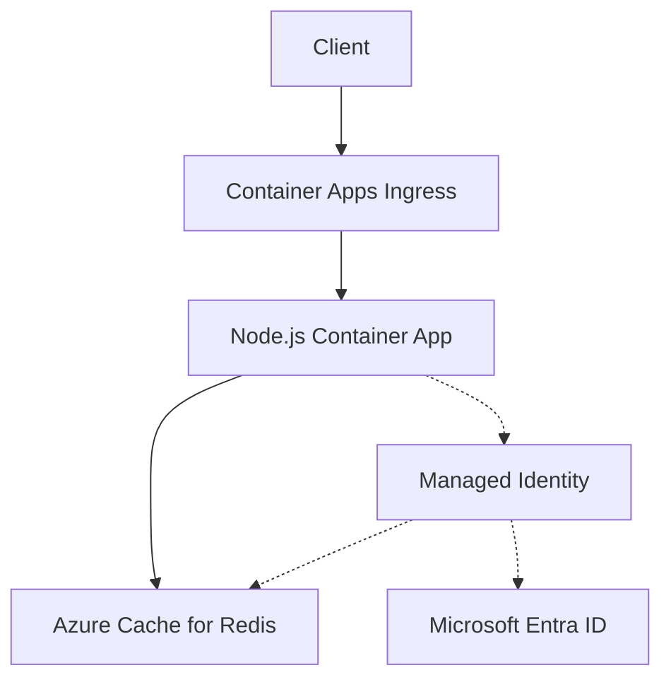

---
content_sources:
  diagrams:
  - id: architecture
    type: flowchart
    source: mslearn-adapted
    based_on:
    - https://learn.microsoft.com/azure/azure-cache-for-redis/cache-azure-active-directory-for-authentication
    - https://learn.microsoft.com/azure/redis/nodejs-get-started
content_validation:
  status: verified
  last_reviewed: '2026-05-23'
  reviewer: agent
  core_claims:
  - claim: This page uses Microsoft Learn as the primary source basis for its Azure-specific
      guidance.
    source: https://learn.microsoft.com/azure/azure-cache-for-redis/cache-azure-active-directory-for-authentication
    verified: true
---
# Azure Cache for Redis Integration (Microsoft Entra Authentication)

Use this recipe to connect Azure Container Apps to Azure Cache for Redis with Microsoft Entra authentication first and access keys only as a fallback.

## Architecture

<!-- diagram-id: architecture -->


Solid arrows show runtime data flow. Dashed arrows show identity and authentication.

## Prerequisites

- Existing Container App: `$APP_NAME` in `$RG`
- Existing Azure Cache for Redis instance with Microsoft Entra authentication enabled
- TLS access enabled on port `6380`

## Step 1: Enable managed identity on the Container App

```bash
az containerapp identity assign \
  --name "$APP_NAME" \
  --resource-group "$RG" \
  --system-assigned

export PRINCIPAL_ID=$(az containerapp show \
  --name "$APP_NAME" \
  --resource-group "$RG" \
  --query "identity.principalId" \
  --output tsv)
```

| Command | Why it is used |
|---|---|
| `az containerapp identity assign ...` | Assigns or inspects managed identity configuration for the Container App. |

## Step 2: Assign Redis data access

```bash
az redis access-policy-assignment create \
  --name "$REDIS_NAME" \
  --resource-group "$RG" \
  --access-policy-name "Data Owner" \
  --object-id "$PRINCIPAL_ID" \
  --object-id-alias "$APP_NAME"
```

| Command | Why it is used |
|---|---|
| `az redis access-policy-assignment ...` | Creates or inspects Azure Cache for Redis resources used by the sample app. |

## Step 3: Configure non-secret Redis settings

Azure Container Apps does **not** inject Redis host names, usernames, or tokens automatically.

```bash
az containerapp update \
  --name "$APP_NAME" \
  --resource-group "$RG" \
  --set-env-vars REDIS_HOST="$REDIS_NAME.redis.cache.windows.net" REDIS_PORT="6380" REDIS_USERNAME="$PRINCIPAL_ID"
```

| Command | Why it is used |
|---|---|
| `az containerapp update ...` | Updates the existing Container App configuration without recreating the app. |

## Step 4: Node.js code (Microsoft Entra token authentication)

Install dependencies:

```bash
npm install @azure/identity redis
```

Use `DefaultAzureCredential` to fetch the Redis access token:

```javascript
const { DefaultAzureCredential } = require("@azure/identity");
const { createClient } = require("redis");

async function createRedisClient() {
  if (process.env.REDIS_ACCESS_KEY) {
    return createClient({
      username: process.env.REDIS_USERNAME || "default",
      password: process.env.REDIS_ACCESS_KEY,
      socket: {
        host: process.env.REDIS_HOST,
        port: Number(process.env.REDIS_PORT || "6380"),
        tls: true,
      },
    });
  }

  const credential = new DefaultAzureCredential();
  const token = await credential.getToken("https://redis.azure.com/.default");

  return createClient({
    username: process.env.REDIS_USERNAME,
    password: token.token,
    socket: {
      host: process.env.REDIS_HOST,
      port: Number(process.env.REDIS_PORT || "6380"),
      tls: true,
    },
  });
}

async function run() {
  const client = await createRedisClient();
  await client.connect();
  await client.set("health", "ok", { EX: 60 });
  console.log(await client.get("health"));
  await client.quit();
}

run().catch((error) => {
  console.error(error);
  process.exitCode = 1;
});
```

!!! warning
    The Entra token used for Redis expires. For long-lived connections, implement token refresh and reconnect logic that matches the guidance for your Redis tier and client library.

## Step 5: Access key fallback

```bash
az containerapp secret set \
  --name "$APP_NAME" \
  --resource-group "$RG" \
  --secrets redis-access-key="<redis-primary-key>"

az containerapp update \
  --name "$APP_NAME" \
  --resource-group "$RG" \
  --set-env-vars REDIS_HOST="$REDIS_NAME.redis.cache.windows.net" REDIS_PORT="6380" REDIS_ACCESS_KEY=secretref:redis-access-key
```

| Command | Why it is used |
|---|---|
| `az containerapp secret set ...` | Manages Container Apps secrets without exposing secret values in plain configuration. |

## Verification

1. Confirm the access policy assignment exists:

```bash
az redis access-policy-assignment list \
  --name "$REDIS_NAME" \
  --resource-group "$RG" \
  --output table
```

| Command | Why it is used |
|---|---|
| `az redis access-policy-assignment ...` | Creates or inspects Azure Cache for Redis resources used by the sample app. |

2. Confirm app logs show successful Redis `SET` and `GET` operations:

```bash
az containerapp logs show \
  --name "$APP_NAME" \
  --resource-group "$RG" \
  --follow false
```

| Command | Why it is used |
|---|---|
| `az containerapp logs show ...` | Runs the Azure CLI operation required by the documented step. |

3. Confirm clients are using TLS on port `6380`.

## See Also

- [Managed Identity](managed-identity.md)
- [Private Endpoints](../../../platform/networking/private-endpoints.md)
- [Networking](../../../platform/networking/vnet-integration.md)

## Sources

- [Use Microsoft Entra for cache authentication](https://learn.microsoft.com/azure/azure-cache-for-redis/cache-azure-active-directory-for-authentication)
- [Use Azure Cache for Redis with Node.js](https://learn.microsoft.com/azure/redis/nodejs-get-started)
