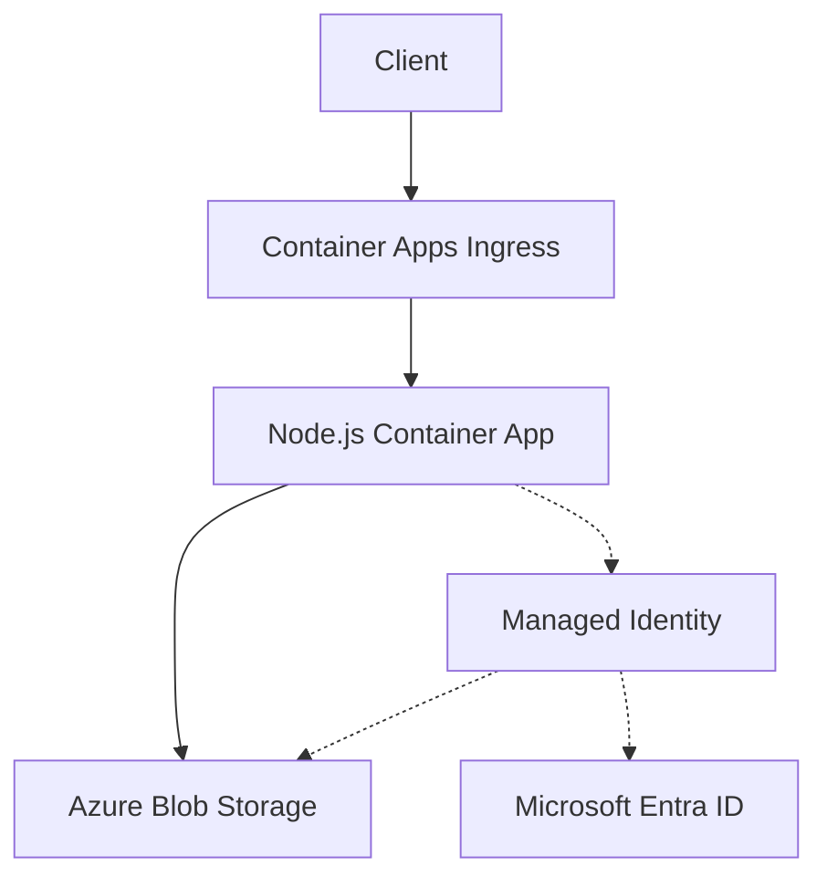

---
content_sources:
  diagrams:
    - id: architecture
      type: flowchart
      source: mslearn-adapted
      based_on:
        - https://learn.microsoft.com/azure/container-apps/storage-mounts
        - https://learn.microsoft.com/javascript/api/overview/azure/storage-blob-readme
---

# Blob Storage Integration (Managed Identity)

Use this recipe to connect a Node.js Container App to Azure Blob Storage with managed identity first and a connection string fallback when you still depend on shared keys.

## Architecture

<!-- diagram-id: architecture -->


Solid arrows show runtime data flow. Dashed arrows show identity and authentication.

## Prerequisites

- Existing Container App: `$APP_NAME` in `$RG`
- Existing storage account and blob container
- Azure CLI with the Container Apps extension

```bash
az extension add --name containerapp --upgrade
```

## Step 1: Enable managed identity on the Container App

```bash
az containerapp identity assign \
  --name "$APP_NAME" \
  --resource-group "$RG" \
  --system-assigned

export PRINCIPAL_ID=$(az containerapp show \
  --name "$APP_NAME" \
  --resource-group "$RG" \
  --query "identity.principalId" \
  --output tsv)
```

## Step 2: Grant Blob data access

```bash
export STORAGE_ID=$(az storage account show \
  --name "$STORAGE_ACCOUNT" \
  --resource-group "$RG" \
  --query "id" \
  --output tsv)

az role assignment create \
  --assignee-object-id "$PRINCIPAL_ID" \
  --assignee-principal-type ServicePrincipal \
  --role "Storage Blob Data Contributor" \
  --scope "$STORAGE_ID"
```

## Step 3: Configure non-secret settings

Azure Container Apps does **not** inject Blob Storage account URLs automatically.

```bash
az containerapp update \
  --name "$APP_NAME" \
  --resource-group "$RG" \
  --set-env-vars STORAGE_ACCOUNT_URL="https://$STORAGE_ACCOUNT.blob.core.windows.net" STORAGE_CONTAINER="$STORAGE_CONTAINER"
```

## Step 4: Node.js code (managed identity)

Install dependencies:

```bash
npm install @azure/identity @azure/storage-blob
```

Upload and download a blob with `DefaultAzureCredential`:

```javascript
const { DefaultAzureCredential } = require("@azure/identity");
const { BlobServiceClient } = require("@azure/storage-blob");

async function streamToBuffer(readable) {
  const chunks = [];
  for await (const chunk of readable) {
    chunks.push(Buffer.isBuffer(chunk) ? chunk : Buffer.from(chunk));
  }
  return Buffer.concat(chunks);
}

function createBlobServiceClient() {
  if (process.env.AZURE_STORAGE_CONNECTION_STRING) {
    return BlobServiceClient.fromConnectionString(process.env.AZURE_STORAGE_CONNECTION_STRING);
  }

  return new BlobServiceClient(
    process.env.STORAGE_ACCOUNT_URL,
    new DefaultAzureCredential(),
  );
}

async function run() {
  const service = createBlobServiceClient();
  const container = service.getContainerClient(process.env.STORAGE_CONTAINER);
  const blob = container.getBlockBlobClient("hello.txt");

  await blob.uploadData(Buffer.from("hello from aca"), { overwrite: true });

  const response = await blob.download();
  const content = await streamToBuffer(response.readableStreamBody);
  console.log(content.toString("utf8"));
}

run().catch((error) => {
  console.error(error);
  process.exitCode = 1;
});
```

## Step 5: Connection string fallback

```bash
az containerapp secret set \
  --name "$APP_NAME" \
  --resource-group "$RG" \
  --secrets storage-connection-string="DefaultEndpointsProtocol=https;AccountName=$STORAGE_ACCOUNT;AccountKey=<storage-account-key>;EndpointSuffix=core.windows.net"

az containerapp update \
  --name "$APP_NAME" \
  --resource-group "$RG" \
  --set-env-vars AZURE_STORAGE_CONNECTION_STRING=secretref:storage-connection-string STORAGE_CONTAINER="$STORAGE_CONTAINER"
```

## Verification

1. Confirm RBAC assignment:

```bash
az role assignment list \
  --assignee "$PRINCIPAL_ID" \
  --scope "$STORAGE_ID" \
  --output table
```

2. Confirm the uploaded blob exists:

```bash
az storage blob list \
  --account-name "$STORAGE_ACCOUNT" \
  --container-name "$STORAGE_CONTAINER" \
  --auth-mode login \
  --output table
```

3. Check app logs for successful upload and download operations:

```bash
az containerapp logs show \
  --name "$APP_NAME" \
  --resource-group "$RG" \
  --follow false
```

## See Also

- [Managed Identity](managed-identity.md)
- [Key Vault Reference](key-vault-reference.md)
- [Node.js Tutorials](../index.md)

## Sources

- [Use storage mounts in Azure Container Apps](https://learn.microsoft.com/azure/container-apps/storage-mounts)
- [Azure Storage Blob client library for JavaScript](https://learn.microsoft.com/javascript/api/overview/azure/storage-blob-readme)
