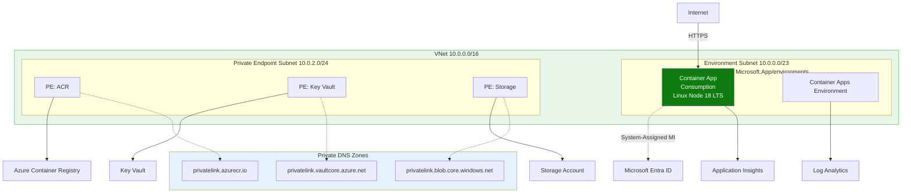
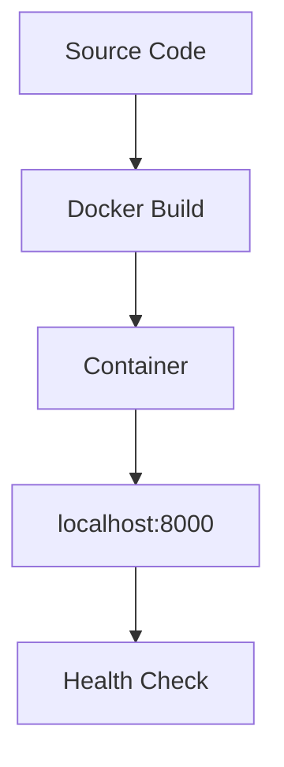

---
content_sources:
  diagrams:
    - id: this-tutorial-assumes-a-production-ready-container
      type: flowchart
      source: mslearn-adapted
      based_on:
        - https://learn.microsoft.com/azure/container-apps/quickstart-code-to-cloud
        - https://learn.microsoft.com/azure/container-apps/containers#configuration
    - id: local-development-workflow
      type: flowchart
      source: mslearn-adapted
      based_on:
        - https://learn.microsoft.com/azure/container-apps/quickstart-code-to-cloud
        - https://learn.microsoft.com/azure/container-apps/containers#configuration
---

# 01 - Run Locally with Docker

Before deploying to Azure Container Apps, validate your Node.js app in a container locally. This catches image, dependency, and port issues early.

!!! info "Infrastructure Context"
    **Service**: Container Apps (Consumption) | **Network**: VNet integrated | **VNet**: ✅

    This tutorial assumes a production-ready Container Apps deployment with a custom VNet, ACR with managed identity pull, and private endpoints for backend services.

    <!-- diagram-id: this-tutorial-assumes-a-production-ready-container -->


## Local Development Workflow

<!-- diagram-id: local-development-workflow -->


## Prerequisites

- Docker Engine or Docker Desktop
- Node.js and npm installed
- Source code with a Dockerfile

!!! tip "Aim for local-cloud parity"
    Keep local container port mapping and environment variable names aligned with your Azure deployment settings. This reduces revision failures caused by mismatched runtime assumptions.

## Step-by-step

1. **Build the container image**

    ```bash
    cd apps/nodejs
    docker build --tag aca-nodejs-guide .
    ```

    ???+ example "Expected output"
        ```text
        [1/5] FROM docker.io/library/node:20-slim
        [2/5] WORKDIR /app
        [3/5] COPY package*.json ./
        [4/5] RUN npm install --omit=dev
        [5/5] COPY src/ ./src/
        Successfully tagged aca-nodejs-guide:latest
        ```

2. **Run the container locally**

    ```bash
    # Copy and customize the environment file
    cp .env.example .env

    docker run --publish 8000:8000 --env-file .env aca-nodejs-guide
    ```

    ???+ example "Expected output"
        ```json
        {"timestamp":"2026-04-05T10:00:00.000Z","level":"INFO","message":"Server started on port 8000"}
        ```

3. **Verify health endpoint**

    ```bash
    curl http://localhost:8000/health
    ```

    ???+ example "Expected output"
        ```json
        {"status":"healthy","timestamp":"2026-04-05T10:01:00.000Z"}
        ```

    You can also verify runtime metadata:

    ```bash
    curl http://localhost:8000/info
    ```

    ???+ example "Expected output"
        ```json
        {"app":"azure-container-apps-nodejs-guide","version":"1.0.0","runtime":{"node":"v20.20.2","platform":"linux","arch":"x64"}}
        ```

4. **Inspect application logs**

    ```bash
    docker logs <container-id>
    ```

    ???+ example "Expected output"
        ```json
        {"timestamp":"2026-04-05T10:00:00.000Z","level":"INFO","message":"Server started on port 8000"}
        {"timestamp":"2026-04-05T10:01:00.000Z","level":"INFO","method":"GET","url":"/health","status":200}
        ```

    To find the container ID: `docker ps`

## Local parity checklist

- Application listens on port `8000` (or your configured container port)
- Required environment variables are present
- `/health` returns HTTP 200
- No startup exceptions in container logs

!!! warning "Do not commit local secret files"
    If you create a local `.env` file for testing, keep sensitive values out of source control and use placeholder values in shared examples.

## Advanced Topics

- Use multi-stage Docker builds to keep your production image lean and secure.
- Use `node --watch` during development to automatically restart the server on file changes.
- Add local Redis or MongoDB via `docker-compose` to mimic cloud dependencies.

## See Also

- [02 - First Deploy to Azure Container Apps](02-first-deploy.md)
- [03 - Configuration, Secrets, and Dapr](03-configuration.md)
- [Recipes Index](../recipes/index.md)

## Sources
- [Quickstart: Code to Cloud (Microsoft Learn)](https://learn.microsoft.com/azure/container-apps/quickstart-code-to-cloud)
- [Dockerfile requirements for Azure Container Apps (Microsoft Learn)](https://learn.microsoft.com/azure/container-apps/containers#configuration)
