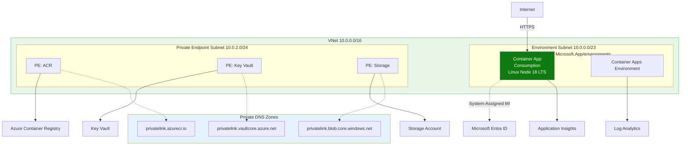
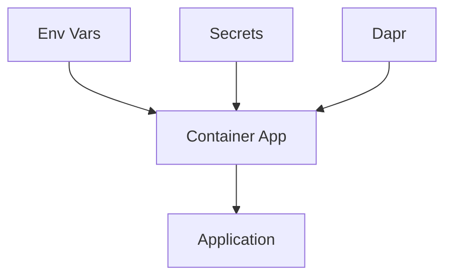

---
content_sources:
  diagrams:
  - id: this-tutorial-assumes-a-production-ready-container
    type: flowchart
    source: mslearn-adapted
    based_on:
    - https://learn.microsoft.com/azure/container-apps/containers
    - https://learn.microsoft.com/azure/container-apps/manage-secrets
  - id: configuration-flow
    type: flowchart
    source: mslearn-adapted
    based_on:
    - https://learn.microsoft.com/azure/container-apps/containers
    - https://learn.microsoft.com/azure/container-apps/manage-secrets
validation:
  az_cli:
    last_tested: null
    cli_version: null
    result: not_tested
  bicep:
    last_tested: null
    result: not_tested
content_validation:
  status: verified
  last_reviewed: '2026-05-23'
  reviewer: agent
  core_claims:
  - claim: This page uses Microsoft Learn as the primary source basis for its Azure-specific
      guidance.
    source: https://learn.microsoft.com/azure/container-apps/containers
    verified: true
---
# 03 - Configuration, Secrets, and Dapr

This step configures runtime settings in Azure Container Apps, including environment variables, secrets, KEDA scaling rules, and Dapr sidecar options.

!!! info "Infrastructure Context"
    **Service**: Container Apps (Consumption) | **Network**: VNet integrated | **VNet**: ✅

    This tutorial assumes a production-ready Container Apps deployment with a custom VNet, ACR with managed identity pull, and private endpoints for backend services.

    <!-- diagram-id: this-tutorial-assumes-a-production-ready-container -->


## Configuration Flow

<!-- diagram-id: configuration-flow -->


## Prerequisites

- Completed [02 - First Deploy to Azure Container Apps](02-first-deploy.md)
- A running Container App

## Step-by-step

1. **Set standard variables**

    ```bash
    RG="rg-nodejs-guide"
    BASE_NAME="nodejs-guide"
    DEPLOYMENT_NAME="main"

    APP_NAME=$(az deployment group show \
      --name "$DEPLOYMENT_NAME" \
      --resource-group "$RG" \
      --query "properties.outputs.containerAppName.value" \
      --output tsv)
    ```

2. **Set environment variables**

    ```bash
    az containerapp update \
      --name "$APP_NAME" \
      --resource-group "$RG" \
      --set-env-vars "LOG_LEVEL=INFO" "FEATURE_FLAG=true"
    ```

    | Command | Why it is used |
    |---|---|
    | `az containerapp update ...` | Updates the existing Container App configuration without recreating the app. |

    ???+ example "Expected output"
        ```json
        {
          "name": "ca-nodejs-guide-<unique-suffix>",
          "provisioningState": "Succeeded"
        }
        ```

3. **Store and reference a secret**

    ```bash
    az containerapp secret set \
      --name "$APP_NAME" \
      --resource-group "$RG" \
      --secrets "db-password=<secret-value>"
    ```

    | Command | Why it is used |
    |---|---|
    | `az containerapp secret set ...` | Manages Container Apps secrets without exposing secret values in plain configuration. |

    ???+ example "Expected output"
        ```text
        Containerapp must be restarted in order for secret changes to take effect.
        ```
        ```json
        [
          {
            "name": "db-password"
          }
        ]
        ```

    ```bash
    az containerapp update \
      --name "$APP_NAME" \
      --resource-group "$RG" \
      --set-env-vars "DB_PASSWORD=secretref:db-password"
    ```

    | Command | Why it is used |
    |---|---|
    | `az containerapp update ...` | Updates the existing Container App configuration without recreating the app. |

    ???+ example "Expected output"
        ```json
        {
          "name": "ca-nodejs-guide-<unique-suffix>",
          "provisioningState": "Succeeded"
        }
        ```

4. **Configure KEDA HTTP autoscaling**

    ```bash
    az containerapp update \
      --name "$APP_NAME" \
      --resource-group "$RG" \
      --min-replicas 0 \
      --max-replicas 10 \
      --scale-rule-name "http-scale" \
      --scale-rule-type "http" \
      --scale-rule-http-concurrency 50
    ```

    | Command | Why it is used |
    |---|---|
    | `az containerapp update ...` | Updates the existing Container App configuration without recreating the app. |

    ???+ example "Expected output"
        ```json
        {
          "name": "ca-nodejs-guide-<unique-suffix>",
          "provisioningState": "Succeeded"
        }
        ```

5. **Enable Dapr sidecar**

    ```bash
    az containerapp dapr enable \
      --name "$APP_NAME" \
      --resource-group "$RG" \
      --dapr-app-id "$APP_NAME" \
      --dapr-app-port 8000
    ```

    | Command | Why it is used |
    |---|---|
    | `az containerapp dapr enable ...` | Configures Dapr sidecar settings for the Container App. |

    ???+ example "Expected output"
        ```json
        {
          "appId": "ca-nodejs-guide-<unique-suffix>",
          "appPort": 8000,
          "appProtocol": "http",
          "enabled": true
        }
        ```

### Verify configuration in Azure Portal

![ca-nodejs-d38538 | Container App | Containers | Refresh | Send us your feedback | Container | Properties | Environment variables | Health probes | Volume mounts | Container details | Name | ca-nodejs-d38538 | Image source | Azure Container Registry | Authentication | Managed identity | Subscription | Visual Studio Enterprise Subscription | Registry | acrbasicsd38538.azurecr.io | Image | nodejs-sample | Image tag | v1 | Command override | Arguments override | Application | Revisions and replicas | Containers | Scale | Volumes | Settings | Networking | Ingress | Custom domains | CORS | Security | Monitoring | Log stream | Logs | Console | Alerts | Metrics](../../../assets/language-guides/nodejs/tutorial/03-containers-blade.png)

**[Observed]** `ca-nodejs-d38538`. `Container App`. `Containers`. `Refresh`. `Send us your feedback`. `Container`. `Properties`. `Environment variables`. `Health probes`. `Volume mounts`. `Container details`. `Name`. `ca-nodejs-d38538`. `Image source`. `Azure Container Registry`. `Docker Hub or other registries`. `Authentication`. `Managed identity`. `Secrets`. `Identity`. `System assigned`. `Subscription`. `Visual Studio Enterprise Subscription`. `Registry`. `acrbasicsd38538.azurecr.io`. `Image`. `nodejs-sample`. `Image tag`. `v1`. `Command override`. `Arguments override`. `Application`. `Revisions and replicas`. `Containers`. `Scale`. `Volumes`. `Settings`. `Networking`. `Ingress`. `Custom domains`. `CORS`. `Security`. `Monitoring`. `Log stream`. `Logs`. `Console`. `Alerts`. `Metrics`.

**[Inferred]** The `Environment variables` tab appears to map to the same `name=value` pairs supplied via `--set-env-vars` in [Step-by-step](#step-by-step). The `Image` field value `nodejs-sample` and `Image tag` value `v1` appear consistent with the `--image` reference set across [Step-by-step](#step-by-step). The `Registry` field value `acrbasicsd38538.azurecr.io` is consistent with the ACR login server referenced throughout [Step-by-step](#step-by-step). The left-navigation entry `Scale` is consistent with the `--scale-rule-*` levers configurable via the operations referenced in [Step-by-step](#step-by-step).

**[Not Proven]** The values configured for `NODE_ENV` and other environment variables are not visible on the `Properties` tab shown here. Any `secretref` mapping is not visible on the `Properties` tab shown here. The KEDA `http-scale` rule definition is not visible on the `Containers` blade. The Dapr `appId` and `appPort` values are not visible on the `Containers` blade.

## Node.js example: read config safely

In Node.js, environment variables are accessed via `process.env`. Use the `dotenv` package (already included in the reference app) for local development.

```javascript
// src/config.js
const LOG_LEVEL = process.env.LOG_LEVEL || 'INFO';
const FEATURE_FLAG = process.env.FEATURE_FLAG === 'true';
const DB_PASSWORD = process.env.DB_PASSWORD;

module.exports = { LOG_LEVEL, FEATURE_FLAG, DB_PASSWORD };
```

## Advanced Topics

- Use Managed Identity to pull secrets directly from Azure Key Vault.
- Implement a custom KEDA scaler (e.g., Azure Service Bus) for event-driven processing.
- Use Dapr components for state management and pub/sub without writing SDK-specific code.

## See Also

- [04 - Logging, Monitoring, and Observability](04-logging-monitoring.md)
- [07 - Revisions and Traffic Splitting](07-revisions-traffic.md)
- [Recipes Index](../recipes/index.md)

## Sources
- [Containers (Microsoft Learn)](https://learn.microsoft.com/azure/container-apps/containers)
- [Manage secrets in Azure Container Apps (Microsoft Learn)](https://learn.microsoft.com/azure/container-apps/manage-secrets)
