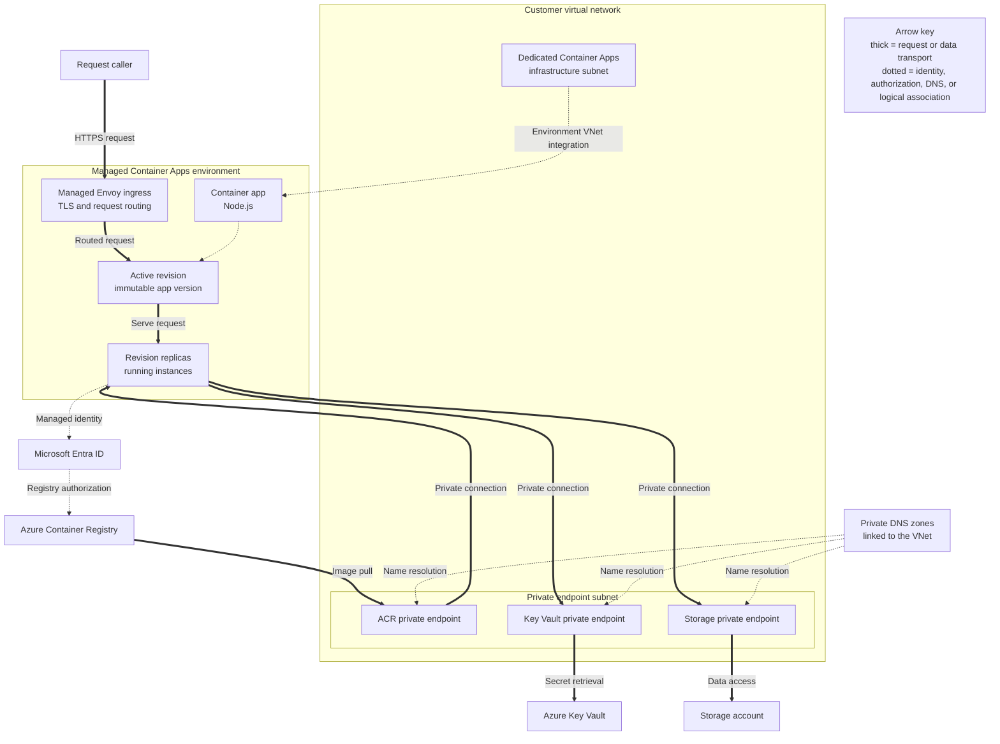
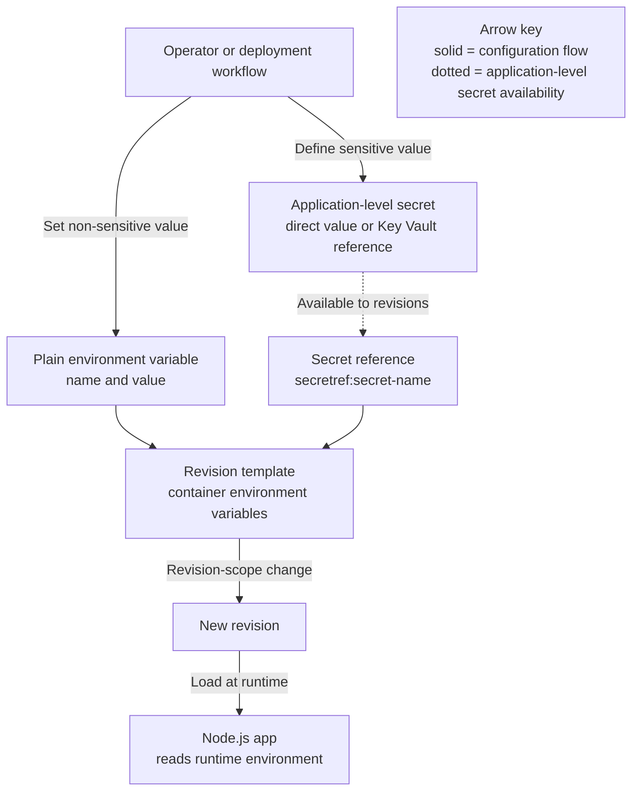

---
content_sources:
  diagrams:
    - id: this-tutorial-assumes-a-production-ready-container
      type: flowchart
      source: mslearn-adapted
      based_on:
        - https://learn.microsoft.com/en-us/azure/container-apps/networking
        - https://learn.microsoft.com/en-us/azure/container-apps/managed-identity-image-pull
        - https://learn.microsoft.com/en-us/azure/container-apps/private-endpoints-with-dns
    - id: configuration-flow
      type: flowchart
      source: mslearn-adapted
      based_on:
        - https://learn.microsoft.com/en-us/azure/container-apps/containers
        - https://learn.microsoft.com/en-us/azure/container-apps/environment-variables
        - https://learn.microsoft.com/en-us/azure/container-apps/manage-secrets
validation:
  az_cli:
    last_tested:
    cli_version:
    result: not_tested
  bicep:
    last_tested:
    result: not_tested
---
# 03 - Configuration, Secrets, and Dapr

This step configures runtime settings in Azure Container Apps, including environment variables, secrets, KEDA scaling rules, and Dapr sidecar options.

!!! info "Infrastructure Context"
    **Service**: Container Apps (Consumption) | **Network**: VNet integrated | **VNet**: ✅

    This tutorial assumes a production-ready Container Apps deployment with a custom VNet, ACR with managed identity pull, and private endpoints for backend services.

    <!-- diagram-id: this-tutorial-assumes-a-production-ready-container -->

```mermaid
flowchart TD
    accTitle: Production-ready Container Apps context for the Node.js tutorial
    accDescr: A caller reaches managed ingress and an active Node.js revision. The app uses managed identity for an Azure Container Registry image pull and reaches backend services through private endpoints whose DNS zones are linked to the virtual network.

    CALLER["Request caller"]
    ACR["Azure Container Registry"]
    KV["Azure Key Vault"]
    STORAGE["Storage account"]
    ENTRA["Microsoft Entra ID"]
    DNS["Private DNS zones<br/>linked to the VNet"]

    subgraph VNET["Customer virtual network"]
        INFRA["Dedicated Container Apps<br/>infrastructure subnet"]
        subgraph PESUBNET["Private endpoint subnet"]
            PE_ACR["ACR private endpoint"]
            PE_KV["Key Vault private endpoint"]
            PE_STORAGE["Storage private endpoint"]
        end
    end

    subgraph ENV["Managed Container Apps environment"]
        INGRESS["Managed Envoy ingress<br/>TLS and request routing"]
        APP["Container app<br/>Node.js"]
        REVISION["Active revision<br/>immutable app version"]
        REPLICAS["Revision replicas<br/>running instances"]
    end

    CALLER ==>|"HTTPS request"| INGRESS
    INGRESS ==>|"Routed request"| REVISION
    INFRA -.->|"Environment VNet integration"| APP
    APP -.-> REVISION
    REVISION ==>|"Serve request"| REPLICAS
    REPLICAS -.->|"Managed identity"| ENTRA
    ENTRA -.->|"Registry authorization"| ACR
    ACR ==>|"Image pull"| PE_ACR
    PE_ACR ==>|"Private connection"| REPLICAS
    REPLICAS ==>|"Private connection"| PE_KV
    PE_KV ==>|"Secret retrieval"| KV
    REPLICAS ==>|"Private connection"| PE_STORAGE
    PE_STORAGE ==>|"Data access"| STORAGE
    DNS -.->|"Name resolution"| PE_ACR
    DNS -.->|"Name resolution"| PE_KV
    DNS -.->|"Name resolution"| PE_STORAGE

    LEGEND["Arrow key<br/>thick = request or data transport<br/>dotted = identity, authorization, DNS, or logical association"]
```

*Figure: The tutorial's shared production context. The Container Apps environment is a managed logical boundary integrated with a dedicated subnet; ACR, Key Vault, Storage, private DNS zones, and Microsoft Entra ID remain separate Azure resources.*

## Configuration Flow

<!-- diagram-id: configuration-flow -->

```mermaid
flowchart TD
    accTitle: Container Apps configuration flow for Node.js
    accDescr: An operator defines plain environment variables or application-level secrets. A revision template references those values, a new revision receives them at runtime, and the Node.js app reads the resulting environment variables.

    OPERATOR["Operator or deployment workflow"]
    PLAIN["Plain environment variable<br/>name and value"]
    SECRET["Application-level secret<br/>direct value or Key Vault reference"]
    TEMPLATE["Revision template<br/>container environment variables"]
    REFERENCE["Secret reference<br/>secretref:secret-name"]
    REVISION["New revision"]
    APP["Node.js app<br/>reads runtime environment"]

    OPERATOR -->|"Set non-sensitive value"| PLAIN
    OPERATOR -->|"Define sensitive value"| SECRET
    PLAIN --> TEMPLATE
    SECRET -.->|"Available to revisions"| REFERENCE
    REFERENCE --> TEMPLATE
    TEMPLATE -->|"Revision-scope change"| REVISION
    REVISION -->|"Load at runtime"| APP

    LEGEND["Arrow key<br/>solid = configuration flow<br/>dotted = application-level secret availability"]
```

*Figure: Environment-variable changes are revision-scoped, while secrets are application-scoped. A secret becomes runtime configuration only when the revision template references it.*

## Prerequisites

- Completed [02 - First Deploy to Azure Container Apps](02-first-deploy.md)
- A running Container App

## Step-by-step

1. **Set standard variables**

    ```bash
    RG="rg-nodejs-guide"
    BASE_NAME="nodejs-guide"
    DEPLOYMENT_NAME="main"

    APP_NAME=$(az deployment group show \
      --name "$DEPLOYMENT_NAME" \
      --resource-group "$RG" \
      --query "properties.outputs.containerAppName.value" \
      --output tsv)
    ```

    | Command/Parameter | Purpose |
    |---|---|
    | `az deployment group show` | Reads outputs from the existing resource-group deployment for reuse in this tutorial. |
    | `--name` | Selects the existing Bicep deployment whose outputs are being read. |
    | `--resource-group` | Targets the resource group that contains the tutorial resources. |
    | `--query` | Extracts `properties.outputs.containerAppName.value` from the command result for this verification or shell variable. |
    | `--output` | Returns the selected value in `tsv)` format for shell capture or readable verification. |

2. **Set environment variables**

    ```bash
    az containerapp update \
      --name "$APP_NAME" \
      --resource-group "$RG" \
      --set-env-vars "LOG_LEVEL=INFO" "FEATURE_FLAG=true"
    ```

    | Command/Parameter | Purpose |
    |---|---|
    | `az containerapp update` | Updates the target Container App with the configuration values in this step. |
    | `--name` | Targets the Container App being configured or inspected in this step. |
    | `--resource-group` | Targets the resource group that contains the tutorial resources. |
    | `--set-env-vars` | Sets the application environment variables or secret references shown in this step. |

    ???+ example "Expected output"
        ```json
        {
          "name": "ca-nodejs-guide-<unique-suffix>",
          "provisioningState": "Succeeded"
        }
        ```

3. **Store and reference a secret**

    ```bash
    az containerapp secret set \
      --name "$APP_NAME" \
      --resource-group "$RG" \
      --secrets "db-password=<secret-value>"
    ```

    | Command/Parameter | Purpose |
    |---|---|
    | `az containerapp secret set` | Creates or updates the named Container Apps secret used by this step. |
    | `--name` | Targets the Container App being configured or inspected in this step. |
    | `--resource-group` | Targets the resource group that contains the tutorial resources. |
    | `--secrets` | Defines the Container Apps secret value or Key Vault reference shown in this step. |

    ???+ example "Expected output"
        ```text
        Containerapp must be restarted in order for secret changes to take effect.
        ```
        ```json
        [
          {
            "name": "db-password"
          }
        ]
        ```

    ```bash
    az containerapp update \
      --name "$APP_NAME" \
      --resource-group "$RG" \
      --set-env-vars "DB_PASSWORD=secretref:db-password"
    ```

    | Command/Parameter | Purpose |
    |---|---|
    | `az containerapp update` | Updates the target Container App with the configuration values in this step. |
    | `--name` | Targets the Container App being configured or inspected in this step. |
    | `--resource-group` | Targets the resource group that contains the tutorial resources. |
    | `--set-env-vars` | Sets the application environment variables or secret references shown in this step. |

    ???+ example "Expected output"
        ```json
        {
          "name": "ca-nodejs-guide-<unique-suffix>",
          "provisioningState": "Succeeded"
        }
        ```

4. **Configure KEDA HTTP autoscaling**

    ```bash
    az containerapp update \
      --name "$APP_NAME" \
      --resource-group "$RG" \
      --min-replicas 0 \
      --max-replicas 10 \
      --scale-rule-name "http-scale" \
      --scale-rule-type "http" \
      --scale-rule-http-concurrency 50
    ```

    | Command/Parameter | Purpose |
    |---|---|
    | `az containerapp update` | Updates the target Container App with the configuration values in this step. |
    | `--name` | Targets the Container App being configured or inspected in this step. |
    | `--resource-group` | Targets the resource group that contains the tutorial resources. |
    | `--min-replicas` | Allows the HTTP-scaled app to scale down to the configured minimum replica count. |
    | `--max-replicas` | Caps the HTTP-scaled app at the configured maximum replica count. |
    | `--scale-rule-name` | Names the scaling rule so it can be identified in the app configuration. |
    | `--scale-rule-type` | Selects the HTTP or Azure Service Bus scaler used in this step. |
    | `--scale-rule-http-concurrency` | Sets the concurrent-request threshold used by the HTTP scaling rule. |

    ???+ example "Expected output"
        ```json
        {
          "name": "ca-nodejs-guide-<unique-suffix>",
          "provisioningState": "Succeeded"
        }
        ```

5. **Enable Dapr sidecar**

    ```bash
    az containerapp dapr enable \
      --name "$APP_NAME" \
      --resource-group "$RG" \
      --dapr-app-id "$APP_NAME" \
      --dapr-app-port 8000
    ```

    | Command/Parameter | Purpose |
    |---|---|
    | `az containerapp dapr enable` | Enables and configures the Dapr sidecar for the target Container App. |
    | `--name` | Targets the Container App being configured or inspected in this step. |
    | `--resource-group` | Targets the resource group that contains the tutorial resources. |
    | `--dapr-app-id` | Sets the Dapr application ID used to identify this service. |
    | `--dapr-app-port` | Sets the application port that the Dapr sidecar calls. |

    ???+ example "Expected output"
        ```json
        {
          "appId": "ca-nodejs-guide-<unique-suffix>",
          "appPort": 8000,
          "appProtocol": "http",
          "enabled": true
        }
        ```

### Verify configuration in Azure Portal

![ca-nodejs-d38538 | Container App | Containers | Refresh | Send us your feedback | Container | Properties | Environment variables | Health probes | Volume mounts | Container details | Name | ca-nodejs-d38538 | Image source | Azure Container Registry | Authentication | Managed identity | Subscription | Visual Studio Enterprise Subscription | Registry | acrbasicsd38538.azurecr.io | Image | nodejs-sample | Image tag | v1 | Command override | Arguments override | Application | Revisions and replicas | Containers | Scale | Volumes | Settings | Networking | Ingress | Custom domains | CORS | Security | Monitoring | Log stream | Logs | Console | Alerts | Metrics](../../../assets/language-guides/nodejs/tutorial/03-containers-blade.png)

**[Observed]** `ca-nodejs-d38538`. `Container App`. `Containers`. `Refresh`. `Send us your feedback`. `Container`. `Properties`. `Environment variables`. `Health probes`. `Volume mounts`. `Container details`. `Name`. `ca-nodejs-d38538`. `Image source`. `Azure Container Registry`. `Docker Hub or other registries`. `Authentication`. `Managed identity`. `Secrets`. `Identity`. `System assigned`. `Subscription`. `Visual Studio Enterprise Subscription`. `Registry`. `acrbasicsd38538.azurecr.io`. `Image`. `nodejs-sample`. `Image tag`. `v1`. `Command override`. `Arguments override`. `Application`. `Revisions and replicas`. `Containers`. `Scale`. `Volumes`. `Settings`. `Networking`. `Ingress`. `Custom domains`. `CORS`. `Security`. `Monitoring`. `Log stream`. `Logs`. `Console`. `Alerts`. `Metrics`.

**[Inferred]** The `Environment variables` tab appears to map to the same `name=value` pairs supplied via `--set-env-vars` in [Step-by-step](#step-by-step). The `Image` field value `nodejs-sample` and `Image tag` value `v1` appear consistent with the `--image` reference set across [Step-by-step](#step-by-step). The `Registry` field value `acrbasicsd38538.azurecr.io` is consistent with the ACR login server referenced throughout [Step-by-step](#step-by-step). The left-navigation entry `Scale` is consistent with the `--scale-rule-*` levers configurable via the operations referenced in [Step-by-step](#step-by-step).

**[Not Proven]** Additional configuration detail, secret-binding detail, and integration detail are not visible on this view.

## Node.js example: read config safely

In Node.js, environment variables are accessed via `process.env`. Use the `dotenv` package (already included in the reference app) for local development.

```javascript
// src/config.js
const LOG_LEVEL = process.env.LOG_LEVEL || 'INFO';
const FEATURE_FLAG = process.env.FEATURE_FLAG === 'true';
const DB_PASSWORD = process.env.DB_PASSWORD;

module.exports = { LOG_LEVEL, FEATURE_FLAG, DB_PASSWORD };
```

## Advanced Topics

- Use Managed Identity to pull secrets directly from Azure Key Vault.
- Implement a custom KEDA scaler (e.g., Azure Service Bus) for event-driven processing.
- Use Dapr components for state management and pub/sub without writing SDK-specific code.

## See Also

- [04 - Logging, Monitoring, and Observability](04-logging-monitoring.md)
- [07 - Revisions and Traffic Splitting](07-revisions-traffic.md)
- [Recipes Index](../recipes/index.md)

## Sources
- [Networking in an Azure Container Apps environment (Microsoft Learn)](https://learn.microsoft.com/en-us/azure/container-apps/networking)
- [Azure Container Apps image pull from ACR with managed identity (Microsoft Learn)](https://learn.microsoft.com/en-us/azure/container-apps/managed-identity-image-pull)
- [Private endpoints and DNS for Container Apps environments (Microsoft Learn)](https://learn.microsoft.com/en-us/azure/container-apps/private-endpoints-with-dns)
- [Manage environment variables on Azure Container Apps (Microsoft Learn)](https://learn.microsoft.com/en-us/azure/container-apps/environment-variables)
- [Containers (Microsoft Learn)](https://learn.microsoft.com/en-us/azure/container-apps/containers)
- [Manage secrets in Azure Container Apps (Microsoft Learn)](https://learn.microsoft.com/en-us/azure/container-apps/manage-secrets)
