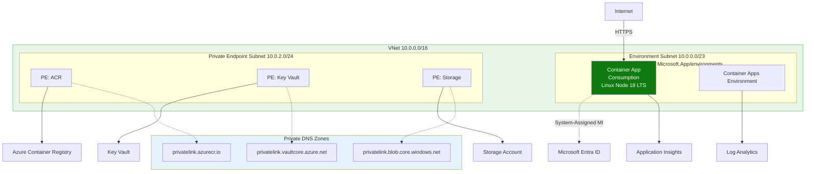
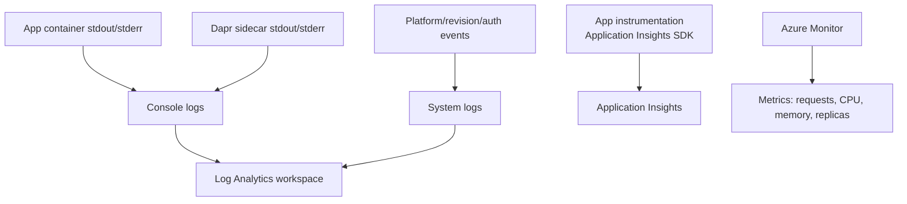
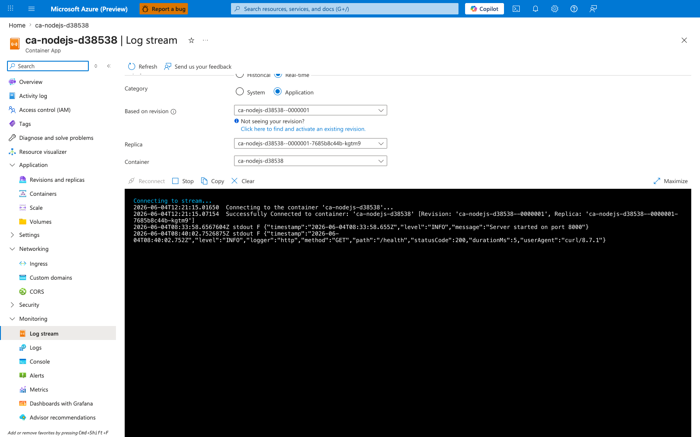

---
content_sources:
  diagrams:
  - id: this-tutorial-assumes-a-production-ready-container
    type: flowchart
    source: mslearn-adapted
    based_on:
    - https://learn.microsoft.com/azure/container-apps/log-monitoring
    - https://learn.microsoft.com/azure/container-apps/observability
  - id: how-observability-works-in-container-apps
    type: flowchart
    source: mslearn-adapted
    based_on:
    - https://learn.microsoft.com/azure/container-apps/log-monitoring
    - https://learn.microsoft.com/azure/container-apps/observability
validation:
  az_cli:
    last_tested: null
    cli_version: null
    result: not_tested
  bicep:
    last_tested: null
    result: not_tested
content_validation:
  status: verified
  last_reviewed: '2026-05-23'
  reviewer: agent
  core_claims:
  - claim: This page uses Microsoft Learn as the primary source basis for its Azure-specific
      guidance.
    source: https://learn.microsoft.com/azure/container-apps/log-monitoring
    verified: true
---
# 04 - Logging, Monitoring, and Observability

This tutorial step shows how to inspect console logs, query Log Analytics, and add Application Insights-based observability for production operations.

!!! info "Infrastructure Context"
    **Service**: Container Apps (Consumption) | **Network**: VNet integrated | **VNet**: ✅

    This tutorial assumes a production-ready Container Apps deployment with a custom VNet, ACR with managed identity pull, and private endpoints for backend services.

    <!-- diagram-id: this-tutorial-assumes-a-production-ready-container -->


## How Observability Works in Container Apps

<!-- diagram-id: how-observability-works-in-container-apps -->


## Prerequisites

- Completed [03 - Configuration, Secrets, and Dapr](03-configuration.md)
- Log Analytics connected to your Container Apps environment

## Step-by-step

1. **Set standard variables**

    ```bash
    RG="rg-nodejs-guide"
    APP_NAME=$(az containerapp list --resource-group "$RG" --query "[0].name" --output tsv)
    ```

2. **Stream console logs**

    ```bash
    az containerapp logs show \
      --name "$APP_NAME" \
      --resource-group "$RG" \
      --follow
    ```

    | Command | Why it is used |
    |---|---|
    | `az containerapp logs show ...` | Runs the Azure CLI operation required by the documented step. |

    ???+ example "Expected output"
        ```json
        {"timestamp":"2026-04-05T11:00:00.000Z","level":"INFO","message":"Server started on port 8000"}
        {"timestamp":"2026-04-05T11:01:00.000Z","level":"INFO","method":"GET","url":"/health","status":200}
        ```

    !!! note
        Use Ctrl+C to stop following logs.

3. **Check system logs for startup or image issues**

    ```bash
    az containerapp logs show \
      --name "$APP_NAME" \
      --resource-group "$RG" \
      --type system
    ```

    | Command | Why it is used |
    |---|---|
    | `az containerapp logs show ...` | Runs the Azure CLI operation required by the documented step. |

    ???+ example "Expected output"
        ```json
        {"TimeStamp":"2026-04-05T11:00:00Z","Type":"Normal","ContainerAppName":"<your-app-name>","Reason":"ConnectedToEventsServer","Msg":"Successfully connected to events server"}
        ```

4. **Query logs via CLI (recommended for automation)**

    Get your Log Analytics workspace ID and run KQL queries directly from the command line:

    ```bash
    # Get the workspace ID
    WORKSPACE_ID=$(az monitor log-analytics workspace list \
      --resource-group "$RG" \
      --query "[0].customerId" \
      --output tsv)

    # Query console logs (use your actual app name from $APP_NAME)
    az monitor log-analytics query \
      --workspace $WORKSPACE_ID \
      --analytics-query "ContainerAppConsoleLogs_CL | where ContainerAppName_s == '$APP_NAME' | project TimeGenerated, ContainerAppName_s, Log_s | take 5" \
      --output table
    ```

    | Command | Why it is used |
    |---|---|
    | `az monitor log-analytics ...` | Creates or inspects Azure Monitor alerts, diagnostic settings, or metrics. |

    ???+ example "Expected output"
        ```text
        ContainerAppName_s    Log_s                                                                                          TimeGenerated
        --------------------  ---------------------------------------------------------------------------------------------  ----------------------------
        <your-app-name>       {"timestamp":"2026-04-04T16:10:50.376Z","level":"INFO","message":"Server started on port 8000"}  2026-04-04T16:10:51.723Z
        <your-app-name>       {"timestamp":"2026-04-04T16:11:58.005Z","level":"INFO","method":"GET","path":"/health",...}      2026-04-04T16:11:58.474Z
        ```

5. **Query for errors via CLI**

    ```bash
    az monitor log-analytics query \
      --workspace $WORKSPACE_ID \
      --analytics-query "ContainerAppConsoleLogs_CL | where ContainerAppName_s == '$APP_NAME' | where Log_s has_any ('error', 'exception', 'failed') | project TimeGenerated, Log_s | take 10" \
      --output table
    ```

    | Command | Why it is used |
    |---|---|
    | `az monitor log-analytics ...` | Creates or inspects Azure Monitor alerts, diagnostic settings, or metrics. |

    ???+ example "Expected output"
        If no errors exist, the query returns an empty result set:

        ```text
        TableName
        -------------
        PrimaryResult
        ```

        If errors exist, they appear with timestamps:

        ```text
        TimeGenerated                 Log_s
        ----------------------------  -------------------------------------------------------
        2026-04-05T11:05:00.000Z      {"level":"ERROR","message":"Database connection failed"}
        ```

6. **Enable Application Insights (OpenTelemetry)**

    The reference app includes the `applicationinsights` SDK. To enable it, provide the connection string:

    ```bash
    # Get connection string from your App Insights resource
    CONNECTION_STRING="InstrumentationKey=...;IngestionEndpoint=..."

    az containerapp update \
      --name "$APP_NAME" \
      --resource-group "$RG" \
      --set-env-vars "APPLICATIONINSIGHTS_CONNECTION_STRING=$CONNECTION_STRING"
    ```

    | Command | Why it is used |
    |---|---|
    | `az containerapp update ...` | Updates the existing Container App configuration without recreating the app. |

    The app will automatically start collecting:
    - HTTP request metrics (latency, throughput)
    - Exception traces
    - Console log redirection to App Insights
    - Dependency tracking (outbound HTTP calls)

## Node.js Structured Logging

The reference app uses a custom middleware to emit JSON logs. This ensures logs are easily searchable in Log Analytics.

```javascript
// src/middleware/logging.js
const jsonLogger = (req, res, next) => {
  res.on('finish', () => {
    console.log(JSON.stringify({
      timestamp: new Date().toISOString(),
      level: 'INFO',
      method: req.method,
      url: req.url,
      status: res.statusCode
    }));
  });
  next();
};
```

## Advanced Topics

- Use the `winston` or `pino` libraries for more advanced logging features like log levels and multiple transports.
- Configure custom metrics in Application Insights to track business-specific KPIs.
- Use Service Map in Application Insights to visualize dependencies between your microservices.

### Verify log stream in Azure Portal



**[Observed]** `Microsoft Azure (Preview)`. `Report a bug`. `Search resources, services, and docs (G+/)`. `Copilot`. `Home`. `ca-nodejs-d38538`. `Container App`. `Log stream`. `Refresh`. `Send us your feedback`. `Historical`. `Real-time`. `Category`. `System`. `Application`. `Based on revision`. `ca-nodejs-d38538--0000001`. `Not seeing your revision?`. `Click here to find and activate an existing revision.`. `Replica`. `ca-nodejs-d38538--0000001-7685b8c44b-kgtm9`. `Container`. `ca-nodejs-d38538`. `Reconnect`. `Stop`. `Copy`. `Clear`. `Maximize`. `Connecting to stream...`. `2026-06-04T12:21:15.01650  Connecting to the container 'ca-nodejs-d38538'...`. `2026-06-04T12:21:15.07154  Successfully Connected to container: 'ca-nodejs-d38538' [Revision: 'ca-nodejs-d38538--0000001', Replica: 'ca-nodejs-d38538--0000001-7685b8c44b-kgtm9']`. `2026-06-04T08:33:58.6567604Z stdout F {"timestamp":"2026-06-04T08:33:58.655Z","level":"INFO","message":"Server started on port 8000"}`. `2026-06-04T08:40:02.7526875Z stdout F {"timestamp":"2026-06-04T08:40:02.752Z","level":"INFO","logger":"http","method":"GET","path":"/health","statusCode":200,"durationMs":5,"userAgent":"curl/8.7.1"}`. `Overview`. `Activity log`. `Access control (IAM)`. `Tags`. `Diagnose and solve problems`. `Resource visualizer`. `Application`. `Revisions and replicas`. `Containers`. `Scale`. `Volumes`. `Settings`. `Networking`. `Ingress`. `Custom domains`. `CORS`. `Security`. `Monitoring`. `Log stream`. `Logs`. `Console`. `Alerts`. `Metrics`. `Dashboards with Grafana`. `Advisor recommendations`.

**[Inferred]** The `Real-time` radio appears to map to the live tail behavior triggered by `az containerapp logs show --follow` in [Step-by-step](#step-by-step) Step 2. The `Category` toggle value `Application` appears consistent with the default console-log stream from [Step-by-step](#step-by-step) Step 2, and the `System` option appears consistent with the system-log selector exercised in [Step-by-step](#step-by-step) Step 3. The displayed log line `{"timestamp":"2026-06-04T08:33:58.655Z","level":"INFO","message":"Server started on port 8000"}` appears consistent with the `Server started on port 8000` startup log shape shown in the expected output of [Step-by-step](#step-by-step) Step 2. The displayed log line containing `"method":"GET","path":"/health","statusCode":200` appears consistent with the per-request structured JSON log shape (containing HTTP method, URL, and status fields) shown in the second expected output line of [Step-by-step](#step-by-step) Step 2.

**[Not Proven]** Additional log query output, trace export detail, and CLI command output are not visible on this view.

## See Also

- [03 - Configuration, Secrets, and Dapr](03-configuration.md)
- [06 - CI/CD with GitHub Actions](06-ci-cd.md)
- [Recipes Index](../recipes/index.md)

## Sources
- [Log monitoring (Microsoft Learn)](https://learn.microsoft.com/azure/container-apps/log-monitoring)
- [Observability in Azure Container Apps (Microsoft Learn)](https://learn.microsoft.com/azure/container-apps/observability)
