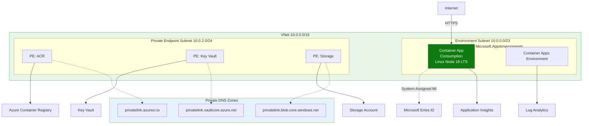
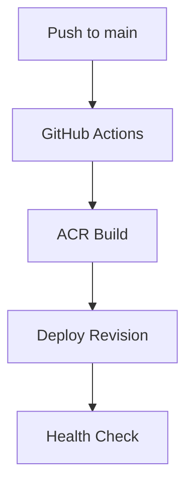
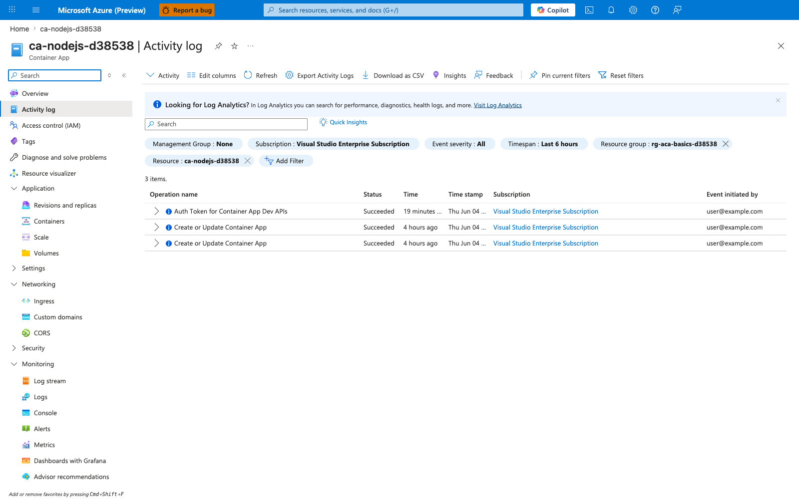

---
content_sources:
  diagrams:
  - id: this-tutorial-assumes-a-production-ready-container
    type: flowchart
    source: mslearn-adapted
    based_on:
    - https://learn.microsoft.com/azure/container-apps/github-actions
    - https://learn.microsoft.com/azure/developer/github/connect-from-azure
  - id: ci-cd-pipeline-flow
    type: flowchart
    source: mslearn-adapted
    based_on:
    - https://learn.microsoft.com/azure/container-apps/github-actions
    - https://learn.microsoft.com/azure/developer/github/connect-from-azure
validation:
  az_cli:
    last_tested: null
    cli_version: null
    result: not_tested
  bicep:
    last_tested: null
    result: not_tested
---
# 06 - CI/CD with GitHub Actions

Automate build and deployment so every commit can produce a new Container App revision. This tutorial uses GitHub Actions, ACR, and Azure Container Apps deploy actions.

!!! info "Infrastructure Context"
    **Service**: Container Apps (Consumption) | **Network**: VNet integrated | **VNet**: ✅

    This tutorial assumes a production-ready Container Apps deployment with a custom VNet, ACR with managed identity pull, and private endpoints for backend services.

    <!-- diagram-id: this-tutorial-assumes-a-production-ready-container -->


## CI/CD Pipeline Flow

<!-- diagram-id: ci-cd-pipeline-flow -->


## Prerequisites

- Completed [05 - Infrastructure as Code with Bicep](05-infrastructure-as-code.md)
- GitHub repository with Actions enabled
- Azure service principal stored as GitHub secret

!!! warning "Never expose credentials in workflow logs"
    Keep all credential material in GitHub Secrets and avoid printing secret-derived values in shell steps. Use masked placeholders in documentation and workflow examples.

## Step-by-step

1. **Configure repository variables and secrets**

    - Variables: `RESOURCE_GROUP`, `APP_NAME`, `ACR_NAME`
    - Secrets: `AZURE_CREDENTIALS`, `REGISTRY_USERNAME`, `REGISTRY_PASSWORD`

    Example `AZURE_CREDENTIALS` JSON (masked):

    ```json
    {
      "clientId": "xxxxxxxx-xxxx-xxxx-xxxx-xxxxxxxxxxxx",
      "clientSecret": "<client-secret>",
      "subscriptionId": "<subscription-id>",
      "tenantId": "<tenant-id>"
    }
    ```

2. **Create workflow file**

    Create a file at `.github/workflows/deploy.yml` in your repository:

    ```yaml
    name: Deploy Node.js App to ACA

    on:
      push:
        branches: [ main ]
        paths:
          - 'apps/nodejs/**'
          - '.github/workflows/deploy.yml'

    jobs:
      build-and-deploy:
        runs-on: ubuntu-latest
        steps:
          - name: Checkout
            uses: actions/checkout@v4

          - name: Azure Login
            uses: azure/login@v2
            with:
              creds: ${{ secrets.AZURE_CREDENTIALS }}

          - name: ACR Login
            uses: azure/docker-login@v2
            with:
              login-server: ${{ vars.ACR_NAME }}.azurecr.io
              username: ${{ secrets.REGISTRY_USERNAME }}
              password: ${{ secrets.REGISTRY_PASSWORD }}

          - name: Build and push image
            run: |
              docker build --tag ${{ vars.ACR_NAME }}.azurecr.io/${{ vars.APP_NAME }}:${{ github.sha }} ./apps/nodejs
              docker push ${{ vars.ACR_NAME }}.azurecr.io/${{ vars.APP_NAME }}:${{ github.sha }}

          - name: Deploy Container App
            uses: azure/container-apps-deploy-action@v1
            with:
              imageToDeploy: ${{ vars.ACR_NAME }}.azurecr.io/${{ vars.APP_NAME }}:${{ github.sha }}
              resourceGroup: ${{ vars.RESOURCE_GROUP }}
              containerAppName: ${{ vars.APP_NAME }}
    ```

3. **Validate rollout behavior**

    - Trigger workflow from a commit to `main`.
    - Confirm a new revision was created.
    - Confirm traffic moved to healthy revision.

    ```bash
    az containerapp revision list \
      --name "$APP_NAME" \
      --resource-group "$RG" \
      --query "[].{name:name,active:properties.active,trafficWeight:properties.trafficWeight,healthState:properties.healthState}"
    ```

    | Command | Why it is used |
    |---|---|
    | `az containerapp revision list ...` | Lists revisions so rollout state, traffic, and health can be verified. |

    ???+ example "Expected output"
        ```json
        [
          {
            "name": "<your-app-name>--0000001",
            "active": false,
            "trafficWeight": 0,
            "healthState": "Healthy"
          },
          {
            "name": "<your-app-name>--0000002",
            "active": true,
            "trafficWeight": 100,
            "healthState": "Healthy"
          }
        ]
        ```

## Node.js Specific CI Tips

- **Run Tests**: Add a step to run `npm test` before building the Docker image.
- **Security Audit**: Use `npm audit` to check for known vulnerabilities in your dependencies.
- **Linting**: Run `npm run lint` to ensure code quality before deployment.

```yaml
          - name: Install dependencies
            run: npm install
            working-directory: ./apps/nodejs

          - name: Run tests
            run: npm test
            working-directory: ./apps/nodejs
```

## Advanced Topics

- Implement multi-environment pipelines (dev -> staging -> prod) with approval gates.
- Use GitHub environments to manage secrets and variables for different stages.
- Integrate with Azure Load Testing to validate performance after deployment.

!!! tip "Use immutable image tags in pipelines"
    Prefer commit SHA or release-based tags for image versions. Immutable tags make revision-to-commit tracing straightforward during incident response.

### Verify deployment activity in Azure Portal



**[Observed]** `Microsoft Azure (Preview)`. `Report a bug`. `Search resources, services, and docs (G+/)`. `Copilot`. `Home`. `ca-nodejs-d38538`. `Container App`. `Activity log`. `Activity`. `Edit columns`. `Refresh`. `Export Activity Logs`. `Download as CSV`. `Insights`. `Feedback`. `Pin current filters`. `Reset filters`. `Looking for Log Analytics?`. `Visit Log Analytics`. `Search`. `Quick Insights`. `Management Group`. `None`. `Subscription`. `Visual Studio Enterprise Subscription`. `Event severity`. `All`. `Timespan`. `Last 6 hours`. `Resource group`. `rg-aca-basics-d38538`. `Resource`. `ca-nodejs-d38538`. `Add Filter`. `3 items.`. `Operation name`. `Status`. `Time`. `Time stamp`. `Subscription`. `Event initiated by`. `Auth Token for Container App Dev APIs`. `Create or Update Container App`. `Succeeded`. `19 minutes ...`. `4 hours ago`. `Thu Jun 04 ...`. `user@example.com`. `Overview`. `Activity log`. `Access control (IAM)`. `Tags`. `Diagnose and solve problems`. `Resource visualizer`. `Application`. `Revisions and replicas`. `Containers`. `Scale`. `Volumes`. `Settings`. `Networking`. `Ingress`. `Custom domains`. `CORS`. `Security`. `Monitoring`. `Log stream`. `Logs`. `Console`. `Alerts`. `Metrics`. `Dashboards with Grafana`. `Advisor recommendations`.

**[Inferred]** The resource-scoped filter chips `Resource group` value `rg-aca-basics-d38538` and `Resource` value `ca-nodejs-d38538` appear to map to the same `${{ vars.RESOURCE_GROUP }}` and `${{ vars.APP_NAME }}` values passed to `resourceGroup` and `containerAppName` by the `azure/container-apps-deploy-action@v1` step in [Step-by-step](#step-by-step) Step 2. The `Create or Update Container App` row appears consistent with the deployment outcome that the same `azure/container-apps-deploy-action@v1` step in [Step-by-step](#step-by-step) Step 2 is expected to trigger when the workflow runs against the configured `containerAppName`. The `Succeeded` `Status` appears consistent with the healthy rollout signal that [Step-by-step](#step-by-step) Step 3 looks for via `az containerapp revision list`, where `healthState: "Healthy"` and `trafficWeight: 100` are expected on the active revision. The repeated `Create or Update Container App` rows with `Succeeded` `Status` within the `Last 6 hours` `Timespan` appear consistent with multiple workflow runs invoking the `azure/container-apps-deploy-action@v1` step in [Step-by-step](#step-by-step) Step 2 against the same `containerAppName`.

**[Not Proven]** Additional GitHub Actions workflow output and CLI command output are not visible on this view.

## See Also
- [07 - Revisions and Traffic Splitting](07-revisions-traffic.md)
- [05 - Infrastructure as Code with Bicep](05-infrastructure-as-code.md)
- [Managed Identity Recipe](../../../platform/identity-and-secrets/managed-identity.md)

## Sources
- [GitHub Actions (Microsoft Learn)](https://learn.microsoft.com/azure/container-apps/github-actions)
- [Connect GitHub Actions to Azure (Microsoft Learn)](https://learn.microsoft.com/azure/developer/github/connect-from-azure)
