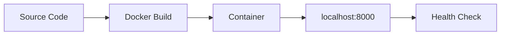

# 01 - Run Locally with Docker

Before deploying to Azure Container Apps, validate your Python app in a container locally. This catches image, dependency, and port issues early.

## Local Development Workflow



## Prerequisites

- Docker Engine or Docker Desktop
- Source code with a Dockerfile

## Step-by-step

1. **Build the container image**

   ```bash
   cd app
   docker build --tag aca-python-guide .
   ```

   ???+ example "Expected output"
       ```text
       [1/6] FROM docker.io/library/python:3.11-slim
       [2/6] WORKDIR /app
       [3/6] COPY requirements.txt .
       [4/6] RUN pip install --no-cache-dir -r requirements.txt
       [5/6] COPY . .
       [6/6] CMD ["gunicorn", "--bind", "0.0.0.0:8000", "--workers", "4", "--chdir", "src", "app:app"]
       Successfully tagged aca-python-guide:latest
       ```

2. **Run the container locally**

   ```bash
   # Copy and customize the environment file
   cp .env.example .env

   docker run --publish 8000:8000 --env-file .env aca-python-guide
   ```

   ???+ example "Expected output"
       ```text
       [2026-04-04 11:30:54 +0000] [1] [INFO] Starting gunicorn 25.3.0
       [2026-04-04 11:30:54 +0000] [1] [INFO] Listening at: http://0.0.0.0:8000 (1)
       [2026-04-04 11:30:54 +0000] [8] [INFO] Booting worker with pid: 8
       ```

3. **Verify health endpoint**

   ```bash
   curl http://localhost:8000/health
   ```

   ???+ example "Expected output"
       ```json
       {"status":"healthy","timestamp":"2026-04-04T11:32:37.322216+00:00"}
       ```

   You can also verify runtime metadata:

   ```bash
   curl http://localhost:8000/info
   ```

   ???+ example "Expected output"
       ```json
       {"containerApp":"ca-myapp","environment":"development","name":"azure-container-apps-python-guide","python":"3.11.15","revision":"ca-myapp--0000001","telemetryMode":"basic","version":"1.0.0"}
       ```

4. **Inspect application logs**

   ```bash
   docker logs <container-id>
   ```

   ???+ example "Expected output"
       ```text
       Starting application...
       PORT=8000
       [INFO] Starting gunicorn 25.3.0
       ```

   To find the container ID: `docker ps`

## Local parity checklist

- Application listens on port `8000` (or your configured container port)
- Required environment variables are present
- `/health` returns HTTP 200
- No startup exceptions in container logs

## Advanced Topics

- Add local Redis or PostgreSQL via `docker network` and separate containers to mimic service dependencies.
- Use OpenTelemetry locally to validate logs and traces before cloud deployment.
- Add a Dapr sidecar for local service invocation testing.

## See Also
- [02 - First Deploy to Azure Container Apps](02-first-deploy.md)
- [03 - Configuration, Secrets, and Dapr](03-configuration.md)
- [Dapr Integration Recipe](recipes/dapr-integration.md)

## Sources
- [Quickstart: Code to Cloud (Microsoft Learn)](https://learn.microsoft.com/azure/container-apps/quickstart-code-to-cloud)
- [Dockerfile requirements for Azure Container Apps (Microsoft Learn)](https://learn.microsoft.com/azure/container-apps/containers#configuration)
