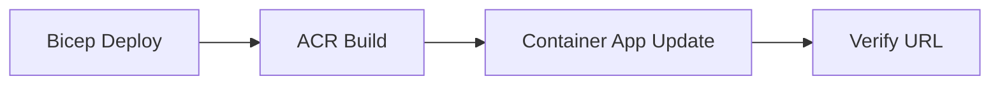

---
hide:
  - toc
---

# 02 - First Deploy to Azure Container Apps

In this step, you provision the core Azure resources, build your image in Azure Container Registry, and deploy your first revision to Azure Container Apps.

!!! info "Infrastructure Context"
    **Service**: Container Apps (Consumption) | **Network**: VNet integrated | **VNet**: ✅

    This tutorial assumes a production-ready Container Apps deployment with a custom VNet, ACR with managed identity pull, and private endpoints for backend services.

    ```mermaid
    flowchart TD
        INET[Internet] -->|HTTPS| CA["Container App\nConsumption\nLinux Python 3.11"]

        subgraph VNET["VNet 10.0.0.0/16"]
            subgraph ENV_SUB["Environment Subnet 10.0.0.0/23\nDelegation: Microsoft.App/environments"]
                CAE[Container Apps Environment]
                CA
            end
            subgraph PE_SUB["Private Endpoint Subnet 10.0.2.0/24"]
                PE_ACR[PE: ACR]
                PE_KV[PE: Key Vault]
                PE_ST[PE: Storage]
            end
        end

        PE_ACR --> ACR[Azure Container Registry]
        PE_KV --> KV[Key Vault]
        PE_ST --> ST[Storage Account]

        subgraph DNS[Private DNS Zones]
            DNS_ACR[privatelink.azurecr.io]
            DNS_KV[privatelink.vaultcore.azure.net]
            DNS_ST[privatelink.blob.core.windows.net]
        end

        PE_ACR -.-> DNS_ACR
        PE_KV -.-> DNS_KV
        PE_ST -.-> DNS_ST

        CA -.->|System-Assigned MI| ENTRA[Microsoft Entra ID]
        CAE --> LOG[Log Analytics]
        CA --> AI[Application Insights]

        style CA fill:#107c10,color:#fff
        style VNET fill:#E8F5E9,stroke:#4CAF50
        style DNS fill:#E3F2FD
    ```

## Deployment Workflow



## Prerequisites

- Completed [01 - Run Locally with Docker](01-local-development.md)
- Azure CLI logged in
- Bicep template at `infra/main.bicep`

## Step-by-step

1. **Set standard variables**

   ```bash
   RG="rg-myapp"
   BASE_NAME="myapp"
   LOCATION="koreacentral"
   DEPLOYMENT_NAME="main"
   ```

2. **Create a resource group**

   ```bash
   az group create --name "$RG" --location "$LOCATION"
   ```

   ???+ example "Expected output"
        ```json
        {
          "id": "/subscriptions/<subscription-id>/resourceGroups/rg-myapp",
          "location": "koreacentral",
          "name": "rg-myapp",
         "properties": {
           "provisioningState": "Succeeded"
         }
       }
       ```

3. **Deploy infrastructure (environment, Log Analytics, ACR, Container App)**

   ```bash
   az deployment group create \
      --name "$DEPLOYMENT_NAME" \
      --resource-group "$RG" \
      --template-file infra/main.bicep \
      --parameters baseName="$BASE_NAME" location="$LOCATION"
   ```

   ???+ example "Expected output"
       This command takes 2-3 minutes to complete. When successful, it returns a JSON object containing the deployment details.

        ```json
        {
          "id": "/subscriptions/<subscription-id>/resourceGroups/rg-myapp/providers/Microsoft.Resources/deployments/main",
          "name": "main",
          "properties": {
            "provisioningState": "Succeeded",
            "outputs": {
              "containerAppName": { "type": "String", "value": "ca-myapp-<unique-suffix>" },
              "containerAppUrl": { "type": "String", "value": "https://ca-myapp-<unique-suffix>.<hash>.<region>.azurecontainerapps.io" }
           }
         }
        }
        ```

   !!! note "Initial revision health can appear unhealthy"
       The Bicep template creates the Container App before your custom image is built and pushed. Until you complete Step 5 and update the app image, the initial revision may show as unhealthy. This is expected.

4. **Capture generated resource names from Bicep outputs**

   ```bash
   APP_NAME=$(az deployment group show \
     --name "$DEPLOYMENT_NAME" \
     --resource-group "$RG" \
     --query "properties.outputs.containerAppName.value" \
     --output tsv)

   ENVIRONMENT_NAME=$(az deployment group show \
     --name "$DEPLOYMENT_NAME" \
     --resource-group "$RG" \
     --query "properties.outputs.containerAppEnvName.value" \
     --output tsv)

   ACR_NAME=$(az deployment group show \
     --name "$DEPLOYMENT_NAME" \
     --resource-group "$RG" \
     --query "properties.outputs.containerRegistryName.value" \
     --output tsv)

   ACR_LOGIN_SERVER=$(az deployment group show \
     --name "$DEPLOYMENT_NAME" \
     --resource-group "$RG" \
     --query "properties.outputs.containerRegistryLoginServer.value" \
     --output tsv)

   APP_URL=$(az deployment group show \
     --name "$DEPLOYMENT_NAME" \
     --resource-group "$RG" \
      --query "properties.outputs.containerAppUrl.value" \
      --output tsv)
   ```

   ???+ example "Expected output"
       These commands capture the values silently. You can verify them by running:

       ```bash
       echo "APP_NAME=$APP_NAME"
       echo "ENVIRONMENT_NAME=$ENVIRONMENT_NAME"
       echo "ACR_NAME=$ACR_NAME"
       echo "ACR_LOGIN_SERVER=$ACR_LOGIN_SERVER"
       echo "APP_URL=$APP_URL"
       ```

       Output:
        ```text
        APP_NAME=ca-myapp-<unique-suffix>
        ENVIRONMENT_NAME=cae-myapp-<unique-suffix>
        ACR_NAME=<acr-name>
        ACR_LOGIN_SERVER=<acr-name>.azurecr.io
        APP_URL=https://ca-myapp-<unique-suffix>.<hash>.<region>.azurecontainerapps.io
        ```


5. **Build and push container image with ACR Tasks**

   ```bash
   az acr build \
      --registry "$ACR_NAME" \
      --image "$BASE_NAME:v1" \
      ./apps/python
   ```

   ???+ example "Expected output (az acr build)"
       The build output shows the Docker build progress. The last few lines should look like this:

       ```text
       Step 7/7 : CMD ["gunicorn", "--bind", "0.0.0.0:8000", "--workers", "4", "--chdir", "src", "app:app"]
        ---> Running in abc123
        ---> def456
       Successfully built def456
       Successfully tagged myapp:v1
       ```

   ```bash
   az containerapp update \
      --name "$APP_NAME" \
      --resource-group "$RG" \
      --image "$ACR_LOGIN_SERVER/$BASE_NAME:v1"
   ```

   ???+ example "Expected output (az containerapp update)"
       ```json
       {
          "latestRevision": "<your-app-name>--xxxxxxx",
          "name": "ca-myapp-<unique-suffix>",
         "provisioningState": "Succeeded"
       }
       ```

6. **Verify deployment state and URL**

   ```bash
   az containerapp show \
      --name "$APP_NAME" \
      --resource-group "$RG" \
      --query "{state:properties.provisioningState,url:properties.configuration.ingress.fqdn}"
   ```

   ???+ example "Expected output"
       ```json
       {
         "state": "Succeeded",
         "url": "ca-myapp-<unique-suffix>.<hash>.<region>.azurecontainerapps.io"
       }
       ```

   Verify the `/health` endpoint with `curl`:
   ```bash
   curl "$APP_URL/health"
   ```

    ???+ example "Expected output (health check)"
        ```json
        {"status":"healthy","timestamp":"2024-01-15T10:30:00.000000+00:00"}
        ```

    Verify ingress configuration details:
    ```bash
    az containerapp ingress show \
      --name "$APP_NAME" \
      --resource-group "$RG"
    ```

    ???+ example "Expected output (ingress configuration)"
        ```json
        {
          "allowInsecure": false,
          "external": true,
          "fqdn": "<your-app-name>.<hash>.<region>.azurecontainerapps.io",
          "targetPort": 8000,
          "transport": "Auto",
          "traffic": [
            { "latestRevision": true, "weight": 100 }
          ]
        }
        ```

7. **Deploy an update (creates a new revision)**

   ```bash
   az acr build --registry "$ACR_NAME" --image "$BASE_NAME:v2" ./apps/python

   az containerapp update \
      --name "$APP_NAME" \
      --resource-group "$RG" \
      --image "$ACR_LOGIN_SERVER/$BASE_NAME:v2"
   ```

    ???+ example "Expected output"
        ```json
        {
          "name": "<your-app-name>",
          "provisioningState": "Succeeded",
          "latestRevisionName": "<your-app-name>--xxxxxxx"
        }
        ```

   Confirm revision status — you should now see **two revisions** (the original v1 and the new v2). In single-revision mode, the old revision is retained but inactive:

   ```bash
   az containerapp revision list \
      --name "$APP_NAME" \
      --resource-group "$RG" \
      --query "[].{name:name,active:properties.active,trafficWeight:properties.trafficWeight,replicas:properties.replicas,healthState:properties.healthState,runningState:properties.runningState}"
   ```

   ???+ example "Expected output (revision list)"
        ```json
        [
          {
            "name": "<your-app-name>--0000001",
            "active": false,
            "trafficWeight": 0,
            "replicas": 0,
            "healthState": "Healthy",
            "runningState": "Running"
          },
          {
            "name": "<your-app-name>--0000002",
            "active": true,
            "trafficWeight": 100,
            "replicas": 1,
            "healthState": "Healthy",
            "runningState": "Running"
          }
        ]
        ```

## What to validate

- Image exists in ACR: `$BASE_NAME:v1` and `$BASE_NAME:v2`
- App endpoint responds with HTTP 200 for `/health`
- A new revision appears after `az containerapp update`

## Advanced Topics

- Move to internal ingress for private APIs and pair with VNet integration.
- Add workload profiles and min/max replicas for predictable performance.
- Use managed identity-based ACR pull for stronger credential hygiene.

## See Also
- [05 - Infrastructure as Code with Bicep](05-infrastructure-as-code.md)
- [07 - Revisions and Traffic Splitting](07-revisions-traffic.md)
- [Networking VNet Recipe](../../platform/networking/vnet-integration.md)

## Sources
- [Get started (Microsoft Learn)](https://learn.microsoft.com/azure/container-apps/get-started)
- [az containerapp up reference (Microsoft Learn)](https://learn.microsoft.com/cli/azure/containerapp#az-containerapp-up)
