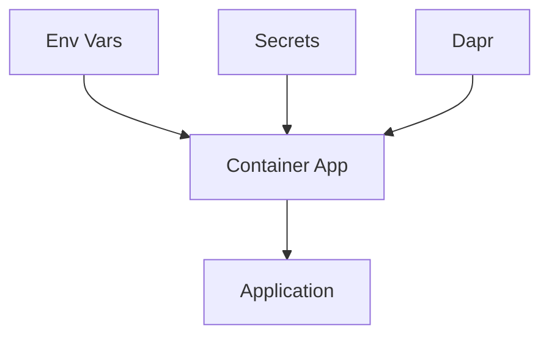

---
hide:
  - toc
---

# 03 - Configuration, Secrets, and Dapr

This step configures runtime settings in Azure Container Apps, including environment variables, secrets, KEDA scaling rules, and Dapr sidecar options.

## Configuration Flow



## Prerequisites

- Completed [02 - First Deploy to Azure Container Apps](02-first-deploy.md)
- A running Container App

## Step-by-step

1. **Set standard variables (reuse Bicep outputs from Step 02)**

   ```bash
   RG="rg-aca-python-demo"
   BASE_NAME="pycontainer"
   DEPLOYMENT_NAME="main"

   APP_NAME=$(az deployment group show \
     --name "$DEPLOYMENT_NAME" \
     --resource-group "$RG" \
     --query "properties.outputs.containerAppName.value" \
     --output tsv)

   ENVIRONMENT_NAME=$(az deployment group show \
     --name "$DEPLOYMENT_NAME" \
     --resource-group "$RG" \
     --query "properties.outputs.containerAppEnvName.value" \
     --output tsv)

   ACR_NAME=$(az deployment group show \
     --name "$DEPLOYMENT_NAME" \
     --resource-group "$RG" \
     --query "properties.outputs.containerRegistryName.value" \
     --output tsv)
   ```

   ???+ example "Expected output"
       The commands above set shell variables silently. Verify them with:

       ```bash
       echo "APP_NAME=$APP_NAME"
       echo "ENVIRONMENT_NAME=$ENVIRONMENT_NAME"
       echo "ACR_NAME=$ACR_NAME"
       ```

       ```text
       APP_NAME=<your-app-name>
       ENVIRONMENT_NAME=<your-env-name>
       ACR_NAME=<acr-name>
       ```

2. **Set environment variables**

   ```bash
   az containerapp update \
     --name "$APP_NAME" \
     --resource-group "$RG" \
      --set-env-vars "LOG_LEVEL=INFO" "FEATURE_FLAG=true"
   ```

   ???+ example "Expected output"
       ```json
       {
         "name": "ca-pycontainer-<unique-suffix>",
         "provisioningState": "Succeeded"
       }
       ```

3. **Store and reference a secret**

   ```bash
   az containerapp secret set \
     --name "$APP_NAME" \
     --resource-group "$RG" \
      --secrets "db-password=<secret-value>"
   ```

   ???+ example "Expected output"
       ```text
       Containerapp must be restarted in order for secret changes to take effect.
       ```
       ```json
       [
         {
           "name": "appinsights-connection-string"
         },
         {
           "name": "registry-password"
         },
         {
           "name": "db-password"
         }
       ]
       ```

   ```bash
   az containerapp update \
     --name "$APP_NAME" \
     --resource-group "$RG" \
     --set-env-vars "DB_PASSWORD=secretref:db-password"
   ```

   ???+ example "Expected output"
       ```json
       {
         "name": "ca-pycontainer-<unique-suffix>",
         "provisioningState": "Succeeded"
       }
       ```

4. **Configure KEDA HTTP autoscaling**

   ```bash
   az containerapp update \
     --name "$APP_NAME" \
     --resource-group "$RG" \
     --min-replicas 0 \
     --max-replicas 10 \
     --scale-rule-name "http-scale" \
     --scale-rule-type "http" \
      --scale-rule-http-concurrency 50
   ```

   ???+ example "Expected output"
       ```json
       {
         "name": "ca-pycontainer-<unique-suffix>",
         "provisioningState": "Succeeded"
       }
       ```

!!! tip "Choosing HTTP concurrency threshold"
    A lower value (e.g., 50) triggers scale-out more aggressively, suitable for latency-sensitive APIs. A higher value (e.g., 100, used in `infra/main.bicep`) delays scale-out for cost efficiency. Choose based on your latency SLO and budget. The Bicep template in `infra/main.bicep` defaults to `maxReplicas=3` for cost safety. Override with `--parameters maxReplicas=10` when deploying infrastructure.

5. **Configure queue-driven KEDA scaling (example)**

   ```bash
   az containerapp update \
     --name "$APP_NAME" \
     --resource-group "$RG" \
     --scale-rule-name "queue-scale" \
     --scale-rule-type "azure-servicebus" \
     --scale-rule-metadata "queueName=orders" "namespace=sb-namespace" \
     --scale-rule-auth "connection=servicebus-connection"
   ```

   ???+ example "Expected output"
       ```json
       {
         "name": "<your-app-name>",
         "provisioningState": "Succeeded"
       }
       ```

   Verify pushed repositories in ACR:

   ```bash
   az acr repository list \
     --name "$ACR_NAME" \
     --output json
   ```

   ???+ example "Expected output"
       ```json
       ["myapp", "myapp-job"]
       ```

6. **Enable Dapr sidecar**

   ```bash
   az containerapp dapr enable \
     --name "$APP_NAME" \
     --resource-group "$RG" \
     --dapr-app-id "$APP_NAME" \
     --dapr-app-port 8000
   ```

   ???+ example "Expected output"
       ```json
       {
         "appId": "ca-pycontainer-<unique-suffix>",
         "appPort": 8000,
         "appProtocol": "http",
         "enableApiLogging": false,
         "enabled": true,
         "httpMaxRequestSize": null,
         "httpReadBufferSize": null,
         "logLevel": "info"
       }
       ```

## Python example: read config safely

```python
import os

LOG_LEVEL = os.environ.get("LOG_LEVEL", "INFO")
FEATURE_FLAG = os.environ.get("FEATURE_FLAG", "false").lower() == "true"
DB_PASSWORD = os.environ.get("DB_PASSWORD", "")
```

## Advanced Topics

- Use Key Vault + managed identity instead of direct secret values.
- Tune KEDA thresholds differently for API and background worker apps.
- Add Dapr pub/sub and state store components for event-driven workflows.

## See Also
- [04 - Logging, Monitoring, and Observability](04-logging-monitoring.md)
- [07 - Revisions and Traffic Splitting](07-revisions-traffic.md)
- [Dapr Integration Recipe](recipes/dapr-integration.md)

## Sources
- [Containers (Microsoft Learn)](https://learn.microsoft.com/azure/container-apps/containers)
- [Manage secrets in Azure Container Apps (Microsoft Learn)](https://learn.microsoft.com/azure/container-apps/manage-secrets)
