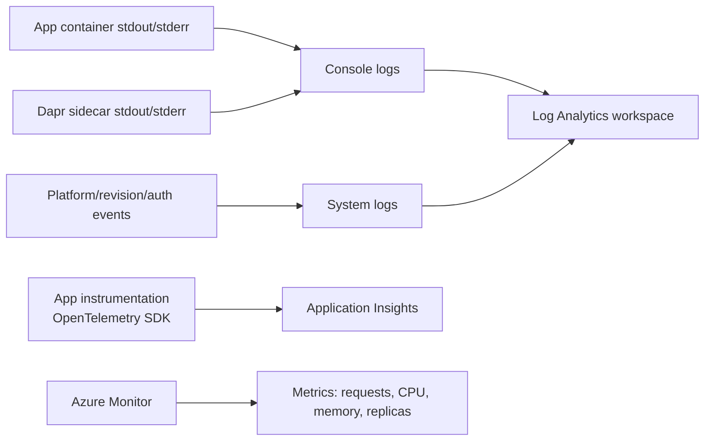
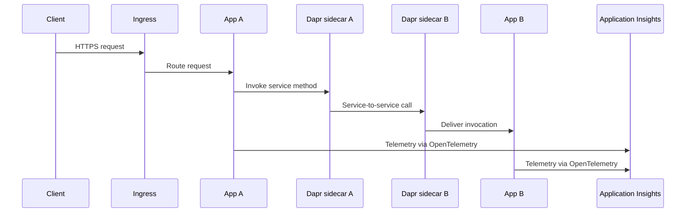

---
hide:
  - toc
---

# 04 - Logging, Monitoring, and Observability

This tutorial step shows how to inspect console logs, query Log Analytics, and add OpenTelemetry-based observability for production operations.

!!! info "Infrastructure Context"
    **Service**: Container Apps (Consumption) | **Network**: VNet integrated | **VNet**: ✅

    This tutorial assumes a production-ready Container Apps deployment with a custom VNet, ACR with managed identity pull, and private endpoints for backend services.

    ```mermaid
    flowchart TD
        INET[Internet] -->|HTTPS| CA["Container App\nConsumption\nLinux Python 3.11"]

        subgraph VNET["VNet 10.0.0.0/16"]
            subgraph ENV_SUB["Environment Subnet 10.0.0.0/23\nDelegation: Microsoft.App/environments"]
                CAE[Container Apps Environment]
                CA
            end
            subgraph PE_SUB["Private Endpoint Subnet 10.0.2.0/24"]
                PE_ACR[PE: ACR]
                PE_KV[PE: Key Vault]
                PE_ST[PE: Storage]
            end
        end

        PE_ACR --> ACR[Azure Container Registry]
        PE_KV --> KV[Key Vault]
        PE_ST --> ST[Storage Account]

        subgraph DNS[Private DNS Zones]
            DNS_ACR[privatelink.azurecr.io]
            DNS_KV[privatelink.vaultcore.azure.net]
            DNS_ST[privatelink.blob.core.windows.net]
        end

        PE_ACR -.-> DNS_ACR
        PE_KV -.-> DNS_KV
        PE_ST -.-> DNS_ST

        CA -.->|System-Assigned MI| ENTRA[Microsoft Entra ID]
        CAE --> LOG[Log Analytics]
        CA --> AI[Application Insights]

        style CA fill:#107c10,color:#fff
        style VNET fill:#E8F5E9,stroke:#4CAF50
        style DNS fill:#E3F2FD
    ```

## How Observability Works in Container Apps



## Distributed Tracing with Dapr



## Prerequisites

- Completed [03 - Configuration, Secrets, and Dapr](03-configuration.md)
- Log Analytics connected to your Container Apps environment

## Step-by-step

1. **Set standard variables (reuse Bicep outputs from Step 02)**

   ```bash
    RG="rg-myapp"
    BASE_NAME="myapp"
   DEPLOYMENT_NAME="main"

   APP_NAME=$(az deployment group show \
     --name "$DEPLOYMENT_NAME" \
     --resource-group "$RG" \
     --query "properties.outputs.containerAppName.value" \
     --output tsv)

   ENVIRONMENT_NAME=$(az deployment group show \
     --name "$DEPLOYMENT_NAME" \
     --resource-group "$RG" \
     --query "properties.outputs.containerAppEnvName.value" \
     --output tsv)

   ACR_NAME=$(az deployment group show \
     --name "$DEPLOYMENT_NAME" \
     --resource-group "$RG" \
     --query "properties.outputs.containerRegistryName.value" \
     --output tsv)
   ```

   ???+ example "Expected output"
       ```text
       APP_NAME=<your-app-name>
       ENVIRONMENT_NAME=<your-env-name>
       ACR_NAME=<acr-name>
       ```

2. **Stream console logs**

   ```bash
   az containerapp logs show \
     --name "$APP_NAME" \
     --resource-group "$RG" \
     --follow
   ```

   ???+ example "Expected output"
       ```json
       {"TimeStamp":"2024-01-15T10:30:01","Log":"Connecting to the container 'app'..."}
       {"TimeStamp":"2024-01-15T10:30:01","Log":"Successfully Connected to container: 'app' [Revision: '<your-app-name>--xxxxxxx', Replica: '<your-app-name>--xxxxxxx-<replica-id>']"}
       {"TimeStamp":"2024-01-15T10:30:00+00:00","Log":"[2024-01-15 10:30:00 +0000] [1] [INFO] Starting gunicorn 21.2.0"}
       {"TimeStamp":"2024-01-15T10:30:00+00:00","Log":"[2024-01-15 10:30:00 +0000] [1] [INFO] Listening at: http://0.0.0.0:8000 (1)"}
       {"TimeStamp":"2024-01-15T10:30:00+00:00","Log":"[2024-01-15 10:30:00 +0000] [7] [INFO] Booting worker with pid: 7"}
       {"TimeStamp":"2024-01-15T10:30:00+00:00","Log":"[2024-01-15 10:30:00 +0000] [8] [INFO] Booting worker with pid: 8"}
       ```

   !!! note
       Use Ctrl+C to stop following logs.

3. **Check system logs for startup or image issues**

   ```bash
   az containerapp logs show \
     --name "$APP_NAME" \
     --resource-group "$RG" \
     --type system
   ```

   ???+ example "Expected output"
       ```json
       {"TimeStamp":"2024-01-15T10:30:00Z","Type":"Normal","ContainerAppName":"<your-app-name>","RevisionName":"<your-app-name>--xxxxxxx","ReplicaName":null,"Msg":"Successfully connected to events server","Reason":"ConnectedToEventsServer","EventSource":"ContainerAppController","Count":1}
       ```

4. **Query Log Analytics via CLI**

   First, get the Log Analytics workspace ID:

   ```bash
   WORKSPACE_ID=$(az containerapp env show \
     --name "$ENVIRONMENT_NAME" \
     --resource-group "$RG" \
     --query "properties.appLogsConfiguration.logAnalyticsConfiguration.customerId" \
     --output tsv)
   ```

   Run a KQL query to fetch recent console logs:

   ```bash
   az monitor log-analytics query \
     --workspace "$WORKSPACE_ID" \
     --analytics-query "ContainerAppConsoleLogs_CL | where ContainerAppName_s == '$APP_NAME' | project TimeGenerated, ContainerAppName_s, Log_s | take 5" \
     --output table
   ```

   ???+ example "Expected output"
       ```text
       TableName      TimeGenerated                    ContainerAppName_s           Log_s
       -------------  -------------------------------  ---------------------------  ------------------------------------------------
       PrimaryResult  2026-04-04T17:15:00.000Z         <your-app-name>              [2026-04-04 17:15:00 +0000] [1] [INFO] Starting gunicorn
       PrimaryResult  2026-04-04T17:15:01.000Z         <your-app-name>              [2026-04-04 17:15:01 +0000] [1] [INFO] Listening at: http://0.0.0.0:8000
       ```

5. **Query for errors via CLI**

   ```bash
   az monitor log-analytics query \
     --workspace "$WORKSPACE_ID" \
     --analytics-query "ContainerAppConsoleLogs_CL | where ContainerAppName_s == '$APP_NAME' | where Log_s has_any ('error', 'exception', 'traceback') | project TimeGenerated, Log_s | take 10" \
     --output table
   ```

   ???+ example "Expected output"
       ```text
       TableName      TimeGenerated                    Log_s
       -------------  -------------------------------  ------------------------------------------------
       PrimaryResult  2026-04-04T11:35:12.000Z         [ERROR] Connection refused: redis://localhost:6379
       PrimaryResult  2026-04-04T11:34:58.000Z         Traceback (most recent call last): ...
       ```

       !!! tip
           If no errors exist, the query returns an empty result set — which is the healthy baseline.

   !!! note "KQL Table Names"
       Some Log Analytics workspaces use `ContainerAppConsoleLogs_CL` (custom log schema), while newer workspaces may use `ContainerAppConsoleLogs`. If queries return no results, try the alternate table name. See [KQL Queries Reference](../../troubleshooting/kql/index.md#schema-note) for details.

6. **Add OpenTelemetry for traces and metrics**

   ```bash
   pip install azure-monitor-opentelemetry
   ```

   ```python
   from azure.monitor.opentelemetry import configure_azure_monitor

   configure_azure_monitor(
       connection_string="InstrumentationKey=<instrumentation-key>;IngestionEndpoint=https://<region>.in.applicationinsights.azure.com/"
   )
   ```

7. **Correlate scaling behavior with telemetry**

   - Watch request bursts and KEDA scale-out events.
   - Verify reduced replica count during idle periods.
   - Compare latency before and after scale events.

## Observability practices

- Emit structured JSON logs with correlation IDs.
- Capture dependency traces for outbound HTTP and database calls.
- Monitor revision-specific failures during rollout windows.

## Advanced Topics

- Deploy an OpenTelemetry Collector sidecar to route telemetry to multiple backends.
- Add custom business metrics (for example, `orders_total`, `queue_depth`).
- Use Dapr tracing to follow service-to-service calls across apps.

## See Also
- [03 - Configuration, Secrets, and Dapr](03-configuration.md)
- [06 - CI/CD with GitHub Actions](06-ci-cd.md)
- [Dapr Integration Recipe](recipes/dapr-integration.md)

## Sources
- [Log monitoring (Microsoft Learn)](https://learn.microsoft.com/azure/container-apps/log-monitoring)
- [Observability in Azure Container Apps (Microsoft Learn)](https://learn.microsoft.com/azure/container-apps/observability)
