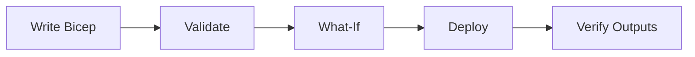

# 05 - Infrastructure as Code with Bicep

Use Bicep to define your Azure Container Apps platform consistently across environments. This step focuses on repeatable provisioning and safe updates.

## Infrastructure Lifecycle



## Prerequisites

- Completed [04 - Logging, Monitoring, and Observability](04-logging-monitoring.md)
- Bicep files under `infra/`

## Step-by-step

1. **Set standard variables**

   ```bash
   RG="rg-aca-python-demo"
   BASE_NAME="pycontainer"
   LOCATION="koreacentral"
   DEPLOYMENT_NAME="main"
   ```

2. **Validate the Bicep template**

   ```bash
   az deployment group validate \
      --resource-group "$RG" \
      --template-file infra/main.bicep \
      --parameters baseName="$BASE_NAME" location="$LOCATION"
   ```

3. **Preview changes with what-if**

   ```bash
   az deployment group what-if \
      --resource-group "$RG" \
      --template-file infra/main.bicep \
      --parameters baseName="$BASE_NAME" location="$LOCATION"
   ```

4. **Deploy infrastructure**

   ```bash
   az deployment group create \
      --name "$DEPLOYMENT_NAME" \
      --resource-group "$RG" \
      --template-file infra/main.bicep \
      --parameters baseName="$BASE_NAME" location="$LOCATION"
   ```

5. **Verify outputs and key resources**

   ```bash
   az deployment group show \
      --resource-group "$RG" \
      --name "$DEPLOYMENT_NAME" \
      --query properties.outputs
   ```

## Example Bicep snippet (environment + logs)

```bicep
param baseName string
var uniqueSuffix = uniqueString(resourceGroup().id)
var containerAppEnvName = 'cae-${baseName}-${uniqueSuffix}'

resource logAnalytics 'Microsoft.OperationalInsights/workspaces@2022-10-01' = {
  name: 'log-${baseName}-${uniqueSuffix}'
  location: resourceGroup().location
  properties: {
    sku: {
      name: 'PerGB2018'
    }
  }
}

resource environment 'Microsoft.App/managedEnvironments@2024-03-01' = {
  name: containerAppEnvName
  location: resourceGroup().location
  properties: {
    appLogsConfiguration: {
      destination: 'log-analytics'
      logAnalyticsConfiguration: {
        customerId: logAnalytics.properties.customerId
        sharedKey: logAnalytics.listKeys().primarySharedKey
      }
    }
  }
}
```

## Advanced Topics

- Split templates into modules (network, observability, apps, identity).
- Use parameter files per environment (dev, test, prod).
- Provision Dapr components declaratively with managed identities.

## See Also
- [02 - First Deploy to Azure Container Apps](02-first-deploy.md)
- [06 - CI/CD with GitHub Actions](06-ci-cd.md)
- [Managed Identity Recipe](../../platform/identity-and-secrets/managed-identity.md)

## References
- [Azure Resource Manager API spec (Microsoft Learn)](https://learn.microsoft.com/azure/container-apps/azure-resource-manager-api-spec)
- [Bicep resource definition: Microsoft.App/containerApps (Microsoft Learn)](https://learn.microsoft.com/azure/templates/microsoft.app/containerapps)
