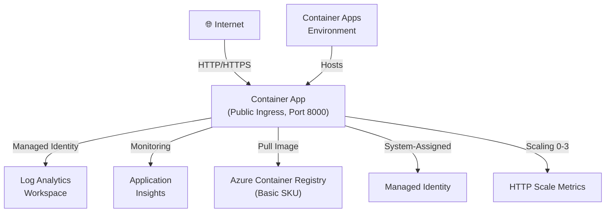
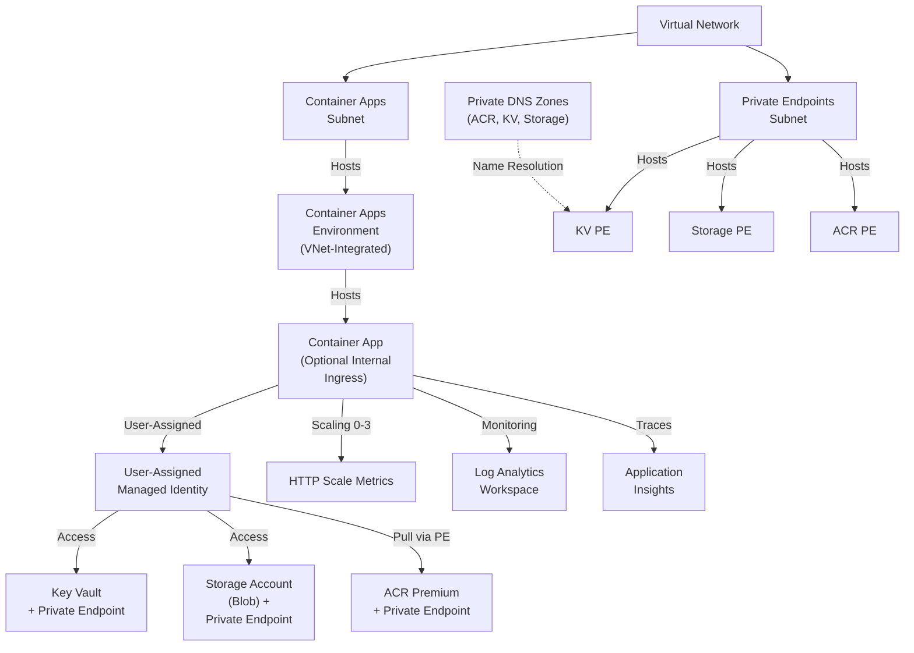
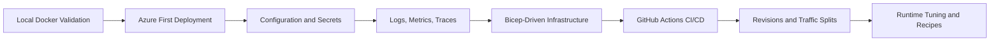

# Python on Azure Container Apps

This guide provides a comprehensive reference implementation for running Python applications on Azure Container Apps (ACA). We use a production-ready Flask application to demonstrate best practices for cloud-native deployment, security, and observability on the Azure platform.

## Reference Application

The reference Python application is located in the `apps/python/` directory. It is a production-hardened Flask implementation designed to showcase modern cloud-native patterns.

Key features demonstrated in the reference app:

- **Health Probes**: Implements `/health` and `/ready` endpoints to enable platform-managed lifecycle and zero-downtime deployments.
- **Structured Logging**: Custom JSON formatter for logs, optimized for seamless integration with Azure Log Analytics and Application Insights.
- **OpenTelemetry**: Native support for distributed tracing and performance monitoring through OpenTelemetry (OTel) instrumentation.
- **Gunicorn Configuration**: Optimized WSGI server settings for containerized workloads, including worker management and signal handling.
- **KEDA-compatible**: Stateless architecture designed for event-driven autoscaling without internal state dependencies.
- **Dapr-ready**: Prepared for service invocation, state management, and pub/sub patterns using the Dapr sidecar model.

## Prerequisites

Before you begin the tutorial, ensure you have the following tools and resources available:

- **Python 3.11 or higher**: Required for local development, testing, and dependency management.
- **Docker Engine**: Essential for building, testing, and validating container images locally before cloud deployment.
- **Azure CLI 2.57+**: The primary tool for provisioning and managing Azure Container Apps and related infrastructure.
- **Azure Subscription**: An active subscription with sufficient permissions to create Resource Groups and Container Apps environments.

## Network Architecture by Deployment Mode

Azure Container Apps supports two primary deployment architectures: **public consumption mode** for development and proof-of-concept workloads, and **private VNet-integrated mode** for production environments requiring network isolation and secure access to dependent services.

### Public Consumption Mode

Ideal for development, testing, and public-facing applications. The Container Apps Environment is deployed without a VNet, and your application is accessible via a public HTTPS endpoint.

### Private VNet-Integrated Mode

For production environments requiring network isolation. The Container Apps Environment is deployed inside a dedicated VNet with private endpoints to all dependent services.

!!! tip "Which mode to choose?"
    Start with **Public Consumption** for development and PoC. Move to **Private VNet-Integrated** when your security policy requires private-only access to dependent services or you need to comply with corporate network isolation requirements.

## Tutorial Steps

Follow these step-by-step guides to master the deployment of Python applications on Azure Container Apps:

1.  [**Local Development**](./01-local-development.md) — Learn how to containerize and run your Flask app in Docker on your local machine.
2.  [**First Deployment**](./02-first-deploy.md) — Push your container image to Azure Container Registry and create your first Container App.
3.  [**Configuration & Secrets**](./03-configuration.md) — Securely manage environment variables and integrate with Azure Key Vault.
4.  [**Logging & Monitoring**](./04-logging-monitoring.md) — Configure structured logging and visualize metrics in the Azure Portal.
5.  [**Infrastructure as Code**](./05-infrastructure-as-code.md) — Define and deploy your application environment using Bicep templates.
6.  [**CI/CD with GitHub Actions**](./06-ci-cd.md) — Build automated pipelines to test and deploy your code on every commit.
7.  [**Revisions & Traffic**](./07-revisions-traffic.md) — Master advanced deployment strategies like blue-green and canary releases.

## Python Guide Progress Snapshot

| Area | Coverage | Primary Asset |
|---|---|---|
| Build and run locally | Complete | [01-local-development](./01-local-development.md) |
| First cloud deployment | Complete | [02-first-deploy](./02-first-deploy.md) |
| Config, secrets, and Dapr | Complete | [03-configuration](./03-configuration.md) |
| Observability | Complete | [04-logging-monitoring](./04-logging-monitoring.md) |
| Infrastructure as Code | Complete | [05-infrastructure-as-code](./05-infrastructure-as-code.md) |
| CI/CD automation | Complete | [06-ci-cd](./06-ci-cd.md) |
| Safe rollout strategy | Complete | [07-revisions-traffic](./07-revisions-traffic.md) |
| Runtime tuning | Complete | [python-runtime](./python-runtime.md) |
| Integration recipes | Complete | [recipes/index](./recipes/index.md) |

## End-to-End Learning Flow

!!! tip "Use this order for fastest production readiness"
    Complete tutorials `01` through `07` sequentially first, then use runtime and recipe pages for optimization and integration. This prevents configuration drift and keeps your revisions reproducible.

## Runtime Guide

For detailed technical information on how the Python runtime is configured and optimized for Azure Container Apps, see the [Python Runtime Reference](./python-runtime.md).

This guide covers:
- WSGI server (Gunicorn) worker configuration and tuning.
- System-level and application-specific environment variable overrides.
- Python package management and Docker layer optimization strategies.

## Recipes

Accelerate your development process with these common integration patterns and production recipes:

- [**Azure Cosmos DB**](./recipes/cosmosdb.md) — Securely connect to NoSQL databases using Managed Identity.
- [**Azure SQL**](./recipes/azure-sql.md) — Relational database integration with passwordless authentication.
- [**Redis Cache**](./recipes/redis.md) — High-performance distributed caching and session state management.
- [**Blob Storage**](./recipes/storage.md) — Cloud file storage and persistent volume mounts for containers.
- [**Dapr Integration**](./recipes/dapr-integration.md) — Building distributed microservices using the Dapr framework.
- [**Custom Domains**](./recipes/custom-domains.md) — Mapping your own branded URLs and SSL certificates to your apps.
- [**Container Registry**](./recipes/container-registry.md) — Private image hosting and security scanning with ACR.

## What You'll Learn

By completing this guide, you will gain the following capabilities:

- Building production-grade Docker images optimized for the Python ecosystem.
- Implementing "Zero-Trust" security by using Managed Identity instead of connection strings.
- Designing for high availability with liveness and readiness probes.
- Troubleshooting distributed systems using platform-native logs and KQL queries.
- Managing the full application lifecycle through infrastructure-as-code and automated CI/CD.

!!! note "Use standard variables consistently"
    For command consistency across tutorials and recipes, use `$RG`, `$APP_NAME`, `$ENVIRONMENT_NAME`, `$ACR_NAME`, and `$LOCATION` in your shell session before running commands.

!!! info "Architecture Best Practices"
    The patterns shown in this guide follow the Azure Well-Architected Framework. We prioritize security via Managed Identity, reliability via Health Probes, and operational excellence via automated deployments.

## See Also

- [Platform Architecture](../../platform/index.md) — Understand the underlying ACA infrastructure.
- [Operations Guide](../../operations/index.md) — Production operations.
- [Troubleshooting Methodology](../../troubleshooting/index.md) — Systematic approach to debugging issues.
- [CLI Reference](../../troubleshooting/first-10-minutes/cli-reference.md) — Quick lookup for CLI commands and limits.

## Sources

- [Azure Container Apps documentation (Microsoft Learn)](https://learn.microsoft.com/azure/container-apps/)
- [Python on Azure Container Apps overview (Microsoft Learn)](https://learn.microsoft.com/azure/container-apps/python-overview)
