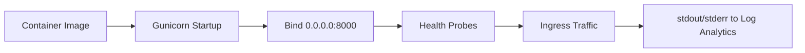

# Python Runtime

This reference summarizes practical runtime defaults for Python workloads on Azure Container Apps so you can keep startup behavior, probe health, and logging predictable across revisions.

## Runtime Execution Model



!!! tip "Treat runtime settings as deployment contracts"
    Keep port binding, process model, and logging behavior stable between revisions. Changing all three at once makes incident triage much harder.

## Runtime Baseline (This Repo)

| Item | Value |
| --- | --- |
| Base image | `python:3.11-slim` |
| Web framework | Flask |
| Process manager | Gunicorn |
| Exposed/listen port | `8000` |
| Start command | `gunicorn --bind 0.0.0.0:8000 --workers 4 --chdir src app:app` |

## Gunicorn Quick Tuning

| Setting | Example | When to change |
| --- | --- | --- |
| Workers | `--workers 4` | Increase for CPU-bound throughput, decrease for memory pressure |
| Worker class | `--worker-class sync` (default) | Use async worker classes only when app stack supports it |
| Timeout | `--timeout 120` | Increase if valid requests exceed default worker timeout |
| Keepalive | `--keep-alive 5` | Tune for high connection churn |
| Access log | `--access-logfile -` | Emit to stdout for Log Analytics |
| Error log | `--error-logfile -` | Emit to stderr for Log Analytics |

## Recommended Command Pattern

```bash
gunicorn \
  --bind 0.0.0.0:8000 \
  --workers 4 \
  --timeout 120 \
  --access-logfile - \
  --error-logfile - \
  --chdir src \
  app:app
```

## Container Apps Alignment Checklist

| Check | Expected |
| --- | --- |
| ACA `targetPort` | `8000` |
| Gunicorn bind | `0.0.0.0:8000` |
| Health endpoint | `GET /health` returns 200 |
| Logs | stdout/stderr only (no file-only logs) |
| Secrets/config | Read from env vars (`os.environ`) |

## Quick Diagnostics

```bash
RG="rg-myapp"
APP_NAME="my-python-app"

az containerapp logs show \
  --name "$APP_NAME" \
  --resource-group "$RG" \
  --type console --follow

az containerapp exec \
  --name "$APP_NAME" \
  --resource-group "$RG" \
  --command "/bin/bash"

# Inside container
python --version
ps aux
```

## Frequent Runtime Failures

| Symptom | Root cause | Action |
| --- | --- | --- |
| Container healthy locally, failing in ACA | Port/ingress mismatch | Align Gunicorn bind and ACA `targetPort` |
| Intermittent worker timeouts | Long request handlers | Optimize handler or raise Gunicorn timeout |
| High memory usage, restarts | Too many workers for memory size | Reduce workers or increase memory |
| Missing traces in App Insights | `TELEMETRY_MODE` or connection string not set | Set `TELEMETRY_MODE=advanced` and `APPLICATIONINSIGHTS_CONNECTION_STRING` |

!!! warning "Avoid hardcoding runtime assumptions"
    If your app assumes a fixed port, writable local filesystem, or shell-only startup dependencies, revisions may pass locally but fail in Container Apps. Validate behavior with environment-driven configuration and health probes.

## See Also

- [Python Language Guide Index](./index.md)
- [01 - Run Locally with Docker](./01-local-development.md)
- [03 - Configuration, Secrets, and Dapr](./03-configuration.md)
- [Container Design Best Practices](../../best-practices/container-design.md)

## Sources
- [Azure Container Apps containers reference (Microsoft Learn)](https://learn.microsoft.com/azure/container-apps/containers)
- [Connect to services in Azure Container Apps (Microsoft Learn)](https://learn.microsoft.com/azure/container-apps/connect-apps)
