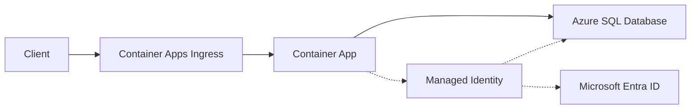

---
hide:
  - toc
content_sources:
  diagrams:
    - id: architecture
      type: flowchart
      source: mslearn-adapted
      based_on:
        - https://learn.microsoft.com/azure/azure-sql/database/authentication-aad-overview
        - https://learn.microsoft.com/azure/azure-sql/database/connect-query-python
---

# Azure SQL Integration (Managed Identity)

Use this recipe to connect Azure Container Apps to Azure SQL Database with Microsoft Entra authentication and no SQL passwords.

## Architecture

<!-- diagram-id: architecture -->


Solid arrows show runtime data flow. Dashed arrows show identity and authentication.

## Prerequisites

- Existing Container App: `$APP_NAME` in `$RG`
- Existing Azure SQL server and database
- SQL server configured with a Microsoft Entra admin
- ODBC Driver 18 available in your container image

## Step 1: Enable managed identity on the Container App

```bash
az containerapp identity assign \
  --name "$APP_NAME" \
  --resource-group "$RG" \
  --system-assigned

export PRINCIPAL_ID=$(az containerapp show \
  --name "$APP_NAME" \
  --resource-group "$RG" \
  --query "identity.principalId" \
  --output tsv)
```

## Step 2: Grant SQL database access to the app identity

From a Microsoft Entra-authenticated SQL session, create a contained user for the app identity.

```sql
CREATE USER [<container-app-name>] FROM EXTERNAL PROVIDER;
ALTER ROLE db_datareader ADD MEMBER [<container-app-name>];
ALTER ROLE db_datawriter ADD MEMBER [<container-app-name>];
```

## Step 3: Configure non-secret app settings

```bash
az containerapp update \
  --name "$APP_NAME" \
  --resource-group "$RG" \
  --set-env-vars SQL_SERVER="$SQL_SERVER.database.windows.net" SQL_DATABASE="$SQL_DATABASE"
```

## Step 4: Python code (token-based SQL connection)

Install dependencies:

```bash
pip install azure-identity pyodbc
```

Use managed identity token with ODBC Driver 18:

```python
import os
import struct
import pyodbc
from azure.identity import DefaultAzureCredential

SQL_COPT_SS_ACCESS_TOKEN = 1256

server = os.environ["SQL_SERVER"]
database = os.environ["SQL_DATABASE"]

credential = DefaultAzureCredential()
token = credential.get_token("https://database.windows.net/.default").token
token_bytes = token.encode("utf-16-le")
token_struct = struct.pack("<I", len(token_bytes)) + token_bytes

connection_string = (
    "Driver={ODBC Driver 18 for SQL Server};"
    f"Server=tcp:{server},1433;"
    f"Database={database};"
    "Encrypt=yes;TrustServerCertificate=no;"
)

with pyodbc.connect(connection_string, attrs_before={SQL_COPT_SS_ACCESS_TOKEN: token_struct}) as conn:
    with conn.cursor() as cursor:
        cursor.execute("SELECT TOP 1 name FROM sys.tables")
        row = cursor.fetchone()
        print(row[0] if row else "No tables found")
```

## Container Apps specifics

- Keep server/database names as environment variables.
- Do not store SQL passwords in Container App secrets.
- If using private connectivity, combine with VNet integration and private endpoint DNS.

## Verification steps

1. Validate identity is present on the app:

```bash
az containerapp show \
  --name "$APP_NAME" \
  --resource-group "$RG" \
  --query "identity" \
  --output json
```

2. Verify runtime connectivity by checking application logs:

```bash
az containerapp logs show \
  --name "$APP_NAME" \
  --resource-group "$RG" \
  --follow false
```

3. Confirm SQL sign-ins in Azure SQL auditing/logs.

## See Also
- [Managed Identity](../../../platform/identity-and-secrets/managed-identity.md)
- [VNet Integration](../../../platform/networking/vnet-integration.md)
- [Private Endpoints](../../../platform/networking/private-endpoints.md)

## Sources
- [Azure SQL + Microsoft Entra authentication](https://learn.microsoft.com/azure/azure-sql/database/authentication-aad-overview)
- [Connect to Azure SQL with Python (Microsoft Learn)](https://learn.microsoft.com/azure/azure-sql/database/connect-query-python)
