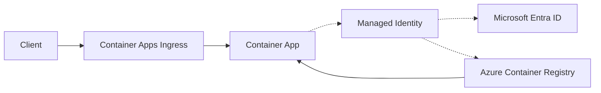
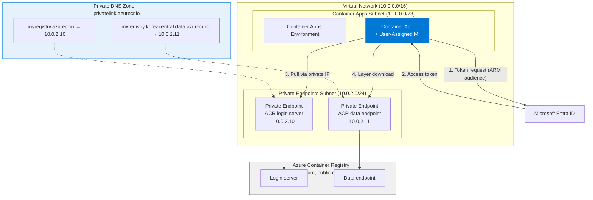

---
content_sources:
  diagrams:
    - id: architecture
      type: flowchart
      source: mslearn-adapted
      based_on:
        - https://learn.microsoft.com/azure/container-registry/container-registry-private-link
        - https://learn.microsoft.com/azure/container-apps/managed-identity-image-pull
        - https://learn.microsoft.com/azure/container-registry/container-registry-authentication-managed-identity
    - id: configure-the-container-app-to-reference
      type: flowchart
      source: mslearn-adapted
      based_on:
        - https://learn.microsoft.com/azure/container-registry/container-registry-private-link
        - https://learn.microsoft.com/azure/container-apps/managed-identity-image-pull
        - https://learn.microsoft.com/azure/container-registry/container-registry-authentication-managed-identity
---

# Private Container Registry (ACR with Private Endpoint)

Pull container images from Azure Container Registry over a private network path — no public registry exposure, no admin credentials.

## Architecture

<!-- diagram-id: architecture -->


Solid arrows show runtime data flow. Dashed arrows show identity and authentication.

!!! note "Private Endpoint requires ACR Premium SKU"
    Private Endpoints for ACR are only available on the **Premium** tier. Basic and Standard ACR cannot use Private Endpoints.

## Overview

By default, Container Apps pulls images from a public ACR endpoint. In a private deployment, you:

1. Deploy ACR with public access disabled and a Private Endpoint in your VNet
2. Configure a **user-assigned managed identity** on your Container App as the pull identity
3. Grant that identity `AcrPull` on the registry
4. Configure the Container App to reference that identity for the registry

<!-- diagram-id: configure-the-container-app-to-reference -->


!!! warning "Two DNS records are required"
    ACR image pulls use **two endpoints**: the login server (`myregistry.azurecr.io`) for authentication and the regional data endpoint (`myregistry.<region>.data.azurecr.io`) for layer downloads. Both must resolve to private IPs through the Private DNS Zone. Missing the data endpoint causes pull failures that are not obvious from the error message.

### Why user-assigned managed identity?

| Approach | Recommended | Notes |
|----------|-------------|-------|
| **User-assigned MI** | ✅ Yes | Created before the app — clean IaC, no two-phase deployment |
| System-assigned MI | ⚠️ Possible | Exists only after app creation — requires two-phase deployment in IaC |
| Admin credentials (username/password) | ❌ No | Weaker operationally, manual rotation, avoid in production |

## Prerequisites

- Container Apps environment deployed **in a VNet** (see [VNet Integration](../../../platform/networking/vnet-integration.md))
- Azure CLI with Container Apps extension: `az extension add --name containerapp`
- Docker (for building and pushing images)
- Variables set:

```bash
export RG="rg-myapp"
export LOCATION="koreacentral"
export ENVIRONMENT_NAME="cae-myapp"
export APP_NAME="ca-myapp"
export ACR_NAME="acrmyapp"          # Globally unique, alphanumeric only
export VNET_NAME="vnet-myapp"
export PE_SUBNET_ID="<private-endpoints-subnet-id>"
export UAMI_NAME="id-myapp"
```

## Step 1: Create ACR (Premium SKU)

Private Endpoints require **Premium** SKU. Enable the data endpoint — it's required for image layer downloads over Private Link.

```bash
az acr create \
  --name "$ACR_NAME" \
  --resource-group "$RG" \
  --location "$LOCATION" \
  --sku Premium \
  --public-network-enabled false \
  --data-endpoint-enabled true
```

!!! important "Enable ARM audience token authentication"
    Managed identity pulls require ACR to accept ARM audience tokens. Enable this explicitly — it is not on by default in all tenants:

    ```bash
    az acr config authentication-as-arm update \
      --registry "$ACR_NAME" \
      --status enabled
    ```

    Without this, managed identity pull attempts fail with `401 Unauthorized` even when RBAC looks correct.

## Step 2: Create a user-assigned managed identity

```bash
az identity create \
  --name "$UAMI_NAME" \
  --resource-group "$RG"

export UAMI_ID=$(az identity show \
  --name "$UAMI_NAME" \
  --resource-group "$RG" \
  --query "id" \
  --output tsv)

export UAMI_PRINCIPAL_ID=$(az identity show \
  --name "$UAMI_NAME" \
  --resource-group "$RG" \
  --query "principalId" \
  --output tsv)

export UAMI_CLIENT_ID=$(az identity show \
  --name "$UAMI_NAME" \
  --resource-group "$RG" \
  --query "clientId" \
  --output tsv)
```

## Step 3: Grant AcrPull to the managed identity

```bash
export ACR_ID=$(az acr show \
  --name "$ACR_NAME" \
  --resource-group "$RG" \
  --query "id" \
  --output tsv)

az role assignment create \
  --assignee-object-id "$UAMI_PRINCIPAL_ID" \
  --assignee-principal-type ServicePrincipal \
  --role "AcrPull" \
  --scope "$ACR_ID"
```

!!! tip "Role assignment propagation"
    RBAC changes take 1–5 minutes to propagate. If a container pull fails immediately after assigning the role, wait and retry the revision.

## Step 4: Create the Private Endpoint for ACR

Create a private endpoint for the registry login server (`registry` group). This handles authentication and, for standard registries, layer downloads as well.

```bash
# Private Endpoint for login server
az network private-endpoint create \
  --name "pe-acr-${ACR_NAME}" \
  --resource-group "$RG" \
  --subnet "$PE_SUBNET_ID" \
  --private-connection-resource-id "$ACR_ID" \
  --group-id "registry" \
  --connection-name "conn-acr-registry"
```

### Optional: Dedicated data endpoint

If you need separate network control over image layer downloads (e.g., for geo-replicated registries), enable the dedicated data endpoint and create a second PE. **This must be done after the ACR is fully provisioned** — the `registry_data_<region>` group ID is not immediately available and will cause a deployment failure if attempted in the same Bicep deployment as the ACR.

```bash
# Step 1: Enable dedicated data endpoint (after ACR is provisioned)
az acr update \
  --name "$ACR_NAME" \
  --resource-group "$RG" \
  --data-endpoint-enabled true

# Step 2: Verify the data endpoint group ID is available
az network private-link-resource list \
  --id "$ACR_ID" \
  --output table

# Step 3: Create the data endpoint PE (using the group ID from step 2)
az network private-endpoint create \
  --name "pe-acr-data-${ACR_NAME}" \
  --resource-group "$RG" \
  --subnet "$PE_SUBNET_ID" \
  --private-connection-resource-id "$ACR_ID" \
  --group-id "registry_data_${LOCATION}" \
  --connection-name "conn-acr-data"

# Step 4: Add DNS zone group for data endpoint
az network private-endpoint dns-zone-group create \
  --resource-group "$RG" \
  --endpoint-name "pe-acr-data-${ACR_NAME}" \
  --name "default" \
  --private-dns-zone "privatelink.azurecr.io" \
  --zone-name "registry-data"
```

!!! warning "Bicep + data endpoint race condition"
    Creating the data endpoint PE in the same Bicep deployment as the ACR resource will fail with `InvalidPrivateEndpointConnectionRequestParameters` because the `registry_data_<region>` group ID is not registered until the ACR fully provisions. Always create the data endpoint PE in a separate step via CLI or a second Bicep deployment.

## Step 5: Configure Private DNS Zone

```bash
export VNET_ID=$(az network vnet show \
  --name "$VNET_NAME" \
  --resource-group "$RG" \
  --query "id" \
  --output tsv)

# Create Private DNS Zone
az network private-dns zone create \
  --resource-group "$RG" \
  --name "privatelink.azurecr.io"

# Link DNS Zone to VNet
az network private-dns link vnet create \
  --resource-group "$RG" \
  --zone-name "privatelink.azurecr.io" \
  --name "link-acr-${VNET_NAME}" \
  --virtual-network "$VNET_ID" \
  --registration-enabled false

# Create DNS Zone Group — automatically registers A record for login server
az network private-endpoint dns-zone-group create \
  --resource-group "$RG" \
  --endpoint-name "pe-acr-${ACR_NAME}" \
  --name "default" \
  --private-dns-zone "privatelink.azurecr.io" \
  --zone-name "registry"
```

Verify A records were registered:

```bash
az network private-dns record-set a list \
  --resource-group "$RG" \
  --zone-name "privatelink.azurecr.io" \
  --output table
```

Expected output:

```
Name                            TTL    Type    AutoRegistered    Records
------------------------------  -----  ------  ----------------  ----------
myregistry                      10     A       False             10.0.2.10
myregistry.koreacentral.data    10     A       False             10.0.2.11
```

!!! note "Data endpoint DNS record is registered automatically"
    When you create the `registry` group Private Endpoint and attach a DNS zone group, Azure automatically registers **both** A records — the login server record (`myregistry`) and the regional data endpoint record (`myregistry.<region>.data`) — in the same `privatelink.azurecr.io` zone. A separate data endpoint Private Endpoint is **not required** for standard image pulls from Container Apps. The explicit `registry_data_<region>` PE is only needed when you require independent network control per endpoint (e.g., for geo-replication scenarios where each replica region gets its own PE).

## Step 6: Build and push the image

Pushing to a private ACR requires network line-of-sight. Use one of:
- A VM or jumpbox inside the VNet
- GitHub Actions self-hosted runner in the VNet
- ACR Tasks (runs inside Azure)

```bash
# Option A: ACR Tasks (builds and pushes inside Azure, no local Docker needed)
az acr build \
  --registry "$ACR_NAME" \
  --image "myapp:latest" \
  --file Dockerfile \
  ../app

# Option B: Local push (only if running inside VNet or ACR public access temporarily enabled)
az acr login --name "$ACR_NAME"
docker build -t "${ACR_NAME}.azurecr.io/myapp:latest" ../app
docker push "${ACR_NAME}.azurecr.io/myapp:latest"
```

!!! warning "CI/CD runners must have network line-of-sight"
    When ACR public access is disabled, GitHub-hosted runners **cannot push images** to the registry. Use **ACR Tasks** or a **self-hosted runner inside the VNet**.

!!! note "ACR Tasks and public network access"
    `az acr build` (ACR Tasks) queues the build on Azure-managed agents with **dynamic public IPs**. These agents cannot reach the registry when `publicNetworkAccess: Disabled`. To use ACR Tasks with a fully private registry, temporarily enable public network access during the build:

    ```bash
    # Enable public access for the build
    az acr update --name "$ACR_NAME" --public-network-enabled true
    az acr build --registry "$ACR_NAME" --image "myapp:latest" --file Dockerfile ../app
    # Re-disable immediately after
    az acr update --name "$ACR_NAME" --public-network-enabled false
    ```

    For production pipelines, prefer a **self-hosted runner or build agent inside the VNet** to avoid toggling public access.

## Step 7: Configure the Container App to use the private registry

Attach the user-assigned MI to the app and configure it as the registry pull identity:

```bash
# Create or update the Container App with UAMI registry auth
az containerapp create \
  --name "$APP_NAME" \
  --resource-group "$RG" \
  --environment "$ENVIRONMENT_NAME" \
  --image "${ACR_NAME}.azurecr.io/myapp:latest" \
  --registry-server "${ACR_NAME}.azurecr.io" \
  --registry-identity "$UAMI_ID" \
  --user-assigned "$UAMI_ID" \
  --env-vars AZURE_CLIENT_ID="$UAMI_CLIENT_ID" \
  --ingress external \
  --target-port 8000
```

For an **existing** app, update registry config:

```bash
az containerapp registry set \
  --name "$APP_NAME" \
  --resource-group "$RG" \
  --server "${ACR_NAME}.azurecr.io" \
  --identity "$UAMI_ID"
```

Then update the image:

```bash
az containerapp update \
  --name "$APP_NAME" \
  --resource-group "$RG" \
  --image "${ACR_NAME}.azurecr.io/myapp:latest"
```

!!! important "Control-plane success ≠ runtime success"
    `az containerapp update --image` updates the **app spec** successfully even when the registry is unreachable. The **revision** will fail to start if DNS resolution or RBAC is wrong. Always check revision status and logs after an image update.

## Step 8: Verify

### Check DNS resolution from inside the container

```bash
az containerapp exec \
  --name "$APP_NAME" \
  --resource-group "$RG" \
  --command "nslookup ${ACR_NAME}.azurecr.io"
```

Expected — private IP, not public:

```
Server:    168.63.129.16
Address:   168.63.129.16#53

Non-authoritative answer:
myregistry.azurecr.io  canonical name = myregistry.privatelink.azurecr.io.
Name:    myregistry.privatelink.azurecr.io
Address: 10.0.2.10
```

Also verify the data endpoint:

```bash
az containerapp exec \
  --name "$APP_NAME" \
  --resource-group "$RG" \
  --command "nslookup ${ACR_NAME}.${LOCATION}.data.azurecr.io"
```

### Check revision status

```bash
az containerapp revision list \
  --name "$APP_NAME" \
  --resource-group "$RG" \
  --output table
```

Expected:

```
Name                             Active    Traffic    Replicas    HealthState
-------------------------------  --------  ---------  ----------  -----------
<your-app-name>--<revision>      True      100        1           Healthy
```

### Check app logs

```bash
az containerapp logs show \
  --name "$APP_NAME" \
  --resource-group "$RG" \
  --follow false \
  --tail 50
```

---

## Using Bicep

See [`infra/modules/acr-private.bicep`](https://github.com/yeongseon/azure-container-apps-practical-guide/blob/main/infra/modules/acr-private.bicep) for the full module.

Integration into your environment:

```bicep
// User-assigned managed identity (created before app — clean IaC)
resource managedIdentity 'Microsoft.ManagedIdentity/userAssignedIdentities@2023-01-31' = {
  name: 'id-${baseName}'
  location: location
}

// ACR with Private Endpoint
module acr 'modules/acr-private.bicep' = {
  name: 'acr-deployment'
  params: {
    baseName: baseName
    location: location
    privateEndpointSubnetId: network.outputs.privateEndpointsSubnetId
    vnetId: network.outputs.vnetId
    pullIdentityPrincipalId: managedIdentity.properties.principalId
  }
}

// Container App references UAMI for registry pull
resource containerApp 'Microsoft.App/containerApps@2023-05-01' = {
  name: 'ca-${baseName}'
  location: location
  identity: {
    type: 'UserAssigned'
    userAssignedIdentities: {
      '${managedIdentity.id}': {}
    }
  }
  properties: {
    // ...
    configuration: {
      registries: [
        {
          server: acr.outputs.loginServer
          identity: managedIdentity.id   // UAMI reference — no password
        }
      ]
    }
    template: {
      containers: [
        {
          name: 'app'
          image: '${acr.outputs.loginServer}/${baseName}:${imageTag}'
          env: [
            {
              name: 'AZURE_CLIENT_ID'
              value: managedIdentity.properties.clientId
            }
          ]
        }
      ]
    }
  }
}
```

---

## Operational Considerations

### Scale-out and restarts

Container Apps uses an **always pull** policy — every new replica and every restart triggers an image pull. This means:

- Private DNS must always resolve correctly inside the VNet
- RBAC role assignment must be active at all times
- Network path (NSG, private endpoint) must remain healthy

A DNS or auth issue that surfaces on scale-out may not have been visible at initial deployment.

### Rotating credentials

With managed identity, there are **no credentials to rotate**. The identity token is refreshed automatically by the platform. This is one of the main reasons to prefer MI over admin credentials.

### Geo-replicated ACR

If ACR is geo-replicated, each replica region has its own data endpoint:

```
myregistry.koreacentral.data.azurecr.io
myregistry.japaneast.data.azurecr.io
```

Each requires a separate Private Endpoint and DNS A record in `privatelink.azurecr.io`. The login server endpoint (`myregistry.azurecr.io`) remains a single endpoint.

---

## Troubleshooting

| Symptom | Cause | Fix |
|---------|-------|-----|
| Revision stuck in `Provisioning` | Image pull failing — check auth or DNS | `az containerapp revision show` → check `RunningState`; check logs |
| `401 Unauthorized` on pull | ARM audience token not enabled, or RBAC not propagated | Run `az acr config authentication-as-arm update --status enabled`; wait 5 min for RBAC propagation |
| `nslookup` returns public IP | Private DNS Zone not linked to VNet, or zone group not created | Verify DNS zone link and `az network private-endpoint dns-zone-group` exists |
| Pull succeeds but container crashes | App config issue, not registry issue | Check container logs; registry auth was fine |
| `az containerapp update --image` succeeds, revision fails | Control-plane change succeeded but runtime pull failed | Check revision logs; confirm DNS resolves to private IP |
| CI/CD push fails with `connection refused` | Runner cannot reach private ACR | Use ACR Tasks (`az acr build`) or self-hosted runner in VNet |
| Data endpoint DNS not resolving | DNS zone group not attached to `registry` PE | Verify `az network private-endpoint dns-zone-group` exists for the registry PE — both A records should auto-register |
| `az acr build` fails with `denied: client with IP ... is not allowed access` | ACR public network access is disabled; ACR Tasks agents use dynamic public IPs | Temporarily enable public access for the build, or use a self-hosted runner in the VNet |
| After ACR key rotation, pull fails | Not applicable for MI auth | N/A — MI tokens are auto-refreshed |

---

## See Also
- [VNet Integration](../../../platform/networking/vnet-integration.md)
- [Private Endpoints](../../../platform/networking/private-endpoints.md)
- [Managed Identity](../../../platform/identity-and-secrets/managed-identity.md)

## Sources
- [ACR Private Link (Microsoft Learn)](https://learn.microsoft.com/azure/container-registry/container-registry-private-link)
- [Managed identity for Container Apps registry auth (Microsoft Learn)](https://learn.microsoft.com/azure/container-apps/managed-identity-image-pull)
- [ACR authentication as ARM (Microsoft Learn)](https://learn.microsoft.com/azure/container-registry/container-registry-authentication-managed-identity)
