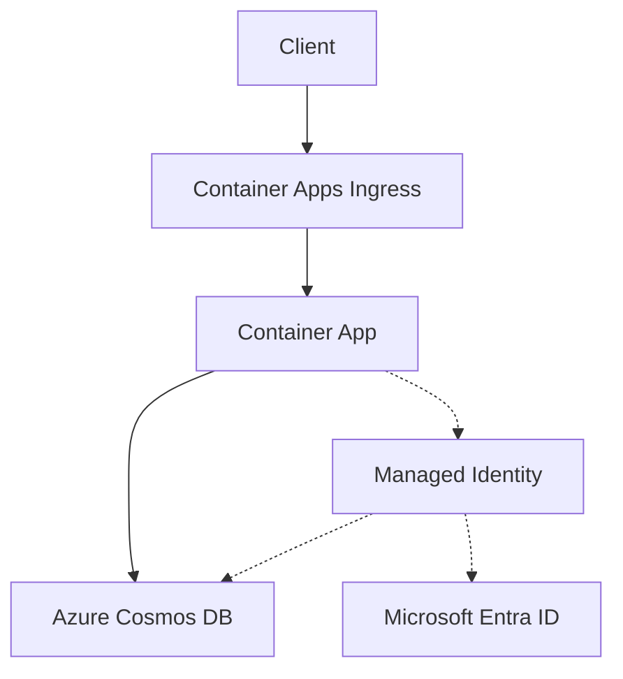

---
content_sources:
  diagrams:
    - id: architecture
      type: flowchart
      source: mslearn-adapted
      based_on:
        - https://learn.microsoft.com/en-us/azure/cosmos-db/nosql/how-to-connect-role-based-access-control
        - https://learn.microsoft.com/en-us/azure/cosmos-db/nosql/quickstart-python
---
# Cosmos DB Integration (Managed Identity)

Use this recipe to connect a Python Container App to Azure Cosmos DB (NoSQL) without account keys or connection strings.

## Architecture

<!-- diagram-id: architecture -->


Solid arrows show runtime data flow. Dashed arrows show identity and authentication.

## Prerequisites

- Existing Container App: `$APP_NAME` in resource group `$RG`
- Existing Cosmos DB account and SQL database/container
- Azure CLI with Container Apps and Cosmos extensions

```bash
az extension add --name containerapp --upgrade
az extension add --name cosmosdb-preview --upgrade
```

| Command | Why it is used |
|---|---|
| `az extension add ...` | Installs or updates the Container Apps Azure CLI extension. |

## Step 1: Enable managed identity on the Container App

```bash
az containerapp identity assign \
  --name "$APP_NAME" \
  --resource-group "$RG" \
  --system-assigned
```

| Command | Why it is used |
|---|---|
| `az containerapp identity assign ...` | Assigns or inspects managed identity configuration for the Container App. |

Get the managed identity principal ID:

```bash
export PRINCIPAL_ID=$(az containerapp show \
  --name "$APP_NAME" \
  --resource-group "$RG" \
  --query "identity.principalId" \
  --output tsv)
```

| Command | Purpose |
|---|---|
| `export PRINCIPAL_ID=$(az containerapp show --name "$APP_NAME" --resource-group "$RG" --query "identity.principalId" --output tsv)` | Captures the app's managed identity principal ID so the next RBAC assignment can grant Cosmos DB access to the actual runtime identity. |

## Step 2: Grant Cosmos DB data-plane access

```bash
export COSMOS_ACCOUNT_ID=$(az cosmosdb show \
  --name "$COSMOS_ACCOUNT" \
  --resource-group "$RG" \
  --query "id" \
  --output tsv)

az role assignment create \
  --assignee-object-id "$PRINCIPAL_ID" \
  --assignee-principal-type ServicePrincipal \
  --role "Cosmos DB Built-in Data Contributor" \
  --scope "$COSMOS_ACCOUNT_ID"
```

| Command | Why it is used |
|---|---|
| `az cosmosdb show ...` | Creates or inspects Cosmos DB resources used by the sample app. |

## Step 3: Configure endpoint in Container Apps settings

Only store non-secret values as plain environment variables.

```bash
az containerapp update \
  --name "$APP_NAME" \
  --resource-group "$RG" \
  --set-env-vars COSMOS_ENDPOINT="https://$COSMOS_ACCOUNT.documents.azure.com:443/" COSMOS_DATABASE="$COSMOS_DATABASE" COSMOS_CONTAINER="$COSMOS_CONTAINER"
```

| Command | Why it is used |
|---|---|
| `az containerapp update ...` | Updates the existing Container App configuration without recreating the app. |

## Step 4: Python code (passwordless access)

Install dependencies:

```bash
pip install azure-identity azure-cosmos
```

Use `DefaultAzureCredential` in your app:

```python
import os
from azure.identity import DefaultAzureCredential
from azure.cosmos import CosmosClient

credential = DefaultAzureCredential()
endpoint = os.environ["COSMOS_ENDPOINT"]
database_name = os.environ["COSMOS_DATABASE"]
container_name = os.environ["COSMOS_CONTAINER"]

client = CosmosClient(url=endpoint, credential=credential)
database = client.get_database_client(database_name)
container = database.get_container_client(container_name)

item = {"id": "order-1001", "type": "order", "status": "created"}
container.upsert_item(item)

stored = container.read_item(item="order-1001", partition_key="order-1001")
print(stored)
```

## Verification steps

1. Confirm identity assignment:

```bash
az containerapp show \
  --name "$APP_NAME" \
  --resource-group "$RG" \
  --query "identity" \
  --output json
```

| Command | Why it is used |
|---|---|
| `az containerapp show ...` | Reads the Container App configuration so the documented setting can be verified. |

2. Confirm role assignment exists:

```bash
az role assignment list \
  --assignee "$PRINCIPAL_ID" \
  --scope "$COSMOS_ACCOUNT_ID" \
  --output table
```

| Command | Why it is used |
|---|---|
| `az role assignment list ...` | Lists Azure RBAC assignments to verify access or diagnose conflicts. |

3. Check app logs for successful read/write operations.

```bash
az containerapp logs show \
  --name "$APP_NAME" \
  --resource-group "$RG" \
  --follow false
```

| Command | Why it is used |
|---|---|
| `az containerapp logs show ...` | Runs the Azure CLI operation required by the documented step. |

## See Also
- [Managed Identity](../../../platform/identity-and-secrets/managed-identity.md)
- [Private Endpoints](../../../platform/networking/private-endpoints.md)

## Sources
- [Azure Cosmos DB for NoSQL RBAC](https://learn.microsoft.com/en-us/azure/cosmos-db/nosql/how-to-connect-role-based-access-control)
- [Azure Cosmos DB for NoSQL Python quickstart (Microsoft Learn)](https://learn.microsoft.com/en-us/azure/cosmos-db/nosql/quickstart-python)
