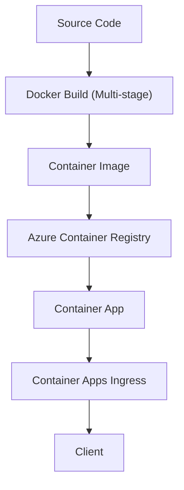

---
content_sources:
  diagrams:
    - id: build-production-ready-python-container-images-that
      type: flowchart
      source: mslearn-adapted
      based_on:
        - https://learn.microsoft.com/en-us/azure/container-apps/containers
        - https://learn.microsoft.com/en-us/azure/container-apps/get-started
---

# Recipe: Custom Container Images for Python on Azure Container Apps

Build production-ready Python container images that start quickly, stay small, and meet Azure Container Apps runtime expectations.

<!-- diagram-id: build-production-ready-python-container-images-that -->


## Prerequisites

- Azure CLI 2.57+ and Container Apps extension
- Docker 24+
- Existing Azure Container Registry (`$ACR_NAME`) and resource group (`$RG`)
- Python web app with a health endpoint (for example, `/health`)

```bash
az extension add --name containerapp --upgrade
az acr login --name "$ACR_NAME"
```

## Multi-stage Docker builds for Python

Use a build stage for dependency resolution and a runtime stage for execution. This keeps toolchains (compilers, headers) out of the final image.

### Example Dockerfile (best practices)

```dockerfile
# syntax=docker/dockerfile:1.7
FROM python:3.11-slim AS builder

ENV PIP_DISABLE_PIP_VERSION_CHECK=1 \
    PIP_NO_CACHE_DIR=1 \
    PYTHONDONTWRITEBYTECODE=1

WORKDIR /build
RUN apt-get update && apt-get install --yes --no-install-recommends \
    build-essential \
    gcc \
    && rm -rf /var/lib/apt/lists/*

COPY requirements.txt .
RUN pip install --upgrade pip \
    && pip wheel --wheel-dir /wheels --requirement requirements.txt

FROM python:3.11-slim AS runtime

ENV PYTHONDONTWRITEBYTECODE=1 \
    PYTHONUNBUFFERED=1 \
    CONTAINER_APP_PORT=8000

WORKDIR /app

# Create a non-root user
RUN groupadd --gid 10001 appgroup \
    && useradd --uid 10001 --gid appgroup --create-home appuser

# Install wheels from builder stage
COPY --from=builder /wheels /wheels
COPY requirements.txt .
RUN pip install --no-cache-dir --no-index --find-links=/wheels --requirement requirements.txt \
    && rm -rf /wheels

COPY src ./src

USER appuser
EXPOSE 8000

CMD ["gunicorn", "--bind", "0.0.0.0:8000", "--workers", "4", "--chdir", "src", "app:app"]
```

## Minimize image size

### Use `.dockerignore`

```text
.git
.venv
__pycache__
*.pyc
*.pyo
tests/
docs/
.pytest_cache/
dist/
build/
```

### Keep layers cache-friendly

1. Copy `requirements.txt` first, then install dependencies.
2. Copy app source later so dependency layers stay cached when only code changes.
3. Pin dependency versions to reduce unexpected rebuild churn.

## Health probe endpoint requirements

Container Apps readiness/liveness probes should target an endpoint that:

- Returns HTTP 200 quickly (avoid heavy database operations)
- Verifies app process health
- Uses the same port as app ingress (`CONTAINER_APP_PORT`, default 8000)

```python
from flask import Flask, jsonify

app = Flask(__name__)

@app.get("/health")
def health():
    return jsonify(status="ok"), 200
```

## Build and push to Azure Container Registry

```bash
export IMAGE_TAG="$(date +%Y%m%d%H%M%S)"
export IMAGE_NAME="$ACR_NAME.azurecr.io/$APP_NAME:$IMAGE_TAG"

docker build --tag "$IMAGE_NAME" .
docker push "$IMAGE_NAME"
```

## Test locally before deploy

```bash
docker run --rm --publish 8000:8000 --env CONTAINER_APP_PORT=8000 "$IMAGE_NAME"
curl "http://localhost:8000/health"
```

If local probes fail, fix startup behavior before creating a new revision in Container Apps.

## Advanced Topics

- Use BuildKit cache mounts to speed dependency downloads in CI.
- Generate SBOM and vulnerability scan reports in your pipeline.
- Use distroless or hardened runtime images only after validating required shared libraries.

## See Also

- [Native Dependencies](native-dependencies.md)
- [Container Registry](container-registry.md)
- [Revisions](../../../platform/revisions/index.md)
- [Microsoft Learn: Container Apps containers](https://learn.microsoft.com/azure/container-apps/containers)
