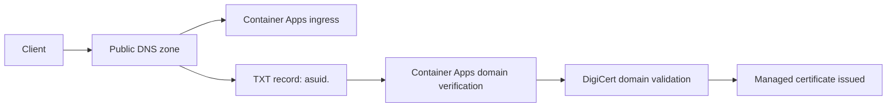
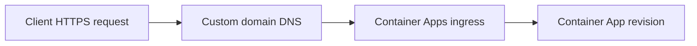

---
hide:
  - toc
content_sources:
  diagrams:
    - id: architecture
      type: flowchart
      source: mslearn-adapted
      based_on:
        - https://learn.microsoft.com/azure/container-apps/custom-domains-managed-certificates
        - https://learn.microsoft.com/azure/container-apps/environment-custom-dns
    - id: digi-cert-managed-certificate-issued
      type: flowchart
      source: mslearn-adapted
      based_on:
        - https://learn.microsoft.com/azure/container-apps/custom-domains-managed-certificates
        - https://learn.microsoft.com/azure/container-apps/environment-custom-dns
---

# Custom Domains and Certificates

Azure Container Apps supports custom hostnames and TLS certificates so you can serve production traffic on your own domain instead of the default `azurecontainerapps.io` endpoint. Managed certificates are validated through DigiCert and require public DNS reachability during issuance.

## Architecture

<!-- diagram-id: architecture -->


<!-- diagram-id: digi-cert-managed-certificate-issued -->


## Prerequisites

- Existing Container App: `$APP_NAME` in `$RG`
- Existing Container Apps environment: `$ENVIRONMENT_NAME`
- A public DNS zone you control for your domain
- Azure CLI with Container Apps extension

```bash
az extension add --name containerapp --upgrade
```

## Configure Custom Domain

1. Get environment static IP (used for apex A record) and app default FQDN (used for subdomain CNAME):

```bash
export ENV_STATIC_IP=$(az containerapp env show \
  --name "$ENVIRONMENT_NAME" \
  --resource-group "$RG" \
  --query "properties.staticIp" \
  --output tsv)

export APP_FQDN=$(az containerapp show \
  --name "$APP_NAME" \
  --resource-group "$RG" \
  --query "properties.configuration.ingress.fqdn" \
  --output tsv)
```

2. Get the domain verification value (`asuid`) from the app:

```bash
export CUSTOM_DOMAIN_VERIFICATION_ID=$(az containerapp show \
  --name "$APP_NAME" \
  --resource-group "$RG" \
  --query "properties.customDomainVerificationId" \
  --output tsv)
```

3. Create DNS records (example with Azure DNS):

```bash
# Apex domain example: contoso.com -> environment static IP
az network dns record-set a add-record \
  --resource-group "$DNS_RG" \
  --zone-name "contoso.com" \
  --record-set-name "@" \
  --ipv4-address "$ENV_STATIC_IP"

# Subdomain example: www.contoso.com -> app FQDN
az network dns record-set cname set-record \
  --resource-group "$DNS_RG" \
  --zone-name "contoso.com" \
  --record-set-name "www" \
  --cname "$APP_FQDN"

# TXT verification record required by Container Apps
az network dns record-set txt add-record \
  --resource-group "$DNS_RG" \
  --zone-name "contoso.com" \
  --record-set-name "asuid.www" \
  --value "$CUSTOM_DOMAIN_VERIFICATION_ID"
```

4. Add hostname to the Container App:

```bash
az containerapp hostname add \
  --name "$APP_NAME" \
  --resource-group "$RG" \
  --hostname "www.contoso.com"
```

## Create Managed Certificate

Bind the hostname with a managed certificate. The certificate is automatically provisioned and validated using DNS.

```bash
az containerapp hostname bind \
  --name "$APP_NAME" \
  --resource-group "$RG" \
  --hostname "www.contoso.com" \
  --environment "$ENVIRONMENT_NAME" \
  --validation-method CNAME
```

If you bring your own certificate instead of managed issuance, upload it to the environment with `az containerapp env certificate upload` and then bind it with `az containerapp hostname bind --certificate <cert-name>`.

## Enforce HTTPS

Set ingress transport to HTTPS-only:

```bash
az containerapp ingress update \
  --name "$APP_NAME" \
  --resource-group "$RG" \
  --transport auto \
  --allow-insecure false
```

## Verification

```bash
az containerapp hostname list \
  --name "$APP_NAME" \
  --resource-group "$RG" \
  --output table

az containerapp env certificate list \
  --name "$ENVIRONMENT_NAME" \
  --resource-group "$RG" \
  --output table
```

Then verify HTTPS from a client:

```bash
curl --verbose https://www.contoso.com/
```

## Troubleshooting

- **Managed certificate remains pending/failed**: confirm the app hostname is publicly reachable and DNS records have propagated.
- **DigiCert validation fails**: verify `asuid.<host>` TXT record value exactly matches the app verification ID.
- **CAA record blocks issuance**: ensure your CAA policy allows DigiCert certificate issuance for your domain.
- **HTTPS still not active**: confirm hostname is bound to the expected certificate and certificate status is `Ready`.

## Advanced Topics

- Use apex + subdomain patterns together (A record for apex, CNAME for subdomain).
- Standardize DNS TTL strategy to reduce cutover delays during migration.
- Pair custom domains with WAF/CDN when you need global edge security and acceleration.

## See Also
- [Networking](../../../platform/networking/vnet-integration.md)

## Sources
- [Container Apps custom domains and managed certificates (Microsoft Learn)](https://learn.microsoft.com/azure/container-apps/custom-domains-managed-certificates)
- [Container Apps environment custom DNS (Microsoft Learn)](https://learn.microsoft.com/azure/container-apps/environment-custom-dns)
