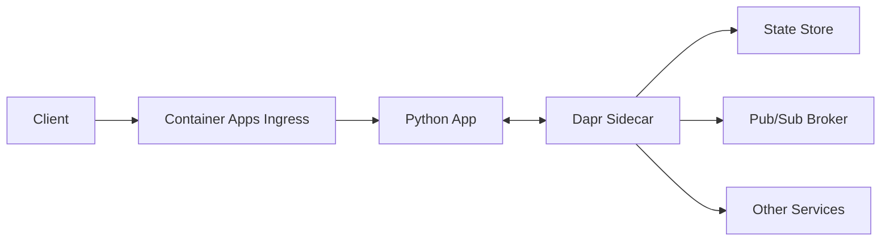

# Dapr Integration (Distributed Application Runtime)

Azure Container Apps (ACA) provides native Dapr integration, allowing your Python application to easily interact with other services and manage state, publish/subscribe messaging, and secrets.



## Enabling Dapr

To enable Dapr for your container app:

```bash
az containerapp dapr enable \
  --name my-python-app \
  --resource-group my-aca-rg \
  --dapr-app-id my-python-service \
  --dapr-app-port 8000
```

## How Dapr Works

Dapr runs as a sidecar container alongside your application. Your application interacts with Dapr using HTTP or gRPC on `localhost`.

## Python Implementation

Use the `dapr` library in your Python code to interact with Dapr.

### State Management

```python
from dapr.clients import DaprClient

with DaprClient() as d:
    # Save state
    d.save_state(store_name='statestore', key='order_1', value='{"item": "laptop"}')

    # Get state
    state = d.get_state(store_name='statestore', key='order_1')
    print(state.data)
```

### Publish/Subscribe Messaging

```python
from dapr.clients import DaprClient

with DaprClient() as d:
    # Publish a message
    d.publish_event(
        pubsub_name='messagebus',
        topic_name='orders',
        data='{"orderId": 123}',
        data_content_type='application/json'
    )
```

## Dapr Components

Configure Dapr components (like state stores or pub/sub brokers) as separate resources in your Bicep/ARM templates. ACA then maps these components to your application at runtime.

## Why use Dapr?

- **Abstracted Infrastructure:** Switch from Redis to Service Bus without changing your application code.
- **Improved Resiliency:** Dapr provides built-in retries and circuit breakers for service-to-service calls.
- **Enhanced Observability:** Dapr automatically collects telemetry for all cross-service communication.

## See Also
- [Service-to-Service Communication](../../../platform/networking/service-to-service.md)
- [Managed Identity](../../../platform/identity-and-secrets/managed-identity.md)
- [Operations: Observability](../../../operations/monitoring/index.md)

## Sources
- [Dapr overview for Azure Container Apps (Microsoft Learn)](https://learn.microsoft.com/azure/container-apps/dapr-overview)
- [Dapr component schema in Azure Container Apps (Microsoft Learn)](https://learn.microsoft.com/azure/container-apps/dapr-component-schema)
