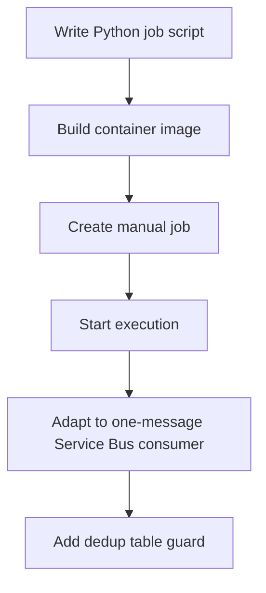

---
content_sources:
  diagrams:
  - id: python-jobs-recipe-flow
    type: flowchart
    source: self-generated
    justification: Language recipe flow synthesized from repository Python job example
      and Microsoft Learn Jobs guidance.
    based_on:
    - https://learn.microsoft.com/azure/container-apps/jobs
    - https://learn.microsoft.com/python/api/overview/azure/identity-readme
    - https://learn.microsoft.com/python/api/overview/azure/servicebus-readme
content_validation:
  status: verified
  last_reviewed: '2026-05-23'
  reviewer: agent
  core_claims:
  - claim: This page uses Microsoft Learn as the primary source basis for its Azure-specific
      guidance.
    source: https://learn.microsoft.com/azure/container-apps/jobs
    verified: true
---
# Recipe: Jobs in Python on Azure Container Apps

Use this recipe to package a Python script as a manual Job, adapt it to a one-message Service Bus consumer, and add a dedup table pattern for safe replay.

## Prerequisites

- Azure Container Apps environment (`$ENVIRONMENT_NAME`)
- Azure Container Registry (`$ACR_NAME`)
- Azure Service Bus namespace and queue for the event-driven example
- Python 3.11+, Docker, and Azure CLI

```bash
export RG="rg-aca-python-prod"
export ENVIRONMENT_NAME="aca-env-python-prod"
export ACR_NAME="acrpythonprod"
export JOB_NAME="job-python-manual"
export EVENT_JOB_NAME="job-python-servicebus"
export SERVICEBUS_NAMESPACE="sb-aca-prod"
export SERVICEBUS_QUEUE="orders"
```

## What You'll Build

- a manual Python Job with a script entrypoint
- an event-driven Service Bus consumer that processes one message and exits
- a dedup-table pattern you can move to a durable database in production

## Steps

<!-- diagram-id: python-jobs-recipe-flow -->


### 1. Package a manual Python job

`job.py`:

```python
import json
import os
import sys
from datetime import datetime, timezone


def main() -> int:
    payload = {
        "event": "job-start",
        "execution": os.getenv("CONTAINER_APP_JOB_EXECUTION_NAME", "local"),
        "task": os.getenv("TASK_NAME", "reconcile-orders"),
        "started_at": datetime.now(timezone.utc).isoformat(),
    }
    print(json.dumps(payload))

    print(json.dumps({"event": "job-work", "message": "processing batch"}))
    print(json.dumps({"event": "job-end", "status": "Succeeded"}))
    return 0


if __name__ == "__main__":
    sys.exit(main())
```

`requirements.txt`:

```text
azure-identity==1.17.1
azure-servicebus==7.13.0
```

`Dockerfile`:

```dockerfile
FROM python:3.11-slim

WORKDIR /app
COPY requirements.txt .
RUN pip install --no-cache-dir -r requirements.txt
COPY job.py .

CMD ["python", "job.py"]
```

Build and deploy the manual Job:

```bash
az acr build \
  --registry "$ACR_NAME" \
  --image "python-jobs/manual:v1" \
  --file "Dockerfile" \
  "."

az containerapp job create \
  --name "$JOB_NAME" \
  --resource-group "$RG" \
  --environment "$ENVIRONMENT_NAME" \
  --trigger-type "Manual" \
  --image "$ACR_NAME.azurecr.io/python-jobs/manual:v1" \
  --parallelism 1 \
  --replica-completion-count 1 \
  --replica-retry-limit 1 \
  --replica-timeout 600

az containerapp job start \
  --name "$JOB_NAME" \
  --resource-group "$RG"
```

| Command | Why it is used |
|---|---|
| `az acr build ...` | Builds and pushes the container image to Azure Container Registry. |

### 2. Adapt the container to an event-driven Service Bus consumer

Replace `job.py` with:

```python
import json
import os
from azure.identity import DefaultAzureCredential
from azure.servicebus import ServiceBusClient


fully_qualified_namespace = f"{os.environ['SERVICEBUS_NAMESPACE']}.servicebus.windows.net"
queue_name = os.environ["SERVICEBUS_QUEUE"]

credential = DefaultAzureCredential()
client = ServiceBusClient(fully_qualified_namespace=fully_qualified_namespace, credential=credential)

with client:
    receiver = client.get_queue_receiver(queue_name=queue_name, max_wait_time=15)
    with receiver:
        messages = receiver.receive_messages(max_message_count=1, max_wait_time=15)
        if not messages:
            print(json.dumps({"event": "empty-queue"}))
        else:
            message = messages[0]
            print(json.dumps({"event": "message-received", "message_id": message.message_id}))
            receiver.complete_message(message)
            print(json.dumps({"event": "message-completed", "message_id": message.message_id}))
```

Create the event-driven Job:

```bash
az acr build \
  --registry "$ACR_NAME" \
  --image "python-jobs/servicebus:v1" \
  --file "Dockerfile" \
  "."

az containerapp job create \
  --name "$EVENT_JOB_NAME" \
  --resource-group "$RG" \
  --environment "$ENVIRONMENT_NAME" \
  --trigger-type "Event" \
  --image "$ACR_NAME.azurecr.io/python-jobs/servicebus:v1" \
  --scale-rule-name "orders-queue" \
  --scale-rule-type "azure-servicebus" \
  --scale-rule-metadata "queueName=$SERVICEBUS_QUEUE" "messageCount=1" "namespace=$SERVICEBUS_NAMESPACE.servicebus.windows.net" \
  --replica-timeout 300 \
  --replica-retry-limit 1 \
  --env-vars SERVICEBUS_NAMESPACE="$SERVICEBUS_NAMESPACE" SERVICEBUS_QUEUE="$SERVICEBUS_QUEUE"
```

| Command | Why it is used |
|---|---|
| `az acr build ...` | Builds and pushes the container image to Azure Container Registry. |

### 3. Add an idempotency guard with a dedup table

For a runnable local example, add a SQLite-backed dedup table. In production, move the same pattern to Azure SQL, PostgreSQL, or another shared durable store.

```python
import sqlite3


def should_process(message_id: str) -> bool:
    conn = sqlite3.connect("/tmp/dedup.db")
    conn.execute("create table if not exists processed_messages (message_id text primary key)")
    cursor = conn.execute(
        "insert or ignore into processed_messages(message_id) values (?)",
        (message_id,),
    )
    conn.commit()
    conn.close()
    return cursor.rowcount == 1
```

Call it before completing the message:

```python
if should_process(str(message.message_id)):
    print(json.dumps({"event": "process-message", "message_id": message.message_id}))
    receiver.complete_message(message)
else:
    print(json.dumps({"event": "duplicate-message", "message_id": message.message_id}))
    receiver.complete_message(message)
```

## Verification

```bash
az containerapp job execution list \
  --name "$JOB_NAME" \
  --resource-group "$RG" \
  --output table

az containerapp job execution list \
  --name "$EVENT_JOB_NAME" \
  --resource-group "$RG" \
  --output table
```

| Command | Why it is used |
|---|---|
| `az containerapp job execution ...` | Creates, updates, starts, or inspects a Container Apps job. |

### Verify job in Azure Portal


**[Observed]** `cj-sample-d38538`. `Container App Job`. `Run now`. `Suspend`. `Refresh`. `Delete`. `Resource group`. `rg-aca-basics-d38538`. `Location`. `Korea Central`. `Subscription`. `Visual Studio Enterprise Subscription`. `Subscription ID`. `00000000-0000-0000-0000-000000000000`. `Container Apps Environme...`. `cae-basics-d38538`. `Log Analytics`. `law-basics-d38538`. `Workload profile`. `Consumption`. `Properties`. `Job`. `Provisioning status`. `Succeeded`. `Trigger Type`. `Manual`. `Execution history`. `View`. `Configuration`. `Replica timeout`. `300`. `Replica retry limit`. `1`. `Advanced`. `Parallelism`. `1`. `Completion count`. `1`.

**[Inferred]** The `Trigger Type` field reading `Manual` appears to map to the `--trigger-type "Manual"` lever passed to `az containerapp job create` in [Steps](#steps) Step 1. The `Replica timeout` value `300` is consistent with the `--replica-timeout` lever passed to `az containerapp job create` in [Steps](#steps) Step 1 (`600` in the manual flow and `300` in the event-driven flow). The `Replica retry limit` value `1` appears to map to the `--replica-retry-limit 1` lever passed in [Steps](#steps) Steps 1 and 2. The `Parallelism` value `1` and `Completion count` value `1` appear to map to `--parallelism 1` and `--replica-completion-count 1` passed in [Steps](#steps) Step 1. The `Run now` toolbar action is consistent with the `az containerapp job start` invocation in [Steps](#steps) Step 1.

**[Not Proven]** The Service Bus scaler from [Steps](#steps) Step 2 is not visible on this Manual job view. The `--env-vars SERVICEBUS_NAMESPACE` and `SERVICEBUS_QUEUE` values from [Steps](#steps) Step 2 are not visible on this view. The dedup-table behavior described in [Steps](#steps) Step 3 is application-internal. Individual execution exit codes are not visible on this overview blade.

## Next Steps / Clean Up

- Move the dedup table from SQLite to a shared durable database.
- Add Application Insights correlation fields to every log line.
- Revisit [Jobs Operations](../../../operations/jobs/index.md) before production rollout.

## See Also

- [Python Recipes Index](index.md)
- [Container Apps Jobs Overview](../../../platform/jobs/index.md)
- [Job Design](../../../best-practices/job-design.md)

## Sources

- [Jobs in Azure Container Apps (Microsoft Learn)](https://learn.microsoft.com/azure/container-apps/jobs)
- [Azure Identity client library for Python](https://learn.microsoft.com/python/api/overview/azure/identity-readme)
- [Azure Service Bus client library for Python](https://learn.microsoft.com/python/api/overview/azure/servicebus-readme)
