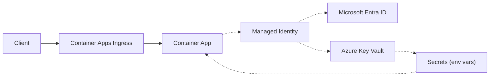

---
content_sources:
  diagrams:
    - id: use-managed-identity-and-key-vault
      type: flowchart
      source: mslearn-adapted
      based_on:
        - https://learn.microsoft.com/en-us/azure/container-apps/manage-secrets#reference-secret-from-key-vault
        - https://learn.microsoft.com/en-us/azure/container-apps/managed-identity
---

# Recipe: Key Vault Secret References in Azure Container Apps

Use managed identity and Key Vault references so your Python app receives secrets as environment variables without embedding secret values in deployment manifests.

<!-- diagram-id: use-managed-identity-and-key-vault -->


## Prerequisites

- Existing Key Vault name (`$KEYVAULT_NAME`)
- Existing Container App (`$APP_NAME`) and resource group (`$RG`)
- Azure CLI with Container Apps extension

```bash
az extension add --name containerapp --upgrade
```

## Create Key Vault and add secrets

```bash
az keyvault create \
  --name "$KEYVAULT_NAME" \
  --resource-group "$RG" \
  --location "$LOCATION"

az keyvault secret set \
  --vault-name "$KEYVAULT_NAME" \
  --name "db-password" \
  --value "replace-with-real-value"
```

## Configure managed identity for Key Vault access

```bash
az containerapp identity assign \
  --name "$APP_NAME" \
  --resource-group "$RG" \
  --system-assigned

export PRINCIPAL_ID=$(az containerapp show \
  --name "$APP_NAME" \
  --resource-group "$RG" \
  --query "identity.principalId" \
  --output tsv)

az role assignment create \
  --assignee-object-id "$PRINCIPAL_ID" \
  --assignee-principal-type ServicePrincipal \
  --role "Key Vault Secrets User" \
  --scope "$(az keyvault show --name "$KEYVAULT_NAME" --query id --output tsv)"
```

## Add a Container Apps secret with Key Vault reference

Key Vault reference syntax:

```text
keyvaultref:https://<key-vault-name>.vault.azure.net/secrets/<secret-name>
```

CLI example:

```bash
az containerapp secret set \
  --name "$APP_NAME" \
  --resource-group "$RG" \
  --secrets "db-password=keyvaultref:https://$KEYVAULT_NAME.vault.azure.net/secrets/db-password,identityref:system"

az containerapp update \
  --name "$APP_NAME" \
  --resource-group "$RG" \
  --set-env-vars "DB_PASSWORD=secretref:db-password"
```

## Access referenced secrets in Python

```python
import os
from flask import Flask, jsonify

app = Flask(__name__)

@app.get("/config-check")
def config_check():
    password = os.getenv("DB_PASSWORD", "")
    return jsonify(dbPasswordConfigured=bool(password)), 200
```

## Secret rotation patterns

- Rotate the Key Vault secret value (`az keyvault secret set` with same name).
- Restart or revise app workloads to pick up updated secret values.
- For controlled rotation, deploy a new revision and shift traffic after validation.

## Bicep example for Key Vault reference

```bicep
resource app 'Microsoft.App/containerApps@2023-05-01' existing = {
  name: appName
}

resource appSecrets 'Microsoft.App/containerApps@2023-05-01' = {
  name: app.name
  properties: {
    configuration: {
      secrets: [
        {
          name: 'db-password'
          keyVaultUrl: 'https://${keyVaultName}.vault.azure.net/secrets/db-password'
          identity: 'system'
        }
      ]
    }
    template: {
      containers: [
        {
          name: 'app'
          image: imageName
          env: [
            {
              name: 'DB_PASSWORD'
              secretRef: 'db-password'
            }
          ]
        }
      ]
    }
  }
}
```

## Troubleshooting common 403 errors

1. Confirm app identity is enabled and principal ID exists.
2. Verify role assignment is on the Key Vault scope and propagated.
3. Check Key Vault firewall/private endpoint settings.
4. Ensure secret URL path and version are correct.

```bash
az containerapp logs show \
  --name "$APP_NAME" \
  --resource-group "$RG" \
  --follow false
```

## Advanced Topics

- Use user-assigned identities for shared access policies across multiple apps.
- Separate secret vaults per environment to reduce blast radius.
- Pair Key Vault reference with revision validation for zero-downtime rotations.

## See Also

- [Managed Identity](managed-identity.md)
- [Revision Validation](revision-validation.md)
- [Key Vault](../../../platform/identity-and-secrets/key-vault.md)
- [Microsoft Learn: Manage secrets in Container Apps](https://learn.microsoft.com/azure/container-apps/manage-secrets)
