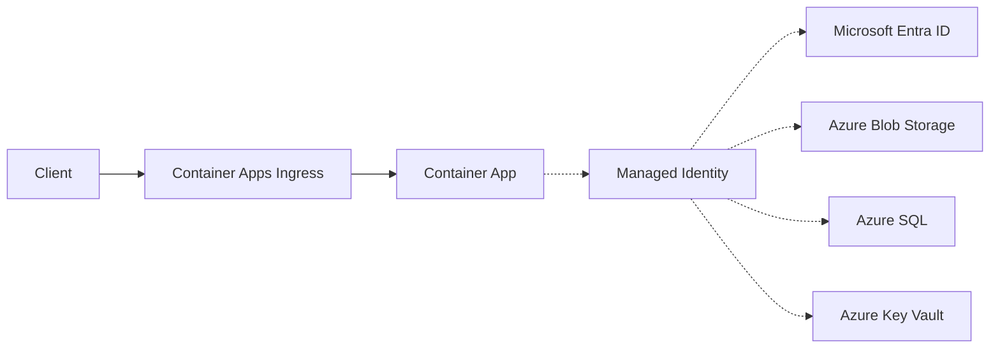

---
content_sources:
  diagrams:
    - id: use-managed-identity-and-defaultazurecredential-to
      type: flowchart
      source: mslearn-adapted
      based_on:
        - https://learn.microsoft.com/en-us/azure/container-apps/managed-identity
        - https://learn.microsoft.com/en-us/azure/container-apps/managed-identity-acr
---

# Recipe: Managed Identity in Python Apps on Azure Container Apps

Use managed identity and `DefaultAzureCredential` to access Azure services from Python without storing credentials in code or configuration.

<!-- diagram-id: use-managed-identity-and-defaultazurecredential-to -->


## Prerequisites

- Existing Container App (`$APP_NAME`) in resource group (`$RG`)
- Azure services to access (Storage, SQL, Cosmos DB, Key Vault)
- Azure CLI 2.57+ and Container Apps extension

```bash
az extension add --name containerapp --upgrade
```

## System-assigned vs user-assigned identity

| Identity type | Scope | Lifecycle | Typical use |
|---|---|---|---|
| System-assigned | One app | Deleted with app | Simple single-app workloads |
| User-assigned | Reusable | Independent resource | Shared identity across apps/jobs |

## Enable identity via CLI

System-assigned:

```bash
az containerapp identity assign \
  --name "$APP_NAME" \
  --resource-group "$RG" \
  --system-assigned
```

User-assigned:

```bash
az identity create \
  --name "id-$APP_NAME" \
  --resource-group "$RG" \
  --location "$LOCATION"

export UAMI_ID=$(az identity show \
  --name "id-$APP_NAME" \
  --resource-group "$RG" \
  --query "id" \
  --output tsv)

az containerapp identity assign \
  --name "$APP_NAME" \
  --resource-group "$RG" \
  --user-assigned "$UAMI_ID"
```

## Enable identity via Bicep

```bicep
resource app 'Microsoft.App/containerApps@2023-05-01' = {
  name: appName
  location: location
  identity: {
    type: 'SystemAssigned'
  }
  properties: {
    managedEnvironmentId: environmentId
    template: {
      containers: [
        {
          name: 'app'
          image: imageName
        }
      ]
    }
  }
}
```

## RBAC role assignments

Grant least privilege on each target resource.

```bash
export PRINCIPAL_ID=$(az containerapp show \
  --name "$APP_NAME" \
  --resource-group "$RG" \
  --query "identity.principalId" \
  --output tsv)

az role assignment create \
  --assignee-object-id "$PRINCIPAL_ID" \
  --assignee-principal-type ServicePrincipal \
  --role "Storage Blob Data Reader" \
  --scope "$(az storage account show --name "$STORAGE_ACCOUNT" --resource-group "$RG" --query id --output tsv)"
```

## Use `DefaultAzureCredential` in Python

`DefaultAzureCredential` uses managed identity in Container Apps, and falls back to Azure CLI credentials in local development.

```python
from azure.identity import DefaultAzureCredential

credential = DefaultAzureCredential()
```

## Example: Flask app reading Blob Storage with managed identity

```python
import os
from flask import Flask, jsonify
from azure.identity import DefaultAzureCredential
from azure.storage.blob import BlobServiceClient

app = Flask(__name__)
credential = DefaultAzureCredential()

account_url = os.environ["STORAGE_ACCOUNT_URL"]
container_name = os.getenv("STORAGE_CONTAINER", "app-data")

@app.get("/blobs")
def list_blobs():
    service = BlobServiceClient(account_url=account_url, credential=credential)
    container = service.get_container_client(container_name)
    names = [blob.name for blob in container.list_blobs()]
    return jsonify(blobs=names), 200
```

Set environment variables:

```bash
az containerapp update \
  --name "$APP_NAME" \
  --resource-group "$RG" \
  --set-env-vars \
    STORAGE_ACCOUNT_URL="https://$STORAGE_ACCOUNT.blob.core.windows.net" \
    STORAGE_CONTAINER="app-data"
```

## Common service patterns

- **Storage**: `Storage Blob Data Reader/Contributor`
- **Azure SQL**: database user mapped to Entra principal
- **Cosmos DB**: `Cosmos DB Built-in Data Reader/Contributor`
- **Key Vault**: `Key Vault Secrets User`

## Local development with identity fallback

```bash
az login
az account set --subscription "<subscription-id>"
python -m flask --app src.app run --port 8000
```

`DefaultAzureCredential` will use Azure CLI token locally and managed identity in Container Apps.

## Advanced Topics

- Use user-assigned identities for blast-radius control and explicit reuse.
- Split read/write privileges into separate identities for zero-trust boundaries.
- Add startup checks that verify token acquisition and downstream authorization.

## See Also

- [Key Vault Reference](key-vault-reference.md)
- [Storage](storage.md)
- [Managed Identity Platform Guide](../../../platform/identity-and-secrets/managed-identity.md)
- [Microsoft Learn: Managed identities in Container Apps](https://learn.microsoft.com/azure/container-apps/managed-identity)
