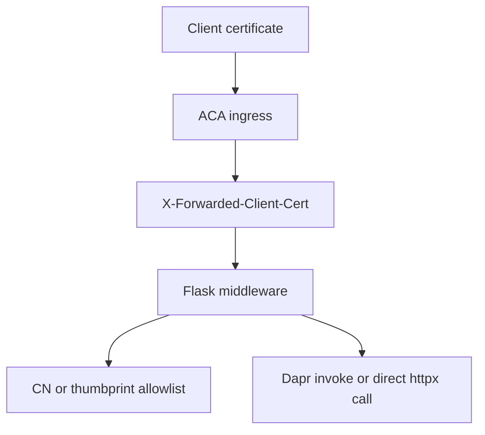

---
content_sources:
  diagrams:
    - id: flask-xfcc-validation-flow
      type: flowchart
      source: mslearn-adapted
      based_on:
        - https://learn.microsoft.com/en-us/azure/container-apps/client-certificate-authorization
        - https://learn.microsoft.com/en-us/azure/container-apps/ingress-overview
        - https://learn.microsoft.com/en-us/azure/container-apps/connect-apps
---

# Recipe: mTLS Client Certificates in Python Apps on Azure Container Apps

Use Flask middleware to parse `X-Forwarded-Client-Cert`, validate the forwarded leaf certificate, and compare direct internal calls with Dapr service invocation.

<!-- diagram-id: flask-xfcc-validation-flow -->


## Prerequisites

- Flask app deployed to Azure Container Apps with ingress enabled.
- `clientCertificateMode` set to `require` or `accept`.
- Python 3.11 or later for local testing.
- Optional Dapr sidecar enabled on both caller and callee apps.

`requirements.txt` additions:

```text
Flask==3.1.0
cryptography==44.0.2
httpx==0.28.1
```

## What You'll Build

- A Flask `before_request` hook that extracts the leaf PEM from `X-Forwarded-Client-Cert`.
- Certificate validation against an allowlist of thumbprints or common names.
- Two outbound patterns:
    - Dapr service invocation through `localhost:3500`
    - Direct internal call with `httpx`

## Steps

### 1. Add the middleware and routes

```python
import hashlib
import os
import re
from typing import Optional

import httpx
from cryptography import x509
from cryptography.hazmat.primitives import hashes, serialization
from flask import Flask, abort, g, jsonify, request

app = Flask(__name__)

ALLOWED_THUMBPRINTS = {
    value.strip().upper()
    for value in os.getenv("ALLOWED_CERT_THUMBPRINTS", "").split(",")
    if value.strip()
}
ALLOWED_COMMON_NAMES = {
    value.strip()
    for value in os.getenv("ALLOWED_CERT_COMMON_NAMES", "api-client.contoso.com").split(",")
    if value.strip()
}
DIRECT_BACKEND_URL = os.getenv("DIRECT_BACKEND_URL", "http://ca-backend")
DAPR_HTTP_PORT = os.getenv("DAPR_HTTP_PORT", "3500")
DAPR_TARGET_APP_ID = os.getenv("DAPR_TARGET_APP_ID", "backend")


def extract_leaf_pem(header_value: str) -> Optional[str]:
    match = re.search(r'Cert="([\s\S]*?)"(?:;|$)', header_value)
    if not match:
        return None
    return match.group(1).replace('\\n', '\n')


def certificate_thumbprint(certificate: x509.Certificate) -> str:
    der_bytes = certificate.public_bytes(serialization.Encoding.DER)
    return hashlib.sha256(der_bytes).hexdigest().upper()


def certificate_common_name(certificate: x509.Certificate) -> Optional[str]:
    for attribute in certificate.subject:
        if attribute.oid == x509.NameOID.COMMON_NAME:
            return attribute.value
    return None


@app.before_request
def require_known_client_certificate() -> None:
    header_value = request.headers.get("X-Forwarded-Client-Cert")
    if not header_value:
        abort(403, description="client certificate header missing")

    leaf_pem = extract_leaf_pem(header_value)
    if not leaf_pem:
        abort(403, description="leaf certificate missing from XFCC header")

    certificate = x509.load_pem_x509_certificate(leaf_pem.encode("utf-8"))
    thumbprint = certificate_thumbprint(certificate)
    common_name = certificate_common_name(certificate)

    if ALLOWED_THUMBPRINTS and thumbprint in ALLOWED_THUMBPRINTS:
        g.client_certificate = {"thumbprint": thumbprint, "common_name": common_name}
        return

    if common_name and common_name in ALLOWED_COMMON_NAMES:
        g.client_certificate = {"thumbprint": thumbprint, "common_name": common_name}
        return

    abort(403, description="client certificate is not allowlisted")


@app.get("/cert-info")
def cert_info():
    return jsonify(g.client_certificate)


@app.get("/call-backend/dapr")
def call_backend_with_dapr():
    url = f"http://127.0.0.1:{DAPR_HTTP_PORT}/v1.0/invoke/{DAPR_TARGET_APP_ID}/method/health"
    response = httpx.get(url, timeout=5.0)
    response.raise_for_status()
    return jsonify({"path": "dapr", "status": response.json()})


@app.get("/call-backend/direct")
def call_backend_direct():
    response = httpx.get(f"{DIRECT_BACKEND_URL}/health", timeout=5.0)
    response.raise_for_status()
    return jsonify({"path": "direct", "status": response.json()})


if __name__ == "__main__":
    app.run(host="0.0.0.0", port=8000, debug=True)
```

### 2. Set the environment variables

```bash
az containerapp update \
  --name "$APP_NAME" \
  --resource-group "$RG" \
  --set-env-vars \
    ALLOWED_CERT_COMMON_NAMES="api-client.contoso.com,partner-gateway.contoso.com" \
    ALLOWED_CERT_THUMBPRINTS="" \
    DIRECT_BACKEND_URL="http://ca-backend" \
    DAPR_TARGET_APP_ID="backend"
```

### 3. Test from outside the app

```bash
curl --include \
  --cert "./client.pem" \
  --key "./client.key" \
  "https://${FQDN}/cert-info"
```

## Verification

- A valid allowlisted certificate returns `200 OK` and the parsed CN or thumbprint.
- A certificate with the wrong CN or thumbprint returns `403`.
- `/call-backend/dapr` succeeds when Dapr is enabled on both apps.
- `/call-backend/direct` succeeds only when direct environment networking and backend ingress are configured correctly.

## See Also

- [Dapr Integration](dapr-integration.md)
- [Ingress Client Certificates](../../../platform/security/ingress-client-certificates.md)
- [mTLS Architecture in Azure Container Apps](../../../platform/security/mtls.md)

## Sources

- [Configure client certificate authentication in Azure Container Apps (Microsoft Learn)](https://learn.microsoft.com/en-us/azure/container-apps/client-certificate-authorization)
- [Ingress overview in Azure Container Apps (Microsoft Learn)](https://learn.microsoft.com/en-us/azure/container-apps/ingress-overview)
- [Communicate between container apps in Azure Container Apps (Microsoft Learn)](https://learn.microsoft.com/en-us/azure/container-apps/connect-apps)
