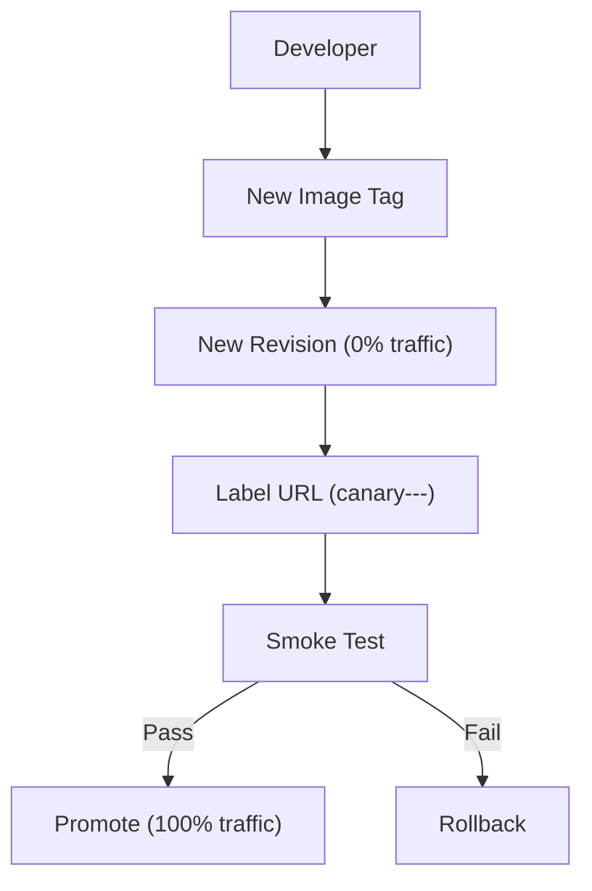

---
content_sources:
  diagrams:
  - id: validate-new-revisions-with-direct-testing
    type: flowchart
    source: mslearn-adapted
    based_on:
    - https://learn.microsoft.com/en-us/azure/container-apps/revisions
    - https://learn.microsoft.com/en-us/azure/container-apps/traffic-splitting
    - https://learn.microsoft.com/en-us/azure/container-apps/health-probes
content_validation:
  status: verified
  last_reviewed: '2026-05-23'
  reviewer: agent
  core_claims:
  - claim: This page uses Microsoft Learn as the primary source basis for its Azure-specific
      guidance.
    source: https://learn.microsoft.com/en-us/azure/container-apps/revisions
    verified: true
---
# Recipe: Revision Validation Before Production Traffic

Validate new revisions with direct testing and controlled traffic movement so you can release safely without impacting all users at once.

<!-- diagram-id: validate-new-revisions-with-direct-testing -->


## Prerequisites

- Existing Container App with multiple revision mode enabled
- Azure CLI 2.57+ with Container Apps extension
- Smoke tests for your key endpoints

```bash
az containerapp revision set-mode \
  --name "$APP_NAME" \
  --resource-group "$RG" \
  --mode multiple
```

| Command | Why it is used |
|---|---|
| `az containerapp revision set-mode ...` | Runs the Azure CLI operation required by the documented step. |

## Deploy a new revision at 0% traffic

```bash
az containerapp update \
  --name "$APP_NAME" \
  --resource-group "$RG" \
  --image "$ACR_NAME.azurecr.io/$APP_NAME:$IMAGE_TAG" \
  --revision-suffix "canary"

export NEW_REVISION=$(az containerapp revision list \
  --name "$APP_NAME" \
  --resource-group "$RG" \
  --query "[?contains(name, 'canary')].name | [0]" \
  --output tsv)

az containerapp ingress traffic set \
  --name "$APP_NAME" \
  --resource-group "$RG" \
  --revision-weight "$NEW_REVISION=0"
```

| Command | Why it is used |
|---|---|
| `az containerapp update ...` | Updates the existing Container App configuration without recreating the app. |

## Revision labels and direct URL testing

Assign a label so testers can call the candidate revision directly.

```bash
az containerapp revision label add \
  --name "$APP_NAME" \
  --resource-group "$RG" \
  --label "canary" \
  --revision "$NEW_REVISION"

export LABEL_URL=$(az containerapp show \
  --name "$APP_NAME" \
  --resource-group "$RG" \
  --query "properties.configuration.ingress.fqdn" \
  --output tsv)

curl --fail "https://canary---$LABEL_URL/health"
```

| Command | Why it is used |
|---|---|
| `az containerapp revision label ...` | Runs the Azure CLI operation required by the documented step. |

## Health check validation before traffic shift

Confirm:

1. `/health` returns 200.
2. Dependency checks (database/cache/API) pass.
3. Error rate and latency are within baseline.

```bash
az containerapp logs show \
  --name "$APP_NAME" \
  --resource-group "$RG" \
  --revision "$NEW_REVISION" \
  --follow false
```

| Command | Why it is used |
|---|---|
| `az containerapp logs show ...` | Runs the Azure CLI operation required by the documented step. |

## Weighted traffic splitting (canary)

Shift traffic gradually while watching telemetry.

```bash
export STABLE_REVISION=$(az containerapp revision list \
  --name "$APP_NAME" \
  --resource-group "$RG" \
  --query "[?properties.active==\`true\` && name!=\`$NEW_REVISION\`].name | [0]" \
  --output tsv)

# 10% canary
az containerapp ingress traffic set \
  --name "$APP_NAME" \
  --resource-group "$RG" \
  --revision-weight "$STABLE_REVISION=90" "$NEW_REVISION=10"

# Promote to 100% after validation window
az containerapp ingress traffic set \
  --name "$APP_NAME" \
  --resource-group "$RG" \
  --revision-weight "$NEW_REVISION=100"
```

| Command | Why it is used |
|---|---|
| `az containerapp revision list ...` | Lists revisions so rollout state, traffic, and health can be verified. |

## Automated revision validation script

```bash
#!/usr/bin/env bash
set -euo pipefail

APP_NAME="$1"
RG="$2"
LABEL="canary"

FQDN=$(az containerapp show \
  --name "$APP_NAME" \
  --resource-group "$RG" \
  --query "properties.configuration.ingress.fqdn" \
  --output tsv)

for path in /health /ready /version; do
  echo "Testing ${path}"
  curl --silent --show-error --fail "https://${LABEL}---${FQDN}${path}" > /dev/null
done

echo "Revision validation passed"
```

## Rollback patterns

- **Fast rollback**: route 100% back to last stable revision.
- **Safe rollback**: keep canary alive at 0% for postmortem testing.
- **Operational rollback**: disable bad revision if it causes repeated probe failures.

```bash
az containerapp ingress traffic set \
  --name "$APP_NAME" \
  --resource-group "$RG" \
  --revision-weight "$STABLE_REVISION=100" "$NEW_REVISION=0"
```

| Command | Why it is used |
|---|---|
| `az containerapp ingress traffic ...` | Runs the Azure CLI operation required by the documented step. |

## Advanced Topics

- Integrate validation into CI/CD gates before promotion.
- Use synthetic transactions instead of health-only checks.
- Add automatic rollback triggers from error-budget policies.

## See Also

- [Container Registry](container-registry.md)
- [Custom Container](custom-container.md)
- [Revisions](../../../platform/revisions/index.md)
- [Microsoft Learn: Revisions in Container Apps](https://learn.microsoft.com/azure/container-apps/revisions)

## Sources

- [Microsoft Learn source 1](https://learn.microsoft.com/en-us/azure/container-apps/revisions)
- [Microsoft Learn source 2](https://learn.microsoft.com/en-us/azure/container-apps/traffic-splitting)
- [Microsoft Learn source 3](https://learn.microsoft.com/en-us/azure/container-apps/health-probes)
