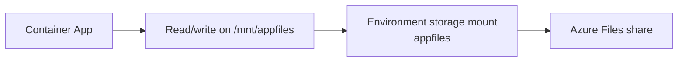
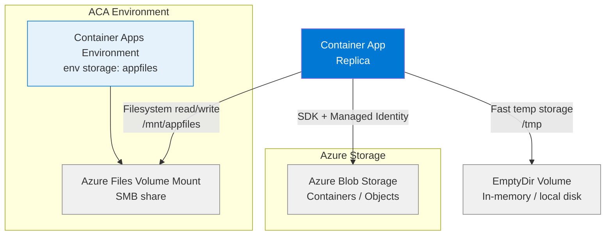

---
hide:
  - toc
content_sources:
  diagrams:
    - id: architecture
      type: flowchart
      source: mslearn-adapted
      based_on:
        - https://learn.microsoft.com/azure/container-apps/storage-mounts
        - https://learn.microsoft.com/python/api/overview/azure/storage-blob-readme
        - https://learn.microsoft.com/azure/container-apps/storage-mounts#storage-types
    - id: container-apps-containers-are-ephemeral-by
      type: flowchart
      source: mslearn-adapted
      based_on:
        - https://learn.microsoft.com/azure/container-apps/storage-mounts
        - https://learn.microsoft.com/python/api/overview/azure/storage-blob-readme
        - https://learn.microsoft.com/azure/container-apps/storage-mounts#storage-types
---

# Storage: Volume Mounts and Blob Storage

Connect your Container App to Azure Storage — either by mounting an Azure Files share directly into the container filesystem, or by accessing Blob Storage programmatically via the SDK with Managed Identity.

## Architecture

<!-- diagram-id: architecture -->


Solid arrows show runtime data flow. Dashed arrows show identity and authentication.

!!! note "Blob mounts are not supported in Container Apps"
    Unlike App Service, Azure Container Apps **cannot mount Blob Storage as a filesystem path**. Use the Azure Storage Blob SDK with Managed Identity for blob access. For shared filesystem access, use **Azure Files volume mounts**.

## Overview

Container Apps containers are ephemeral by default — all writes to the local filesystem are lost when a replica restarts or scales down. To persist data or share files across replicas, you need external storage.

<!-- diagram-id: container-apps-containers-are-ephemeral-by -->


### When to use which storage type

| Scenario | Recommended approach |
|----------|---------------------|
| User file uploads, blob data | **Blob Storage SDK** (Managed Identity) |
| Shared files across replicas (config, exports) | **Azure Files volume mount** |
| Large objects, static assets | **Blob Storage SDK** |
| Temporary processing scratch space | **EmptyDir volume** |
| Secrets as files | **Secret volume** |
| SQLite database | ⚠️ Azure Files mount — but see [limitations](#limitations-and-caveats) |
| High-frequency writes (> 100/sec) | **Blob SDK directly** — mounts add latency |

### Storage options comparison

| Option | Persistence | Shared across replicas | Access type | Authentication |
|--------|-------------|----------------------|-------------|----------------|
| Container local disk | ❌ Ephemeral | ❌ No | Filesystem | N/A |
| EmptyDir volume | ❌ Per-revision | ✅ Within replica only | Filesystem | N/A |
| Azure Files mount | ✅ Persistent | ✅ Yes | Filesystem | Storage key (via env storage) |
| Blob Storage SDK | ✅ Persistent | ✅ Yes | SDK / HTTP | Managed Identity or key |

### I/O performance

| Storage | Latency (approx.) | Throughput | Notes |
|---------|------------------|------------|-------|
| Container local disk | ~1ms | High | Lost on restart |
| EmptyDir (tmpfs) | ~1ms | High | Lost on revision change |
| Azure Files mount | ~10–50ms | Medium | Shared, persistent, SMB over network |
| Blob Storage SDK | ~5–20ms | High | Full read/write, passwordless |

## Prerequisites

- Existing Container App: `$APP_NAME` in `$RG`
- Existing Container Apps environment: `$ENVIRONMENT_NAME`
- Existing Storage account: `$STORAGE_ACCOUNT`
- Azure CLI with Container Apps extension: `az extension add --name containerapp`

## Part 1: Blob Storage via SDK (Managed Identity)

Access Blob Storage from your app code using a system-assigned managed identity — no storage keys required.

### Step 1: Enable managed identity

```bash
az containerapp identity assign \
  --name "$APP_NAME" \
  --resource-group "$RG" \
  --system-assigned

export PRINCIPAL_ID=$(az containerapp show \
  --name "$APP_NAME" \
  --resource-group "$RG" \
  --query "identity.principalId" \
  --output tsv)
```

### Step 2: Assign Storage Blob Data Contributor role

```bash
export STORAGE_ID=$(az storage account show \
  --name "$STORAGE_ACCOUNT" \
  --resource-group "$RG" \
  --query "id" \
  --output tsv)

az role assignment create \
  --assignee-object-id "$PRINCIPAL_ID" \
  --assignee-principal-type ServicePrincipal \
  --role "Storage Blob Data Contributor" \
  --scope "$STORAGE_ID"
```

### Step 3: Configure the Blob endpoint

```bash
az containerapp update \
  --name "$APP_NAME" \
  --resource-group "$RG" \
  --set-env-vars STORAGE_ACCOUNT_URL="https://$STORAGE_ACCOUNT.blob.core.windows.net"
```

### Step 4: Python code for Blob operations

Install dependencies:

```bash
pip install azure-identity azure-storage-blob
```

Use `DefaultAzureCredential` for passwordless access:

```python
import os
from azure.identity import DefaultAzureCredential
from azure.storage.blob import BlobServiceClient

credential = DefaultAzureCredential()
account_url = os.environ["STORAGE_ACCOUNT_URL"]
service_client = BlobServiceClient(account_url=account_url, credential=credential)
container_client = service_client.get_container_client("app-data")

# Upload
container_client.upload_blob(name="hello.txt", data=b"hello from aca", overwrite=True)

# Download
blob = container_client.download_blob("hello.txt")
content = blob.readall()

# List blobs
for b in container_client.list_blobs():
    print(b.name)
```

### Verification

Check blob upload from CLI:

```bash
az storage blob list \
  --account-name "$STORAGE_ACCOUNT" \
  --container-name "app-data" \
  --auth-mode login \
  --output table
```

Check app logs:

```bash
az containerapp logs show \
  --name "$APP_NAME" \
  --resource-group "$RG" \
  --follow false
```

---

## Part 2: Azure Files Volume Mount

Mount an Azure Files share into the container as a local directory. All replicas share the same mounted filesystem.

!!! important "Volume mounts are registered at the Environment level"
    In Container Apps, storage is registered on the **Environment**, not the app. Once registered, any app in that environment can reference it. A change to volume mounts creates a new **revision**.

### Step 1: Create an Azure Files share

```bash
az storage share-rm create \
  --storage-account "$STORAGE_ACCOUNT" \
  --resource-group "$RG" \
  --name "app-files"
```

### Step 2: Register storage in the Container Apps Environment

#### Using CLI

```bash
export STORAGE_KEY=$(az storage account keys list \
  --account-name "$STORAGE_ACCOUNT" \
  --resource-group "$RG" \
  --query "[0].value" \
  --output tsv)

az containerapp env storage set \
  --name "$ENVIRONMENT_NAME" \
  --resource-group "$RG" \
  --storage-name "appfiles" \
  --azure-file-account-name "$STORAGE_ACCOUNT" \
  --azure-file-account-key "$STORAGE_KEY" \
  --azure-file-share-name "app-files" \
  --access-mode ReadWrite
```

Verify the environment storage was registered:

```bash
az containerapp env storage show \
  --name "$ENVIRONMENT_NAME" \
  --resource-group "$RG" \
  --storage-name "appfiles"
```

Expected output:

```json
{
  "name": "appfiles",
  "properties": {
    "azureFile": {
      "accessMode": "ReadWrite",
      "accountName": "mystorageaccount",
      "shareName": "app-files"
    }
  }
}
```

#### Using Bicep

```bicep
resource environment 'Microsoft.App/managedEnvironments@2023-05-01' existing = {
  name: environmentName
}

resource environmentStorage 'Microsoft.App/managedEnvironments/storages@2023-05-01' = {
  parent: environment
  name: 'appfiles'
  properties: {
    azureFile: {
      accountName: storageAccountName
      accountKey: storageAccountKey  // Store in Key Vault — see Security section
      shareName: 'app-files'
      accessMode: 'ReadWrite'
    }
  }
}
```

### Step 3: Attach the volume mount to your Container App

#### Using YAML update

Export the current app definition:

```bash
az containerapp show \
  --name "$APP_NAME" \
  --resource-group "$RG" \
  --output yaml > app-volume.yaml
```

Edit `app-volume.yaml` to add volumes and volumeMounts under `template`:

```yaml
template:
  containers:
    - name: app
      image: <your-image>
      volumeMounts:
        - volumeName: appfiles
          mountPath: /mnt/appfiles
  volumes:
    - name: appfiles
      storageType: AzureFile
      storageName: appfiles   # Must match the name registered in the environment
```

Apply the updated template:

```bash
az containerapp update \
  --name "$APP_NAME" \
  --resource-group "$RG" \
  --yaml app-volume.yaml
```

This creates a **new revision**. Traffic will shift to the new revision automatically unless you are using manual revision mode.

#### Using Bicep

```bicep
resource containerApp 'Microsoft.App/containerApps@2023-05-01' = {
  name: appName
  location: location
  properties: {
    environmentId: environment.id
    template: {
      containers: [
        {
          name: 'app'
          image: containerImage
          volumeMounts: [
            {
              volumeName: 'appfiles'
              mountPath: '/mnt/appfiles'
            }
          ]
        }
      ]
      volumes: [
        {
          name: 'appfiles'
          storageType: 'AzureFile'
          storageName: 'appfiles'  // References the environment storage name
        }
      ]
    }
  }
}
```

### Step 4: Python code for mounted filesystem

Once mounted, use standard Python file I/O — no special SDK required:

```python
import os

MOUNT_PATH = os.environ.get("FILES_MOUNT_PATH", "/mnt/appfiles")

# Write a file
def save_report(filename: str, content: str) -> None:
    filepath = os.path.join(MOUNT_PATH, filename)
    with open(filepath, "w") as f:
        f.write(content)

# Read a file
def load_report(filename: str) -> str:
    filepath = os.path.join(MOUNT_PATH, filename)
    with open(filepath, "r") as f:
        return f.read()

# List files
def list_reports() -> list[str]:
    return os.listdir(MOUNT_PATH)
```

Set the mount path as an env var so local development can override it:

```bash
az containerapp update \
  --name "$APP_NAME" \
  --resource-group "$RG" \
  --set-env-vars FILES_MOUNT_PATH=/mnt/appfiles
```

### Verification

Verify the mount is active and accessible in a running replica:

```bash
az containerapp exec \
  --name "$APP_NAME" \
  --resource-group "$RG" \
  --command "ls -la /mnt/appfiles"
```

Expected output (if the share has files):

```
total 8
drwxrwxrwx 2 root root 4096 Jan 01 00:00 .
drwxr-xr-x 3 root root 4096 Jan 01 00:00 ..
-rw-r--r-- 1 root root   14 Jan 01 00:00 hello.txt
```

Write a test file from inside the container and confirm it persists across replicas:

```bash
# Write from one replica
az containerapp exec \
  --name "$APP_NAME" \
  --resource-group "$RG" \
  --command "sh -c 'echo test > /mnt/appfiles/test.txt'"

# Verify via Azure Files
az storage file list \
  --account-name "$STORAGE_ACCOUNT" \
  --share-name "app-files" \
  --output table
```

---

## Part 3: EmptyDir Volume (Ephemeral Scratch Space)

Use `EmptyDir` for temporary per-replica working directories — faster than Azure Files, but data is lost when the replica restarts or the revision changes.

Use EmptyDir when:
- You need a fast temp directory for in-flight processing (image resize, zip/unzip)
- You want to share temp files between **multiple containers in the same replica** (sidecar pattern)
- You explicitly do NOT need persistence

```yaml
template:
  containers:
    - name: app
      image: <your-image>
      volumeMounts:
        - volumeName: tmpdata
          mountPath: /tmp/processing
  volumes:
    - name: tmpdata
      storageType: EmptyDir
```

!!! warning "EmptyDir is not shared across replicas"
    Each replica gets its own EmptyDir. If you scale to 3 replicas, each has an independent `/tmp/processing` directory.

---

## Security: Protecting the Storage Key

The `az containerapp env storage set` command requires a storage account key. Avoid storing this key in scripts or CI pipelines — use Key Vault instead.

### Store the storage key in Key Vault

```bash
az keyvault secret set \
  --vault-name "$KEY_VAULT_NAME" \
  --name "storage-account-key" \
  --value "$STORAGE_KEY"
```

### Reference from Bicep (secure parameter)

```bicep
// Reference key from Key Vault at deployment time
resource keyVault 'Microsoft.KeyVault/vaults@2023-07-01' existing = {
  name: keyVaultName
}

resource environmentStorage 'Microsoft.App/managedEnvironments/storages@2023-05-01' = {
  parent: environment
  name: 'appfiles'
  properties: {
    azureFile: {
      accountName: storageAccountName
      accountKey: keyVault.getSecret('storage-account-key')
      shareName: 'app-files'
      accessMode: 'ReadWrite'
    }
  }
}
```

!!! note "Managed Identity not supported for volume mounts"
    Azure Files volume mounts in Container Apps authenticate using a **storage account key** — Managed Identity is not supported for the mount mechanism itself. Use Key Vault to secure the key at rest. For blob access (SDK-based), Managed Identity is fully supported and preferred.

See [Key Vault Secrets Management](../../../platform/identity-and-secrets/key-vault.md) for the full setup.

---

## Limitations and Caveats

!!! warning "Know these before relying on Azure Files mounts in production"

    - **Storage is registered at environment level.** All apps in the environment can reference the same storage name. Name your storages clearly (`appfiles-prod`, `appfiles-staging`) to avoid confusion.
    - **Blob Storage cannot be mounted as a filesystem path.** Container Apps only supports `AzureFile`, `EmptyDir`, and `Secret` volume types — not `AzureBlob`. Use the SDK for blob access.
    - **Volume mount changes create a new revision.** Updating `volumeMounts` or `volumes` in the app template triggers a revision rollout. Plan for this in production.
    - **Azure Files uses SMB over network.** Expect ~10–50ms latency per I/O operation. Avoid patterns that do thousands of small reads/writes per request.
    - **SQLite and file-locking workloads are unreliable.** SMB file locks are not fully compatible with SQLite's locking model. Use Azure SQL or Cosmos DB instead.
    - **Scaling to zero disconnects the mount.** When a Container App scales to zero replicas, there is no active mount. On scale-up, the mount reconnects automatically — but do not assume the mount is always live.
    - **Storage account key in environment storage is not rotated automatically.** If you rotate the storage key, you must re-run `az containerapp env storage set` with the new key.
    - **Access mode is set at environment registration, not at mount time.** `ReadOnly` or `ReadWrite` is configured when you register storage in the environment — not per-app.

---

## Troubleshooting

| Symptom | Cause | Fix |
|---------|-------|-----|
| `/mnt/appfiles` not visible in `containerapp exec` | Volume mount not applied or wrong revision active | Check revision list; verify YAML has `volumes` + `volumeMounts`; ensure latest revision is active |
| `Permission denied` writing to mount | `access-mode` set to `ReadOnly` | Re-register environment storage with `--access-mode ReadWrite` |
| `Transport endpoint is not connected` | SMB connection dropped (transient) | Retry; check storage account firewall — ensure Container Apps environment subnet is allowed |
| Files written on one replica not visible on another | Writing to container local disk, not the mount | Confirm `mountPath` in YAML matches path used in code; use `os.environ.get("FILES_MOUNT_PATH")` |
| `AccountIsDisabled` or `AuthenticationFailed` | Storage key rotated or incorrect | Retrieve new key and re-run `az containerapp env storage set` |
| `az containerapp env storage set` fails | Environment name or resource group mismatch | Verify `$ENVIRONMENT_NAME` matches the environment your app is in |
| Slow file I/O on mount | Azure Files SMB latency | Use EmptyDir for hot temporary files; only persist final results to the mount |
| Mount missing after scale-out | New replica starting up before mount is ready | Add retry logic on startup; mount reconnects within seconds |

---

## See Also
- [Managed Identity](../../../platform/identity-and-secrets/managed-identity.md)
- [Key Vault Secrets Management](../../../platform/identity-and-secrets/key-vault.md)
- [Private Endpoints](../../../platform/networking/private-endpoints.md)

## Sources
- [Azure Files in Container Apps (Microsoft Learn)](https://learn.microsoft.com/azure/container-apps/storage-mounts)
- [Azure Storage Blob SDK for Python](https://learn.microsoft.com/python/api/overview/azure/storage-blob-readme)
- [Container Apps volume mount types (Microsoft Learn)](https://learn.microsoft.com/azure/container-apps/storage-mounts#storage-types)
