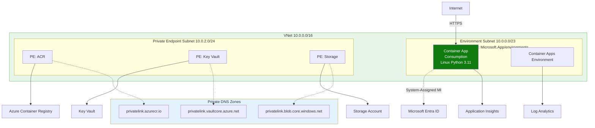
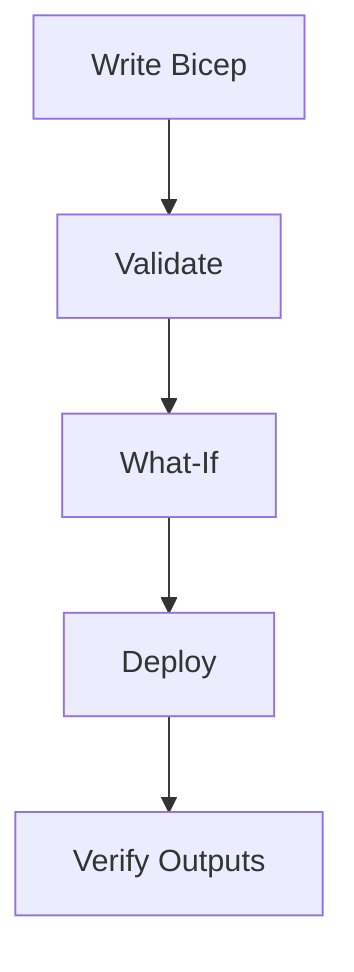

---
content_sources:
  diagrams:
    - id: this-tutorial-assumes-a-production-ready-container
      type: flowchart
      source: mslearn-adapted
      based_on:
        - https://learn.microsoft.com/en-us/azure/container-apps/azure-resource-manager-api-spec
        - https://learn.microsoft.com/en-us/azure/templates/microsoft.app/containerapps
    - id: infrastructure-lifecycle
      type: flowchart
      source: mslearn-adapted
      based_on:
        - https://learn.microsoft.com/en-us/azure/container-apps/azure-resource-manager-api-spec
        - https://learn.microsoft.com/en-us/azure/templates/microsoft.app/containerapps
validation:
  az_cli:
    last_tested:
    cli_version:
    result: not_tested
  bicep:
    last_tested:
    result: not_tested
---
# 05 - Infrastructure as Code with Bicep

Use Bicep to define your Azure Container Apps platform consistently across environments. This step focuses on repeatable provisioning and safe updates.

!!! info "Infrastructure Context"
    **Service**: Container Apps (Consumption) | **Network**: VNet integrated | **VNet**: ✅

    This tutorial assumes a production-ready Container Apps deployment with a custom VNet, ACR with managed identity pull, and private endpoints for backend services.

    <!-- diagram-id: this-tutorial-assumes-a-production-ready-container -->


## Infrastructure Lifecycle

<!-- diagram-id: infrastructure-lifecycle -->


## Prerequisites

- Completed [04 - Logging, Monitoring, and Observability](04-logging-monitoring.md)
- Bicep files under `infra/`

!!! tip "Run validate and what-if before every apply"
    Treat `az deployment group validate` and `az deployment group what-if` as required safety checks to prevent accidental production-impacting infrastructure changes.

## Step-by-step

1. **Set standard variables**

   ```bash
   RG="rg-aca-python-demo"
   BASE_NAME="pycontainer"
   LOCATION="koreacentral"
   DEPLOYMENT_NAME="main"
   ```

2. **Validate the Bicep template**

   ```bash
   az deployment group validate \
      --resource-group "$RG" \
      --template-file infra/main.bicep \
      --parameters baseName="$BASE_NAME" location="$LOCATION"
   ```

   | Command | Why it is used |
   |---|---|
   | `az deployment group validate ...` | Runs the Azure CLI operation required by the documented step. |

   ???+ example "Expected output"
       ```json
       {
         "status": "Succeeded",
         "error": null
       }
       ```

3. **Preview changes with what-if**

   ```bash
   az deployment group what-if \
      --resource-group "$RG" \
      --template-file infra/main.bicep \
      --parameters baseName="$BASE_NAME" location="$LOCATION"
   ```

   | Command | Why it is used |
   |---|---|
   | `az deployment group what-if ...` | Previews resource changes before deployment. |

   ???+ example "Expected output"
       ```text
       Resource and property changes are indicated with these symbols:
         + Create
         ~ Modify

       The deployment will update the following scope:
       Scope: /subscriptions/<subscription-id>/resourceGroups/rg-aca-python-demo

         ~ Microsoft.App/containerApps/<your-app-name> [2024-03-01]
           ~ properties.template.containers[0].image: "<acr-name>.azurecr.io/myapp:v1.0.0"
       ```

4. **Deploy infrastructure**

   ```bash
   az deployment group create \
      --name "$DEPLOYMENT_NAME" \
      --resource-group "$RG" \
      --template-file infra/main.bicep \
      --parameters baseName="$BASE_NAME" location="$LOCATION"
   ```

   | Command | Why it is used |
   |---|---|
   | `az deployment group create ...` | Deploys the Bicep or ARM template into the target resource group. |

   ???+ example "Expected output"
       ```json
       {
         "id": "/subscriptions/<subscription-id>/resourceGroups/rg-aca-python-demo/providers/Microsoft.Resources/deployments/main",
         "name": "main",
         "properties": {
           "provisioningState": "Succeeded",
           "outputs": {
             "containerAppName": { "type": "String", "value": "<your-app-name>" },
             "containerAppEnvName": { "type": "String", "value": "<your-env-name>" },
             "containerRegistryName": { "type": "String", "value": "<acr-name>" },
             "location": { "type": "String", "value": "koreacentral" }
           }
         }
       }
       ```

5. **Verify outputs and key resources**

   ```bash
   az deployment group show \
      --resource-group "$RG" \
      --name "$DEPLOYMENT_NAME" \
      --query properties.outputs
   ```

   | Command | Why it is used |
   |---|---|
   | `az deployment group show ...` | Reads deployment output and provisioning state for verification. |

   ???+ example "Expected output"
       ```json
       {
         "containerAppName": {
           "type": "String",
           "value": "<your-app-name>"
         },
         "containerAppEnvName": {
           "type": "String",
           "value": "cae-myapp"
         },
         "containerRegistryName": {
           "type": "String",
           "value": "<acr-name>"
         },
         "containerRegistryLoginServer": {
           "type": "String",
           "value": "<acr-name>.azurecr.io"
         }
        }
        ```

### Verify deployed resources in Azure Portal

![rg-aca-basics-d38538 | Resource group | Overview | Create | Manage view | Delete resource group | Refresh | Export to CSV | Subscription | Visual Studio Enterprise Subscription | Subscription ID | 00000000-0000-0000-0000-000000000000 | Deployments | No deployments | Location | Korea Central | Resources | Recommendations | Name | Type | acrbasicsd38538 | Container registry | ca-sample-d38538 | Container App | cae-basics-d38538 | Container Apps Environment | law-basics-d38538 | Log Analytics workspace](../../../assets/language-guides/python/tutorial/05-resource-group-overview-blade.png)

**[Observed]** `rg-aca-basics-d38538`. `Resource group`. `Create`. `Manage view`. `Delete resource group`. `Refresh`. `Export to CSV`. `Open query`. `Assign tags`. `Move`. `Delete`. `Export template`. `Group by none`. `Essentials`. `Subscription (move)`. `Visual Studio Enterprise Subscription`. `Subscription ID`. `00000000-0000-0000-0000-000000000000`. `Tags (edit)`. `Add tags`. `Deployments`. `No deployments`. `Location`. `Korea Central`. `View Cost`. `JSON View`. `Resources`. `Recommendations`. `Filter for any field...`. `Type equals all`. `Location equals all`. `Add filter`. `Name`. `Type`. `acrbasicsd38538`. `Container registry`. `ca-dotnet-d38538`. `Container App`. `ca-java-d38538`. `ca-nodejs-d38538`. `ca-sample-d38538`. `cae-basics-d38538`. `Container Apps Environment`. `cj-event-d38538`. `Container App Job`. `cj-sample-d38538`. `cj-scheduled-d38538`. `law-basics-d38538`. `Log Analytics workspace`. `stacad38538`. `Storage account`. `stacad38538-00000000-0000-0000-0000-000000000000`. `Event Grid System Topic`. `Overview`. `Activity log`. `Access control (IAM)`. `Tags`. `Resource visualizer`. `Events`. `Settings`. `Cost Management`. `Monitoring`. `Automation`. `Help`. `Showing 1 - 12 of 12`.

**[Inferred]** The `Container Apps Environment` row `cae-basics-d38538` appears consistent with the environment resource created by `az deployment group create` against the Bicep template in [Step-by-step](#step-by-step) Step 4. The `Container registry` row `acrbasicsd38538` appears consistent with the `containerRegistryName` output that [Step-by-step](#step-by-step) Step 5 retrieves via `az deployment group show --query properties.outputs`. The `Log Analytics workspace` row appears consistent with the workspace resource referenced by the environment module shown in [Example Bicep snippet (environment + logs)](#example-bicep-snippet-environment-logs). The `Container App` row `ca-sample-d38538` appears consistent with the `containerAppName` output that [Step-by-step](#step-by-step) Step 5 retrieves from the same deployment.

**[Not Proven]** Additional template validation output, change preview detail, and deployment history detail are not visible on this view.

## Example Bicep snippet (environment + logs)

```bicep
param baseName string
var uniqueSuffix = uniqueString(resourceGroup().id)
var containerAppEnvName = 'cae-${baseName}-${uniqueSuffix}'

resource logAnalytics 'Microsoft.OperationalInsights/workspaces@2022-10-01' = {
  name: 'log-${baseName}-${uniqueSuffix}'
  location: resourceGroup().location
  properties: {
    sku: {
      name: 'PerGB2018'
    }
  }
}

resource environment 'Microsoft.App/managedEnvironments@2024-03-01' = {
  name: containerAppEnvName
  location: resourceGroup().location
  properties: {
    appLogsConfiguration: {
      destination: 'log-analytics'
      logAnalyticsConfiguration: {
        customerId: logAnalytics.properties.customerId
        sharedKey: logAnalytics.listKeys().primarySharedKey
      }
    }
  }
}
```

## Advanced Topics

- Split templates into modules (network, observability, apps, identity).
- Use parameter files per environment (dev, test, prod).
- Provision Dapr components declaratively with managed identities.

!!! warning "Avoid out-of-band portal edits"
    Manual portal changes can create drift from your Bicep templates. Prefer template updates and redeployment so environments remain reproducible and auditable.

## CLI Alternative (No Bicep)

Use these commands when you need an imperative deployment path without Bicep.

### Step 1: Set variables

```bash
RG="rg-flask-containerapp"
APP_NAME="ca-flask-demo"
BASE_NAME="flask-app"
ENVIRONMENT_NAME="cae-flask-demo"
ACR_NAME="crflaskdemo"
LOG_NAME="log-flask-demo"
LOCATION="koreacentral"
```

???+ example "Expected output"
    ```text
    Variables set for rg-flask-containerapp, ca-flask-demo, and crflaskdemo.
    ```

### Step 2: Create resource group and Log Analytics workspace

```bash
az group create --name "$RG" --location "$LOCATION"

az monitor log-analytics workspace create --resource-group "$RG" --workspace-name "$LOG_NAME" --location "$LOCATION"

LOG_ID=$(az monitor log-analytics workspace show --resource-group "$RG" --workspace-name "$LOG_NAME" --query customerId --output tsv)
```

| Command | Why it is used |
|---|---|
| `az group create ...` | Creates the isolated resource group used by the example. |

???+ example "Expected output"
    ```json
    {
      "resourceGroup": "rg-flask-containerapp",
      "workspace": "log-flask-demo",
      "workspaceId": "11111111-2222-3333-4444-555555555555",
      "provisioningState": "Succeeded"
    }
    ```

### Step 3: Create ACR and Container Apps environment

```bash
az acr create --resource-group "$RG" --name "$ACR_NAME" --sku Basic

az containerapp env create --resource-group "$RG" --name "$ENVIRONMENT_NAME" --location "$LOCATION" --logs-workspace-id "$LOG_ID"

az acr build --registry "$ACR_NAME" --image "$BASE_NAME:v1" ./apps/python
```

| Command | Why it is used |
|---|---|
| `az acr create --resource-group ...` | Creates Azure Container Registry for container image storage. |

???+ example "Expected output"
    ```text
    ACR crflaskdemo created.
    Container Apps environment cae-flask-demo provisioned.
    Image pushed: crflaskdemo.azurecr.io/flask-app:v1
    ```

### Step 4: Create Container App with environment variables

```bash
az containerapp create --resource-group "$RG" --name "$APP_NAME" --environment "$ENVIRONMENT_NAME" --image "$ACR_NAME.azurecr.io/$BASE_NAME:v1" --target-port 8000 --ingress external --env-vars FLASK_ENV=production --query "properties.configuration.ingress.fqdn"
```

| Command | Why it is used |
|---|---|
| `az containerapp create --resource-group ...` | Creates the Container App with the documented image, ingress, scale, and environment settings. |

???+ example "Expected output"
    ```text
    "<container-app-fqdn>"
    ```

### Step 5: Validate configuration

```bash
az containerapp show --resource-group "$RG" --name "$APP_NAME" --query "{state:properties.provisioningState,fqdn:properties.configuration.ingress.fqdn,env:properties.template.containers[0].env}"
```

| Command | Why it is used |
|---|---|
| `az containerapp show --resource-group ...` | Reads the Container App configuration so the documented setting can be verified. |

???+ example "Expected output"
    ```json
    {
      "state": "Succeeded",
      "fqdn": "<container-app-fqdn>",
      "env": [
        {
          "name": "FLASK_ENV",
          "value": "production"
        }
      ]
    }
    ```

## See Also
- [02 - First Deploy to Azure Container Apps](02-first-deploy.md)
- [06 - CI/CD with GitHub Actions](06-ci-cd.md)
- [Managed Identity Recipe](../../../platform/identity-and-secrets/managed-identity.md)

## Sources
- [Azure Resource Manager API spec (Microsoft Learn)](https://learn.microsoft.com/en-us/azure/container-apps/azure-resource-manager-api-spec)
- [Bicep resource definition: Microsoft.App/containerApps (Microsoft Learn)](https://learn.microsoft.com/en-us/azure/templates/microsoft.app/containerapps)
