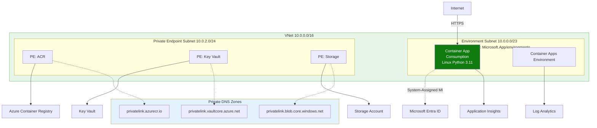
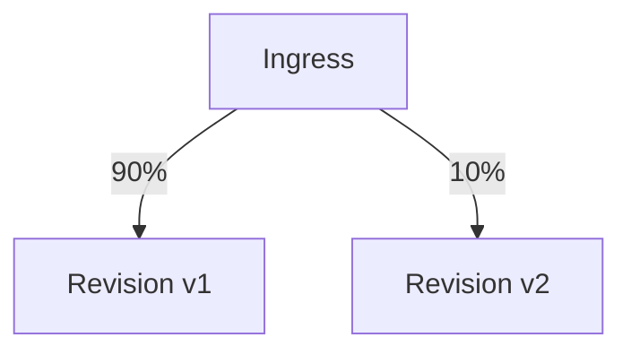

---
content_sources:
  diagrams:
  - id: this-tutorial-assumes-a-production-ready-container
    type: flowchart
    source: mslearn-adapted
    based_on:
    - https://learn.microsoft.com/azure/container-apps/revisions
    - https://learn.microsoft.com/azure/container-apps/traffic-splitting
  - id: revision-traffic-splitting
    type: flowchart
    source: mslearn-adapted
    based_on:
    - https://learn.microsoft.com/azure/container-apps/revisions
    - https://learn.microsoft.com/azure/container-apps/traffic-splitting
validation:
  az_cli:
    last_tested: null
    cli_version: null
    result: not_tested
  bicep:
    last_tested: null
    result: not_tested
---
# 07 - Revisions and Traffic Splitting

Azure Container Apps revisions provide immutable deployment snapshots. Use them for safe releases, canary traffic, and quick rollback.

!!! info "Infrastructure Context"
    **Service**: Container Apps (Consumption) | **Network**: VNet integrated | **VNet**: ✅

    This tutorial assumes a production-ready Container Apps deployment with a custom VNet, ACR with managed identity pull, and private endpoints for backend services.

    <!-- diagram-id: this-tutorial-assumes-a-production-ready-container -->


## Revision Traffic Splitting

<!-- diagram-id: revision-traffic-splitting -->


## Prerequisites

- Completed [06 - CI/CD with GitHub Actions](06-ci-cd.md)
- At least two deployed images/tags

!!! tip "Define promotion criteria before traffic split"
    Decide in advance which metrics (error rate, latency percentile, saturation) must stay within threshold before increasing canary traffic.

## Step-by-step

1. **Set standard variables (reuse Bicep outputs from Step 02)**

   ```bash
   RG="rg-myapp"
   BASE_NAME="myapp"
   DEPLOYMENT_NAME="main"

   APP_NAME=$(az deployment group show \
     --name "$DEPLOYMENT_NAME" \
     --resource-group "$RG" \
     --query "properties.outputs.containerAppName.value" \
     --output tsv)

   ENVIRONMENT_NAME=$(az deployment group show \
     --name "$DEPLOYMENT_NAME" \
     --resource-group "$RG" \
     --query "properties.outputs.containerAppEnvName.value" \
     --output tsv)

   ACR_NAME=$(az deployment group show \
     --name "$DEPLOYMENT_NAME" \
     --resource-group "$RG" \
     --query "properties.outputs.containerRegistryName.value" \
     --output tsv)

   ACR_LOGIN_SERVER=$(az deployment group show \
     --name "$DEPLOYMENT_NAME" \
     --resource-group "$RG" \
     --query "properties.outputs.containerRegistryLoginServer.value" \
     --output tsv)
   ```

2. **Switch to multiple revision mode**

   ```bash
   az containerapp revision set-mode \
     --name "$APP_NAME" \
     --resource-group "$RG" \
     --mode multiple
   ```

   | Command | Why it is used |
   |---|---|
   | `az containerapp revision set-mode ...` | Runs the Azure CLI operation required by the documented step. |

   ???+ example "Expected output"
       ```
       "Multiple"
       ```

3. **Deploy a new version to create a new revision**

   ```bash
   az acr build --registry "$ACR_NAME" --image "$BASE_NAME:v3" ./app

   az containerapp update \
     --name "$APP_NAME" \
     --resource-group "$RG" \
     --image "$ACR_LOGIN_SERVER/$BASE_NAME:v3"
   ```

   | Command | Why it is used |
   |---|---|
   | `az acr build --registry ...` | Builds and pushes the container image to Azure Container Registry. |

   ???+ example "Expected output"
       `az acr build` takes 1-2 minutes. The `az containerapp update` returns:
       ```json
       {
         "latestRevision": "<your-app-name>--xxxxxxx",
         "name": "<your-app-name>",
         "provisioningState": "Succeeded"
       }
       ```

4. **List revisions and choose targets**

   ```bash
   az containerapp revision list \
     --name "$APP_NAME" \
     --resource-group "$RG" \
     --query "[].{name:name,active:properties.active,createdTime:properties.createdTime}" \
     --output table
   ```

   | Command | Why it is used |
   |---|---|
   | `az containerapp revision list ...` | Lists revisions so rollout state, traffic, and health can be verified. |

   ???+ example "Expected output"
        ```text
        Name                                     Active    CreatedTime
        ---------------------------------------  --------  -------------------------
        <your-app-name>--0000001                 True      2024-01-15T10:00:00+00:00
        <your-app-name>--0000002                 True      2024-01-15T10:15:00+00:00
        ```

        JSON equivalent (`--output json`):
        ```json
        [
          {
            "name": "<your-app-name>--0000001",
            "active": true,
            "createdTime": "2024-01-15T10:00:00+00:00"
          },
          {
            "name": "<your-app-name>--0000002",
            "active": true,
            "createdTime": "2024-01-15T10:15:00+00:00"
          }
        ]
        ```

5. **Apply canary traffic split (90/10)**

   ```bash
   az containerapp ingress traffic set \
     --name "$APP_NAME" \
     --resource-group "$RG" \
     --revision-weight "<stable-revision>=90" "<canary-revision>=10"
   ```

   | Command | Why it is used |
   |---|---|
   | `az containerapp ingress traffic ...` | Runs the Azure CLI operation required by the documented step. |

   ???+ example "Expected output"
        ```json
        [
          {
            "revisionName": "<your-app-name>--0000001",
            "weight": 90
          },
          {
            "revisionName": "<your-app-name>--0000002",
            "weight": 10
          }
        ]
        ```

   Verify applied traffic routing:

   ```bash
   az containerapp ingress show \
     --name "$APP_NAME" \
     --resource-group "$RG"
   ```

   | Command | Why it is used |
   |---|---|
   | `az containerapp ingress show ...` | Reads ingress configuration such as exposure, target port, transport, and affinity. |

   ???+ example "Expected output"
        ```json
        {
          "allowInsecure": false,
          "external": true,
          "fqdn": "<your-app-name>.<hash>.<region>.azurecontainerapps.io",
          "targetPort": 8000,
          "transport": "Auto",
          "traffic": [
            {
              "revisionName": "<your-app-name>--0000001",
              "weight": 90
            },
            {
              "revisionName": "<your-app-name>--0000002",
              "weight": 10
            }
          ]
        }
        ```

6. **Rollback instantly if errors increase**

   ```bash
   az containerapp ingress traffic set \
     --name "$APP_NAME" \
     --resource-group "$RG" \
     --revision-weight "<stable-revision>=100"
   ```

   | Command | Why it is used |
   |---|---|
   | `az containerapp ingress traffic ...` | Runs the Azure CLI operation required by the documented step. |

   ???+ example "Expected output"
       ```json
       [
         {
           "revisionName": "<your-app-name>--0000001",
           "weight": 100
         }
       ]
       ```

7. **Deactivate bad revision after confirmation**

   ```bash
   az containerapp revision deactivate \
     --name "$APP_NAME" \
     --resource-group "$RG" \
     --revision "<canary-revision>"
   ```

   | Command | Why it is used |
   |---|---|
   | `az containerapp revision deactivate ...` | Runs the Azure CLI operation required by the documented step. |

   ???+ example "Expected output"
       ```
       "Deactivate succeeded"
       ```


### Verify revisions and traffic in Azure Portal


**[Observed]** `ca-sample-d38538`. `Container App`. `Revisions and replicas`. `Create new revision`. `Save`. `Refresh`. `Deployment mode`. `Send us your feedback`. `Learn more`. `Active revisions`. `Inactive revisions`. `Replicas`. `Name`. `Date created`. `Running status`. `View Logs`. `Label`. `Traffic`. `ca-sample-d38538--0uzoi59`. `6/3/2026, 10:34:26 PM`. `Running`. `View details`. `Show Logs`. `100`. `%`. `1`. `Show replicas`. `Application`. `Revisions and replicas`. `Containers`. `Scale`. `Volumes`. `Settings`. `Networking`. `Ingress`. `Custom domains`. `CORS`. `Security`. `Monitoring`. `Log stream`. `Logs`. `Console`. `Alerts`. `Metrics`.

**[Inferred]** The `Deployment mode` toolbar action appears to map to the same lever set by `az containerapp revision set-mode --mode multiple` in [Step-by-step](#step-by-step) Step 2. The `Create new revision` toolbar action is consistent with the new-revision effect of `az containerapp update --image` in [Step-by-step](#step-by-step) Step 3. The `Active revisions` and `Inactive revisions` tabs are consistent with the `revision list` and `revision deactivate` operations in [Step-by-step](#step-by-step) Steps 4 and 7. The `Traffic` column value `100 %` for `ca-sample-d38538--0uzoi59` appears to map to the per-revision weight set by `az containerapp ingress traffic set --revision-weight` in [Step-by-step](#step-by-step) Steps 5 and 6.

**[Not Proven]** Additional revision detail and traffic-split detail are not visible on this view.

## Operational guidance

- Pair canary rollout with telemetry checks (errors, latency, saturation).
- Keep one prior known-good revision for emergency rollback.
- Use KEDA metrics and revision health together for rollout decisions.

!!! warning "Do not leave stale canary revisions active"
    After rollback or promotion, deactivate obsolete revisions to reduce operational confusion and prevent unintended traffic assignment during future updates.

## Advanced Topics

- Route traffic by labels for blue/green style releases.
- Combine revisions with Dapr service invocation for progressive migration.
- Automate canary promotion in CI/CD using policy checks.

## See Also
- [04 - Logging, Monitoring, and Observability](04-logging-monitoring.md)
- [06 - CI/CD with GitHub Actions](06-ci-cd.md)
- [Revisions Operations](../../../operations/revision-management/index.md)

## Sources
- [Revisions (Microsoft Learn)](https://learn.microsoft.com/azure/container-apps/revisions)
- [Traffic splitting in Azure Container Apps (Microsoft Learn)](https://learn.microsoft.com/azure/container-apps/traffic-splitting)
