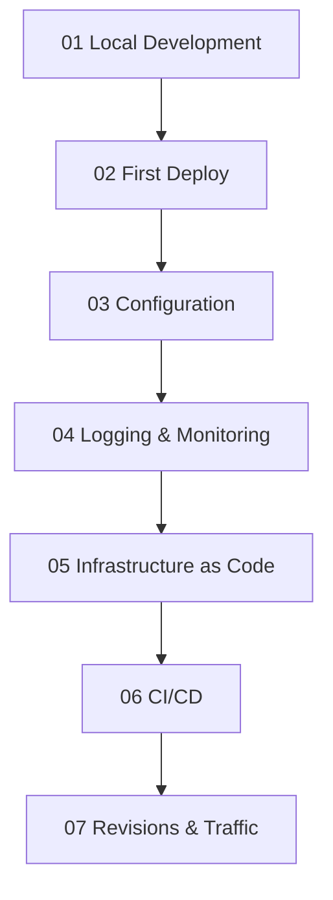

---
content_sources:
  diagrams:
    - id: tutorial-progression
      type: flowchart
      source: mslearn-adapted
      based_on:
        - https://learn.microsoft.com/en-us/azure/container-apps/
        - https://learn.microsoft.com/en-us/azure/container-apps/quickstart-code-to-cloud
validation:
  az_cli:
    last_tested:
    cli_version:
    result: not_tested
  bicep:
    last_tested:
    result: not_tested
---
# Python Tutorial Index

This tutorial path walks you from local development to safe production rollout for Python apps on Azure Container Apps. It is the Python-specific companion to the series-standard [Learning Paths](../../../start-here/learning-paths.md) page.

## Prerequisites

Before starting, install and verify:

- Python 3.11+
- Docker (for local build and run)
- Azure CLI 2.57+ with the Container Apps extension
- An Azure subscription
- A Python web app that exposes `/health`

```bash
az extension add --name containerapp --upgrade
az login
```

### Prerequisite-to-Module Mapping

| Prerequisite | Why It Matters | First Module That Uses It | Quick Validation |
|---|---|---|---|
| Azure subscription | Required for all `az containerapp` operations | Python 02 | `az account show --output table` |
| Azure CLI + extension | Needed to create app, revisions, and jobs | Python 02 | `az extension add --name containerapp --upgrade` |
| Docker | Needed for local image build and run | Python 01 | `docker build --tag "$APP_NAME:local" .` |
| Health endpoint (`/health`) | Required for stable probe behavior | Python 01 and best-practices container design | `curl --fail "http://localhost:8000/health"` |
| Log Analytics awareness | Required for production debugging | Python 04 and operations/monitoring | Run any starter KQL in troubleshooting/kql |

## Tutorial Progression

<!-- diagram-id: tutorial-progression -->


## Steps

| Step | Title | Purpose |
|---|---|---|
| [01-local-development](./01-local-development.md) | Local Development | Build and run the app locally with Docker. |
| [02-first-deploy](./02-first-deploy.md) | First Deploy | Publish the container image and create the first Container App. |
| [03-configuration](./03-configuration.md) | Configuration | Set environment variables and secrets safely. |
| [04-logging-monitoring](./04-logging-monitoring.md) | Logging & Monitoring | Collect logs, metrics, and traces for the app. |
| [05-infrastructure-as-code](./05-infrastructure-as-code.md) | Infrastructure as Code | Provision the environment with Bicep. |
| [06-ci-cd](./06-ci-cd.md) | CI/CD | Automate build and deployment with GitHub Actions. |
| [07-revisions-traffic](./07-revisions-traffic.md) | Revisions & Traffic | Use revisions and traffic splitting for safe releases. |

## Recommended Command Sequence for New Environments

Run this once when provisioning a fresh environment, then continue tutorial modules with the same variable names.

```bash
az group create --name "$RG" --location "$LOCATION"

az containerapp env create \
  --name "$ACA_ENV_NAME" \
  --resource-group "$RG" \
  --location "$LOCATION"

az acr create \
  --name "$ACR_NAME" \
  --resource-group "$RG" \
  --location "$LOCATION" \
  --sku Basic
```

!!! info "Use reusable variables from day one"
    Keep command examples consistent with this guide's variables: `$RG`, `$APP_NAME`, `$ACA_ENV_NAME`, `$ACR_NAME`, and `$LOCATION`.

## Suggested 2-Week Learning Plan

| Day Range | Focus | Deliverable |
|---|---|---|
| Day 1-2 | Start Here + platform basics | Team-level architecture notes and service choice |
| Day 3-4 | Python 01-03 | First deployed revision with secrets/config |
| Day 5 | Python 04 | Basic dashboard + log query for error rate |
| Day 6-7 | Python 05-06 | Reproducible IaC deploy + CI/CD pipeline |
| Day 8 | Python 07 | Revision split test plan |
| Day 9-10 | operations + troubleshooting | Incident runbook draft and recovery drill |

!!! note "Do not skip observability setup"
    Teams that delay logging and alert basics usually struggle during the first production incident. Complete logging and monitoring before scaling traffic.

!!! warning "Avoid premature multi-service complexity"
    Start with one container app and one clear API workflow. Add Dapr sidecars, jobs, and private networking after the baseline deployment is stable.

## Skill Checkpoints

Before moving from one phase to the next, validate these checkpoints:

| Phase | Checkpoint | Evidence |
|---|---|---|
| Build | App listens on configured port | Successful local run and `/health` response |
| Deploy | Revision becomes healthy | `az containerapp revision list --name "$APP_NAME" --resource-group "$RG" --output table` |
| Operate | Logs are queryable and structured | KQL query returns expected JSON schema |
| Improve | Safe rollout behavior | Successful traffic split or rollback simulation |

## Advanced Topics

- Use [Dapr integration](../recipes/dapr-integration.md) for service invocation, pub/sub, and state APIs.
- Add VNet and private networking patterns from [networking recipes](../../../platform/networking/vnet-integration.md).
- Standardize environment provisioning with reusable Bicep modules.

### Verify in Azure Portal


**[Observed]** `Microsoft Azure (Preview)`. `Report a bug`. `Search resources, services, and docs (G+/)`. `Copilot`. `Home`. `Search`. `cae-basics-d38538`. `Container Apps Environment`. `Refresh`. `Delete`. `Essentials`. `Resource group (move)`. `rg-aca-basics-d38538`. `Status`. `Succeeded`. `Location (move)`. `Korea Central`. `Subscription (move)`. `Visual Studio Enterprise Subscription`. `Subscription ID`. `00000000-0000-0000-0000-000000000000`. `Aspire Dashboard`. `Not yet active (set up)`. `Tags (edit)`. `Add tags`. `Environment type`. `Workload profiles`. `Static IP`. `4.230.156.3`. `Applications`. `7`. `KEDA version`. `2.18.1`. `Dapr version`. `1.16.4-msft.7`. `View Cost`. `JSON View`. `Applications`. `Monitoring`. `Tutorials`. `Name`. `App Type`. `Resource Group`. `ca-dotnet-d38538`. `Container App`. `ca-sample-d38538`. `ca-nodejs-d38538`. `ca-java-d38538`. `cj-event-d38538`. `Container App Job`. `cj-scheduled-d38538`. `cj-sample-d38538`. `Overview`. `Activity log`. `Access control (IAM)`. `Tags`. `Diagnose and solve problems`. `Resource visualizer`. `Settings`. `Dapr components`. `Certificates`. `Quota`. `Workload profiles`. `Networking`. `Volume mounts`. `Identity`. `Planned Maintenance`. `Locks`. `Apps`. `Services`. `Monitoring`. `Automation`. `Help`.

**[Inferred]** The `Container App` row `ca-sample-d38538` in the `Applications` tab appears consistent with the Container App created by [Steps](#steps) Step `02-first-deploy`, whose Purpose column states "Publish the container image and create the first Container App". The `Environment type` value `Workload profiles` appears consistent with the environment that [Steps](#steps) Step `05-infrastructure-as-code` provisions, whose Purpose column states "Provision the environment with Bicep". The `Resource group` value `rg-aca-basics-d38538` appears consistent with the resource group that hosts the environment provisioned in [Steps](#steps) Step `05-infrastructure-as-code`, whose Purpose column states "Provision the environment with Bicep". The `Status` value `Succeeded` appears consistent with the healthy provisioning end-state targeted by the Bicep run in [Steps](#steps) Step `05-infrastructure-as-code`.

**[Not Proven]** Additional tutorial step output and CLI command output from earlier steps are not visible on this view.

## Related Guides

- [Python guide overview](../index.md)
- [Python runtime reference](../python-runtime.md)
- [Python recipes index](../recipes/index.md)

## See Also

- [Learning Paths](../../../start-here/learning-paths.md)
- [Language guides](../../index.md)

## Sources

- [Microsoft Learn: Azure Container Apps](https://learn.microsoft.com/en-us/azure/container-apps/)
- [Microsoft Learn: Quickstart - Code to cloud](https://learn.microsoft.com/en-us/azure/container-apps/quickstart-code-to-cloud)
