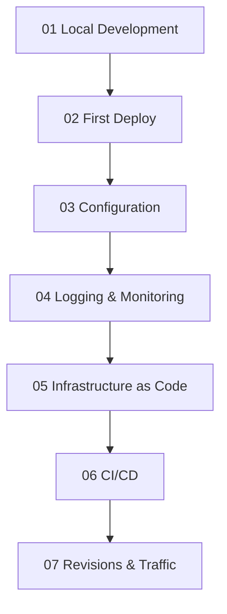

---
content_sources:
  diagrams:
  - id: tutorial-progression
    type: flowchart
    source: mslearn-adapted
    based_on:
    - https://learn.microsoft.com/azure/container-apps/
    - https://learn.microsoft.com/azure/container-apps/quickstart-code-to-cloud
validation:
  az_cli:
    last_tested: null
    cli_version: null
    result: not_tested
  bicep:
    last_tested: null
    result: not_tested
content_validation:
  status: verified
  last_reviewed: '2026-05-23'
  reviewer: agent
  core_claims:
  - claim: This page uses Microsoft Learn as the primary source basis for its Azure-specific
      guidance.
    source: https://learn.microsoft.com/azure/container-apps/
    verified: true
---
# Python Tutorial Index

This tutorial path walks you from local development to safe production rollout for Python apps on Azure Container Apps.

## Prerequisites

Before starting, install and verify:

- Python 3.11+
- Docker
- Azure CLI

## Tutorial Progression

<!-- diagram-id: tutorial-progression -->

## Steps

| Step | Title | Purpose |
|---|---|---|
| [01-local-development](./01-local-development.md) | Local Development | Build and run the app locally with Docker. |
| [02-first-deploy](./02-first-deploy.md) | First Deploy | Publish the container image and create the first Container App. |
| [03-configuration](./03-configuration.md) | Configuration | Set environment variables and secrets safely. |
| [04-logging-monitoring](./04-logging-monitoring.md) | Logging & Monitoring | Collect logs, metrics, and traces for the app. |
| [05-infrastructure-as-code](./05-infrastructure-as-code.md) | Infrastructure as Code | Provision the environment with Bicep. |
| [06-ci-cd](./06-ci-cd.md) | CI/CD | Automate build and deployment with GitHub Actions. |
| [07-revisions-traffic](./07-revisions-traffic.md) | Revisions & Traffic | Use revisions and traffic splitting for safe releases. |

### Verify in Azure Portal

![cae-basics-d38538|Container Apps Environment|Refresh|Delete|Essentials|Resource group|rg-aca-basics-d38538|Status|Succeeded|Location|Korea Central|Subscription|Visual Studio Enterprise Subscription|Subscription ID|00000000-0000-0000-0000-000000000000|Environment type|Workload profiles|Static IP|4.230.156.3|Applications|7|KEDA version|2.18.1|Dapr version|1.16.4-msft.7|Applications|Monitoring|Tutorials|Name|App Type|Resource Group|ca-dotnet-d38538|Container App|ca-sample-d38538|ca-nodejs-d38538|ca-java-d38538|cj-event-d38538|Container App Job|cj-scheduled-d38538|cj-sample-d38538](../../../assets/language-guides/python/tutorial/index-environment-overview-blade.png)

**[Observed]** `cae-basics-d38538`. `Container Apps Environment`. `Refresh`. `Delete`. `Essentials`. `Resource group (move)`. `rg-aca-basics-d38538`. `Status`. `Succeeded`. `Location (move)`. `Korea Central`. `Subscription (move)`. `Visual Studio Enterprise Subscription`. `Subscription ID`. `00000000-0000-0000-0000-000000000000`. `Aspire Dashboard`. `Not yet active (set up)`. `Tags (edit)`. `Add tags`. `Environment type`. `Workload profiles`. `Static IP`. `4.230.156.3`. `Applications`. `7`. `KEDA version`. `2.18.1`. `Dapr version`. `1.16.4-msft.7`. `View Cost`. `JSON View`. `Applications`. `Monitoring`. `Tutorials`. `Name`. `App Type`. `Resource Group`. `ca-dotnet-d38538`. `Container App`. `ca-sample-d38538`. `ca-nodejs-d38538`. `ca-java-d38538`. `cj-event-d38538`. `Container App Job`. `cj-scheduled-d38538`. `cj-sample-d38538`. `Overview`. `Activity log`. `Access control (IAM)`. `Tags`. `Diagnose and solve problems`. `Resource visualizer`. `Settings`. `Dapr components`. `Certificates`. `Quota`. `Workload profiles`. `Networking`. `Volume mounts`. `Identity`. `Planned Maintenance`. `Locks`. `Apps`. `Services`. `Monitoring`. `Automation`. `Help`.

**[Inferred]** The `Container App` row `ca-sample-d38538` in the `Applications` tab appears consistent with the Container App created by [Steps](#steps) Step `02-first-deploy`, whose Purpose column states "Publish the container image and create the first Container App". The `Environment type` value `Workload profiles` appears consistent with the environment that [Steps](#steps) Step `05-infrastructure-as-code` provisions, whose Purpose column states "Provision the environment with Bicep". The non-zero `Applications` count `7` appears consistent with the deployment outcomes chained from [Steps](#steps) Step `02-first-deploy` through Step `07-revisions-traffic`, which collectively create and roll out Container App revisions. The `Status` value `Succeeded` appears consistent with the healthy provisioning end-state targeted by the Bicep run in [Steps](#steps) Step `05-infrastructure-as-code`.

**[Not Proven]** The local Docker build and `python` run output from [Steps](#steps) Step `01-local-development` are not visible on this view. The `az containerapp create` output from [Steps](#steps) Step `02-first-deploy` is not visible on this view. The `az containerapp logs show` output and Log Analytics KQL results from [Steps](#steps) Step `04-logging-monitoring` are not visible on this view. The revision list and traffic-split percentages from [Steps](#steps) Step `07-revisions-traffic` are not visible on this view.

## Related Guides

- [Python guide overview](../index.md)
- [Python runtime reference](../python-runtime.md)
- [Python recipes index](../recipes/index.md)

## See Also

- [Tutorial index](index.md)
- [Language guides](../../index.md)

## Sources

- [Microsoft Learn source 1](https://learn.microsoft.com/azure/container-apps/)
- [Microsoft Learn source 2](https://learn.microsoft.com/azure/container-apps/quickstart-code-to-cloud)
