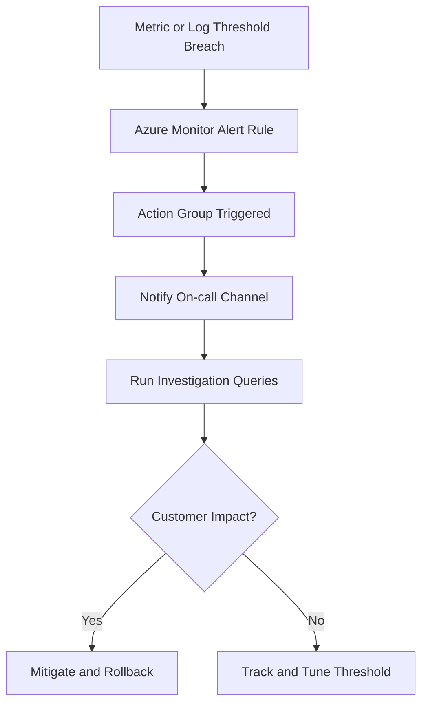

---
hide:
  - toc
content_sources:
  diagrams:
    - id: alert-lifecycle-flow
      type: flowchart
      source: mslearn-adapted
      based_on:
        - https://learn.microsoft.com/azure/container-apps/alerts
        - https://learn.microsoft.com/azure/container-apps/log-monitoring
---

# Alerting for Container Apps

Alerting translates platform telemetry into actionable incident signals. This page provides a baseline alert set for production Container Apps.

## Prerequisites

```bash
export RG="rg-myapp"
export APP_NAME="ca-myapp"
export JOB_NAME="job-myapp"
```

## Key Metrics to Alert On

Prioritize metrics that indicate user impact or workload instability:

- **Replica count** dropping unexpectedly or pinned at max replicas
- **HTTP 5xx rate** rising above baseline
- **Response latency** p95/p99 exceeding SLO thresholds
- **CPU/Memory utilization** sustained near limits
- **Job execution failures** for scheduled/event-driven jobs

## Azure Monitor Alert Rules

Use metric alerts for fast detection and log alerts for richer context.

Metric alert examples:

- High server error percentage over 5 minutes
- High memory working set over 10 minutes
- Zero ready replicas for active production app

Create a metric alert with Azure CLI:

```bash
az monitor metrics alert create \
  --name "aca-high-memory" \
  --resource-group "$RG" \
  --scopes "/subscriptions/<subscription-id>/resourceGroups/$RG/providers/Microsoft.App/containerApps/$APP_NAME" \
  --condition "avg WorkingSetBytes > 800000000" \
  --window-size "PT5M" \
  --evaluation-frequency "PT1M" \
  --severity 2 \
  --action "/subscriptions/<subscription-id>/resourceGroups/$RG/providers/microsoft.insights/actionGroups/ag-oncall"
```

Pre-alert baseline checks from real deployment (PII scrubbed):

```bash
az containerapp revision list \
  --name "$APP_NAME" \
  --resource-group "$RG" \
  --output json

az containerapp job execution list \
  --name "$JOB_NAME" \
  --resource-group "$RG" \
  --output json
```

```json
[
  {
    "name": "ca-myapp--0000001",
    "active": true,
    "trafficWeight": 100,
    "replicas": 1,
    "healthState": "Healthy",
    "runningState": "Running"
  }
]
```

```json
[
  {
    "name": "job-myapp-w6gm0ew",
    "status": "Succeeded",
    "startTime": "2026-04-04T12:53:54+00:00",
    "endTime": "2026-04-04T12:54:29+00:00"
  }
]
```

## Log-Based Alerts with KQL

Use log alerts for pattern detection, retries, and error semantics from application logs.

Sample KQL (5xx spike):

```kql
ContainerAppConsoleLogs_CL
| where TimeGenerated > ago(5m)
| where ContainerAppName_s == "$APP_NAME"
| where Log_s has "\"status\":500" or Log_s has "\"status\":503"
| summarize ErrorCount = count() by bin(TimeGenerated, 1m)
| where ErrorCount > 20
```

Example query result format:

```text
TimeGenerated               ErrorCount
-------------------------  ----------
2026-04-04T12:50:00Z       0
2026-04-04T12:51:00Z       0
```

Sample KQL (job failures):

```kql
ContainerAppSystemLogs_CL
| where TimeGenerated > ago(15m)
| where Log_s has "$JOB_NAME" and Log_s has "Failed"
| summarize FailureCount = count()
| where FailureCount >= 1
```

## Action Groups and Notification Channels

Route alerts by criticality:

- **Severity 0-1**: paging channel (PagerDuty, SMS, phone)
- **Severity 2-3**: team chat + email
- **Severity 4**: ticketing/backlog for non-urgent trends

Keep ownership explicit by mapping each alert to an on-call team.

## Recommended Threshold Baseline

- HTTP 5xx rate > 2% for 5 minutes (sev2)
- p95 latency > 1.5s for 10 minutes (sev2)
- Ready replicas = 0 for 2 minutes (sev1)
- Memory > 85% for 10 minutes (sev2)
- Job failures >= 1 in last 15 minutes (sev2)

Tune these values using your normal load patterns after 2-4 weeks of baseline data.

## Alert Lifecycle Flow

<!-- diagram-id: alert-lifecycle-flow -->


## Alert Rule Decision Matrix

| Alert Type | Best Use Case | Strength | Limitation |
|---|---|---|---|
| Metric alert | Fast resource saturation detection | Near-real-time signal | Less detailed error context |
| Log search alert | Semantic detection from app/system logs | Rich context and pattern matching | Slightly higher detection latency |
| Activity log alert | Control-plane change visibility | Captures config mutations | Not a direct user-impact metric |

!!! tip "Map each alert to a specific runbook"
    Include runbook URL, owner team, and first query in the alert description so responders can act immediately.

!!! warning "Avoid alert storms"
    Duplicate rules for the same symptom across metrics and logs can flood channels. Deduplicate by signal ownership and escalation target.

### Activity Log Alert Example

```bash
az monitor activity-log alert create \
  --name "aca-config-change" \
  --resource-group "$RG" \
  --scope "/subscriptions/<subscription-id>/resourceGroups/$RG/providers/Microsoft.App/containerApps/$APP_NAME" \
  --condition category=Administrative and operationName=Microsoft.App/containerApps/write and level=Informational \
  --action-group "/subscriptions/<subscription-id>/resourceGroups/$RG/providers/microsoft.insights/actionGroups/ag-oncall"
```

## See Also

- [Monitoring](../monitoring/index.md)
- [Troubleshooting](../../troubleshooting/index.md)
- [Recovery and Incident Readiness](../recovery/index.md)

## Sources

- [Set alerts in Azure Container Apps](https://learn.microsoft.com/azure/container-apps/alerts)
- [Monitor logs in Azure Container Apps](https://learn.microsoft.com/azure/container-apps/log-monitoring)
