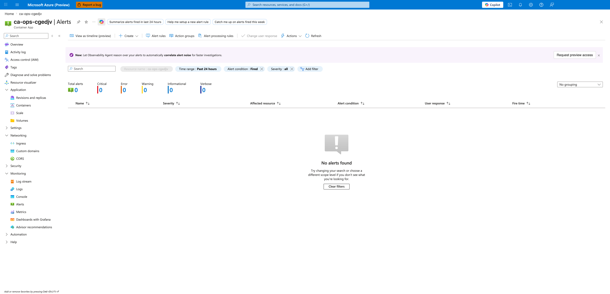
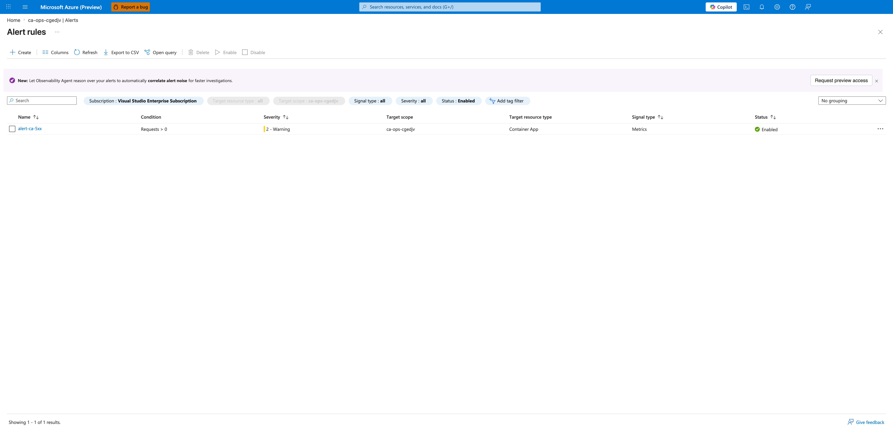
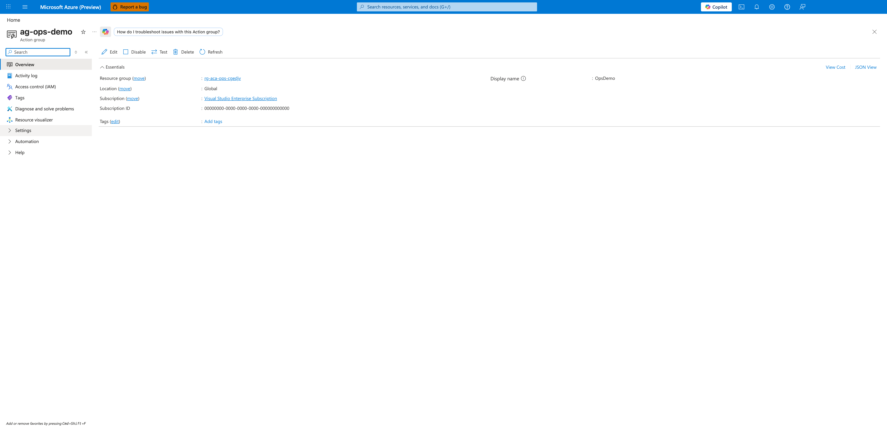
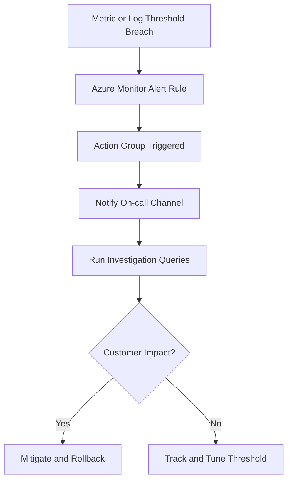

---
content_sources:
  diagrams:
  - id: alert-lifecycle-flow
    type: flowchart
    source: mslearn-adapted
    based_on:
    - https://learn.microsoft.com/azure/container-apps/alerts
    - https://learn.microsoft.com/azure/container-apps/log-monitoring
---
# Alerting for Container Apps

Alerting translates platform telemetry into actionable incident signals. This page provides a baseline alert set for production Container Apps.

## Prerequisites

```bash
export RG="rg-myapp"
export APP_NAME="ca-myapp"
export JOB_NAME="job-myapp"
```

## Key Metrics to Alert On

Prioritize metrics that indicate user impact or workload instability:

- **Replica count** dropping unexpectedly or pinned at max replicas
- **HTTP 5xx rate** rising above baseline
- **Response latency** p95/p99 exceeding SLO thresholds
- **CPU/Memory utilization** sustained near limits
- **Job execution failures** for scheduled/event-driven jobs

For a question-driven selection table that maps each incident question to the exact metric, aggregation, split dimension, and a starting threshold, see [Metric alerts by incident question](metric-alerts-by-incident-question.md).

## Azure Monitor Alert Rules

Use metric alerts for fast detection and log alerts for richer context.

Metric alert examples:

- High server error percentage over 5 minutes
- High memory working set over 10 minutes
- Zero ready replicas for active production app

Create a metric alert with Azure CLI:

```bash
az monitor metrics alert create \
  --name "aca-high-memory" \
  --resource-group "$RG" \
  --scopes "/subscriptions/<subscription-id>/resourceGroups/$RG/providers/Microsoft.App/containerApps/$APP_NAME" \
  --condition "avg WorkingSetBytes > 800000000" \
  --window-size "PT5M" \
  --evaluation-frequency "PT1M" \
  --severity 2 \
  --action "/subscriptions/<subscription-id>/resourceGroups/$RG/providers/microsoft.insights/actionGroups/ag-oncall"
```

| Command | Why it is used |
|---|---|
| `az monitor metrics ...` | Creates or inspects Azure Monitor alerts, diagnostic settings, or metrics. |

### Portal view: Container App Alerts blade

Open the Container App in the Azure Portal, then choose **Monitoring → Alerts** in the left navigation. This per-resource Alerts blade is scoped to a single Container App and lists fired alert instances (not the rule definitions themselves).



[Observed] The header row reads `ca-ops-cgedjv | Alerts`. The pinned filter chips read `Resource name : ca-ops-cgedjv` (greyed out and pre-scoped to this Container App), `Time range : Past 24 hours`, `Alert condition : Fired`, and `Severity : all`. The summary tiles report `Total alerts: 0` with per-severity counters `Critical: 0`, `Error: 0`, `Warning: 0`, `Informational: 0`, `Verbose: 0`. The empty-state panel in the grid area shows the heading `No alerts found`, the body text `Try changing your search or choose a different scope level if you don't see what you're looking for`, and a `Clear filters` button.

[Inferred] An empty Fired list with `Severity : all` means no alert rule scoped to this Container App has transitioned to the Fired state inside the 24-hour window. This view does not prove that no rules exist - it only proves that none of the existing rules have produced a firing instance. To verify rule definitions and their enabled state, the toolbar **Alert rules** button must be opened (next capture).

[Not Proven] This blade does not display rule scope, condition, severity, or action group binding. It also does not distinguish between "no rule exists" and "a rule exists but its condition has not been met". Inspection of the **Alert rules** sub-blade is required to confirm what is being evaluated.

### Portal view: Azure Monitor alert rules

From the Alerts blade toolbar, choose **Alert rules**. The Alert rules blade lists every alert rule whose scope includes the current resource and surfaces the rule's enabled state, severity, and condition summary.



[Observed] Exactly one row is rendered: `Name: alert-ca-5xx`, `Condition: Requests > 0`, `Severity: 2 - Warning`, `Target scope: ca-ops-cgedjv`, `Target resource type: Container App`, `Signal type: Metrics`, `Status: Enabled` with a green check icon. The filter chips show `Subscription : Visual Studio Enterprise Subscription`, `Target resource type : all`, `Target scope : ca-ops-cgedjv`, `Signal type : all`, `Severity : all`, `Status : Enabled`. The grid footer reads `Showing 1 - 1 of 1 results`.

[Inferred] The `Status: Enabled` flag together with the green check confirms the rule is currently armed and will evaluate every aggregation window. Because `Signal type` reports `Metrics`, this is a metric alert rule and its evaluation cadence is governed by the rule's `evaluation-frequency` and `window-size` properties, not by log ingestion latency. The single-row result is consistent with the prior CLI-created `alert-ca-5xx` rule; because the grid is filtered to `Status : Enabled`, this view confirms only that exactly one **enabled** metric alert rule is currently scoped to this Container App and does not rule out the existence of additional disabled rules.

[Not Proven] This grid does not reveal the action group bound to the rule, the resolved condition expression (only the truncated summary `Requests > 0`), or the evaluation window. The rule detail blade must be opened to see scope hierarchy, condition aggregation, and the action group binding.

### Portal view: Alert rule configuration

Click the rule name (`alert-ca-5xx`) to open the metric alert rule detail blade. This view shows the resolved scope, condition, and action group binding in a single place.


[Observed] The Essentials section reads `Resource group: rg-aca-ops-cgedjv`, `Location: Global`, `Subscription: Visual Studio Enterprise Subscription`, `Severity: 2 - Warning`, `Description: Demo: 5xx response detected on ca-ops Container App`. The **Scope** card shows `Resource: ca-ops-cgedjv` with hierarchy `Visual Studio Enterprise Subscription > rg-aca-ops-cgedjv`. The **Conditions** card lists `Requests > 0` with `Time series monitored: 1` and `Estimated monthly cost: $0.10`. The **Actions** card lists `Name: ag-ops-demo`.

[Inferred] The rule is fully bound: a Container App scope (`ca-ops-cgedjv`), a metric condition (`Requests > 0`), and an action group (`ag-ops-demo`) are all present. Because the condition counts every request (`> 0`) rather than filtering on status code, this rule will fire on any incoming traffic in the evaluation window and is therefore a demonstration rule rather than a production 5xx detector - the `Description` field reinforces this intent. The `Location: Global` value is expected for metric alerts because Azure Monitor evaluates them out of a regional pool independent of the monitored resource's region.

[Not Proven] This overview does not display the rule's `evaluation-frequency` or `window-size` (they live in the **Alert rule configuration** sub-blade), nor does it expand the action group to show notification channels. The action group's configured notifications must be inspected separately (next capture).

Pre-alert baseline checks from real deployment (PII scrubbed):

```bash
az containerapp revision list \
  --name "$APP_NAME" \
  --resource-group "$RG" \
  --output json

az containerapp job execution list \
  --name "$JOB_NAME" \
  --resource-group "$RG" \
  --output json
```

| Command | Why it is used |
|---|---|
| `az containerapp revision list ...` | Lists revisions so rollout state, traffic, and health can be verified. |

```json
[
  {
    "name": "ca-myapp--0000001",
    "active": true,
    "trafficWeight": 100,
    "replicas": 1,
    "healthState": "Healthy",
    "runningState": "Running"
  }
]
```

```json
[
  {
    "name": "job-myapp-w6gm0ew",
    "status": "Succeeded",
    "startTime": "2026-04-04T12:53:54+00:00",
    "endTime": "2026-04-04T12:54:29+00:00"
  }
]
```

## Log-Based Alerts with KQL

Use log alerts for pattern detection, retries, and error semantics from application logs.

Sample KQL (5xx spike):

```kql
ContainerAppConsoleLogs_CL
| where TimeGenerated > ago(5m)
| where ContainerAppName_s == "$APP_NAME"
| where Log_s has "\"status\":500" or Log_s has "\"status\":503"
| summarize ErrorCount = count() by bin(TimeGenerated, 1m)
| where ErrorCount > 20
```

Example query result format:

```text
TimeGenerated               ErrorCount
-------------------------  ----------
2026-04-04T12:50:00Z       0
2026-04-04T12:51:00Z       0
```

Sample KQL (job failures):

```kql
ContainerAppSystemLogs_CL
| where TimeGenerated > ago(15m)
| where Log_s has "$JOB_NAME" and Log_s has "Failed"
| summarize FailureCount = count()
| where FailureCount >= 1
```

## Action Groups and Notification Channels

Route alerts by criticality:

- **Severity 0-1**: paging channel (PagerDuty, SMS, phone)
- **Severity 2-3**: team chat + email
- **Severity 4**: ticketing/backlog for non-urgent trends

Keep ownership explicit by mapping each alert to an on-call team.

### Portal view: Action group overview

From the alert rule overview, click **ag-ops-demo** in the **Actions** card to open the action group resource. The action group bound to an alert rule is itself an Azure resource. Opening it confirms the display name (used in notification payloads), the subscription, and the resource group, and acts as the entry point to inspect or edit notification channels (Settings → Notifications, Actions).



[Observed] The header reads `ag-ops-demo` with subtitle `Action group`. The Essentials section reports `Resource group: rg-aca-ops-cgedjv`, `Location: Global`, `Subscription: Visual Studio Enterprise Subscription`, `Display name: OpsDemo`. The left navigation exposes `Overview`, `Activity log`, `Access control (IAM)`, `Tags`, `Diagnose and solve problems`, `Resource visualizer`, `Settings`, `Automation`, `Help`.

[Inferred] The action group exists and is reachable, which confirms that the action group resource ID referenced by `alert-ca-5xx` is valid. `Location: Global` is the expected value for Action Groups - they are routed through the regional notification pipeline regardless of the monitored resource's region. `Display name: OpsDemo` is the short name that Azure Monitor injects into email subjects, SMS bodies, and webhook payloads when the action group fires, so it is the user-facing label that on-call responders will see, distinct from the resource name `ag-ops-demo`.

[Not Proven] This Overview blade does not enumerate the actual notification channels (email, SMS, webhook, ITSM, Logic App, etc.) - those live under **Settings → Notifications** and **Settings → Actions**. An empty Overview here is also consistent with an action group that has no configured channels, which would cause alerts to fire silently. To prove notifications will actually reach a responder, the **Notifications** sub-blade must be opened and at least one channel verified.

## Recommended Threshold Baseline

- HTTP 5xx rate > 2% for 5 minutes (sev2)
- p95 latency > 1.5s for 10 minutes (sev2)
- Ready replicas = 0 for 2 minutes (sev1)
- Memory > 85% for 10 minutes (sev2)
- Job failures >= 1 in last 15 minutes (sev2)

Tune these values using your normal load patterns after 2-4 weeks of baseline data.

## Alert Lifecycle Flow

<!-- diagram-id: alert-lifecycle-flow -->


## Alert Rule Decision Matrix

| Alert Type | Best Use Case | Strength | Limitation |
|---|---|---|---|
| Metric alert | Fast resource saturation detection | Near-real-time signal | Less detailed error context |
| Log search alert | Semantic detection from app/system logs | Rich context and pattern matching | Slightly higher detection latency |
| Activity log alert | Control-plane change visibility | Captures config mutations | Not a direct user-impact metric |

!!! tip "Map each alert to a specific runbook"
    Include runbook URL, owner team, and first query in the alert description so responders can act immediately.

!!! warning "Avoid alert storms"
    Duplicate rules for the same symptom across metrics and logs can flood channels. Deduplicate by signal ownership and escalation target.

### Activity Log Alert Example

```bash
az monitor activity-log alert create \
  --name "aca-config-change" \
  --resource-group "$RG" \
  --scope "/subscriptions/<subscription-id>/resourceGroups/$RG/providers/Microsoft.App/containerApps/$APP_NAME" \
  --condition category=Administrative and operationName=Microsoft.App/containerApps/write and level=Informational \
  --action-group "/subscriptions/<subscription-id>/resourceGroups/$RG/providers/microsoft.insights/actionGroups/ag-oncall"
```

| Command | Why it is used |
|---|---|
| `az monitor activity-log ...` | Creates or inspects Azure Monitor alerts, diagnostic settings, or metrics. |

## See Also

- [Monitoring](../monitoring/index.md)
- [Troubleshooting](../../troubleshooting/index.md)
- [Recovery and Incident Readiness](../recovery/index.md)

## Sources

- [Set alerts in Azure Container Apps](https://learn.microsoft.com/azure/container-apps/alerts)
- [Monitor logs in Azure Container Apps](https://learn.microsoft.com/azure/container-apps/log-monitoring)
