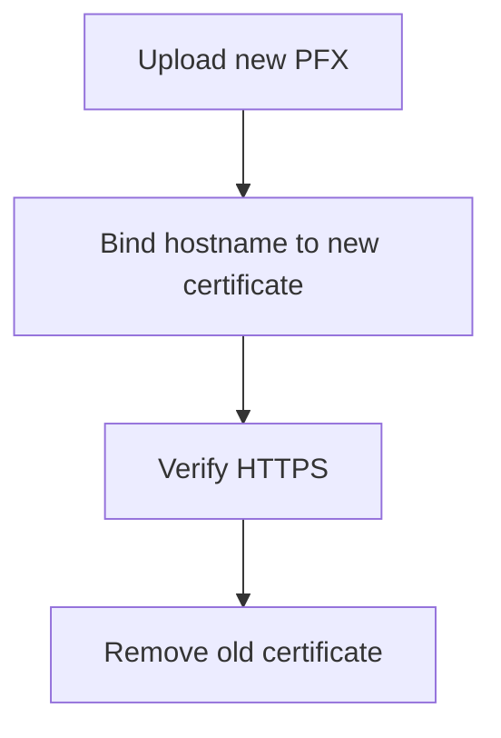

---
content_sources:
  diagrams:
    - id: byo-certificate-rotation-flow
      type: flowchart
      source: mslearn-adapted
      based_on:
        - https://learn.microsoft.com/azure/container-apps/custom-domains-certificates
content_validation:
  status: verified
  last_reviewed: "2026-04-25"
  reviewer: agent
  core_claims:
    - claim: "Azure Container Apps documents uploading certificates to the managed environment."
      source: "https://learn.microsoft.com/azure/container-apps/custom-domains-certificates"
      verified: true
    - claim: "A hostname can be bound to a specific uploaded certificate."
      source: "https://learn.microsoft.com/azure/container-apps/custom-domains-certificates"
      verified: true
---

# Bring Your Own Certificates

Use your own certificate when managed certificates do not fit your hostname, CA, or organizational certificate process.

## Prerequisites

- A supported certificate package for Container Apps
- The certificate password stored securely
- Permission to upload certificates to the managed environment

```bash
export RG="rg-aca-prod"
export APP_NAME="app-python-api-prod"
export ENVIRONMENT_NAME="aca-env-prod"
export HOSTNAME="api.contoso.com"
export CERTIFICATE_FILE="./certs/api-contoso-com.pfx"
```

## When to Use

- When you must use your own public or private CA
- When managed certificates do not support the hostname pattern
- When certificate lifecycle is owned by a separate security process

## Procedure

Upload the certificate to the environment:

```bash
az containerapp env certificate upload \
  --name "$ENVIRONMENT_NAME" \
  --resource-group "$RG" \
  --certificate-file "$CERTIFICATE_FILE" \
  --certificate-password "$CERTIFICATE_PASSWORD"
```

Bind the uploaded certificate to the hostname:

```bash
az containerapp hostname bind \
  --name "$APP_NAME" \
  --resource-group "$RG" \
  --hostname "$HOSTNAME" \
  --certificate "api-contoso-com"
```

Rotation pattern:

1. Upload the replacement certificate.
2. Re-bind the hostname to the replacement certificate.
3. Verify HTTPS on the hostname.
4. Remove the old certificate after successful cutover.

!!! warning "Key Vault-backed custom-domain bindings are not documented on the cited Container Apps pages"
    Microsoft Learn verifies the uploaded-certificate workflow: use `az containerapp env certificate upload` to upload an SNI `.pfx` certificate to the environment, then use `az containerapp hostname bind` to bind it to the hostname.
    The cited Container Apps custom-domain pages do not document a Key Vault-backed certificate source for custom-domain bindings, so keep that integration unverified until Microsoft Learn publishes a dedicated workflow.

<!-- diagram-id: byo-certificate-rotation-flow -->


## Verification

- Confirm the environment lists the uploaded certificate.
- Confirm the hostname binding points to the intended certificate.
- Confirm the served certificate matches the new subject or thumbprint.

## Rollback / Troubleshooting

- If upload fails, verify file format and password.
- If binding fails, confirm the certificate exists in the same environment.
- If the new certificate breaks traffic, re-bind the previous certificate first.

## See Also

- [Custom Domains and TLS](index.md)
- [Managed Certificates](managed-certificates.md)
- [Secret Rotation](../secret-rotation/index.md)

## Sources

- [Custom domains and certificates in Azure Container Apps](https://learn.microsoft.com/azure/container-apps/custom-domains-certificates)
