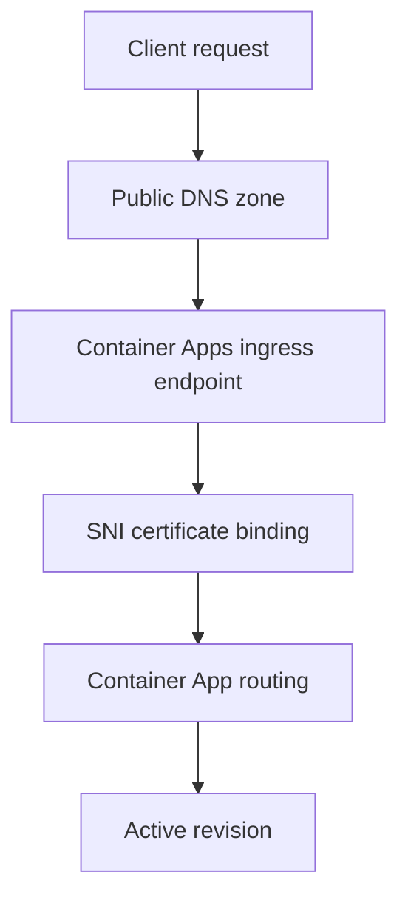

---
content_sources:
  diagrams:
    - id: custom-domain-request-flow
      type: flowchart
      source: mslearn-adapted
      based_on:
        - https://learn.microsoft.com/azure/container-apps/custom-domains-managed-certificates
        - https://learn.microsoft.com/azure/container-apps/custom-domains-certificates
content_validation:
  status: verified
  last_reviewed: "2026-04-25"
  reviewer: agent
  core_claims:
    - claim: "Azure Container Apps supports custom domains with managed certificates and uploaded certificates."
      source: "https://learn.microsoft.com/azure/container-apps/custom-domains-managed-certificates"
      verified: true
    - claim: "Custom domain binding is tied to TLS certificate binding on the container app."
      source: "https://learn.microsoft.com/azure/container-apps/custom-domains-certificates"
      verified: true
---

# Custom Domains and TLS

This runbook covers the operational steps for binding custom hostnames and TLS certificates to Azure Container Apps.

## Prerequisites

- External ingress enabled for the target app
- Control of the DNS zone for the hostname
- A certificate strategy chosen before production cutover

```bash
export RG="rg-aca-prod"
export APP_NAME="app-python-api-prod"
export HOSTNAME="api.contoso.com"
```

## When to Use

- When you need a customer-facing hostname instead of the default Azure domain
- When you need an operational runbook for certificate renewal or replacement
- When you need to verify DNS, SNI, and certificate binding together

## Procedure

1. Verify the app uses external ingress.
2. Add the hostname to the app.
3. Bind either a managed certificate or an uploaded certificate.
4. Validate DNS resolution and TLS negotiation.

The two main certificate paths are:

- **Managed certificate** for a lower-operations experience
- **Bring your own certificate** when you need your own CA, packaging, or domain support path

Microsoft Learn now documents the current domain-type split: Container Apps supports apex domains and subdomains, uses **A record + HTTP validation** for apex domains, and **CNAME + CNAME validation** for subdomains. Both managed-certificate and uploaded-certificate workflows still require the matching TXT verification record.

<!-- diagram-id: custom-domain-request-flow -->


## Verification

Check the hostname binding on the app:

```bash
az containerapp hostname list \
  --name "$APP_NAME" \
  --resource-group "$RG" \
  --output table
```

Validate that the expected hostname serves TLS:

```bash
curl --head "https://$HOSTNAME"
openssl s_client -connect "$HOSTNAME:443" -servername "$HOSTNAME"
```

## Rollback / Troubleshooting

- If DNS validation fails, wait for propagation and re-check the exact record value.
- If TLS fails, verify the certificate is bound to the same hostname.
- If the app is internal-only, change ingress mode before troubleshooting certificates.

## See Also

- [Managed Certificates](managed-certificates.md)
- [Bring Your Own Certificates](byo-certificates.md)
- [Deployment Networking](../deployment/networking.md)

## Sources

- [Custom domains and managed certificates in Azure Container Apps](https://learn.microsoft.com/azure/container-apps/custom-domains-managed-certificates)
- [Custom domains and certificates in Azure Container Apps](https://learn.microsoft.com/azure/container-apps/custom-domains-certificates)
