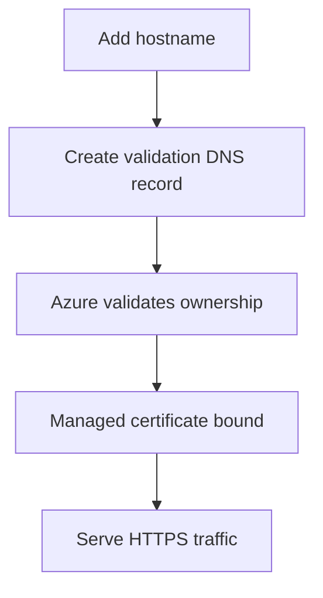

---
content_sources:
  diagrams:
    - id: managed-certificate-lifecycle
      type: flowchart
      source: mslearn-adapted
      based_on:
        - https://learn.microsoft.com/azure/container-apps/custom-domains-managed-certificates
content_validation:
  status: pending_review
  last_reviewed: "2026-04-25"
  reviewer: agent
  core_claims:
    - claim: "Azure Container Apps documents a managed certificate workflow for custom domains."
      source: "https://learn.microsoft.com/azure/container-apps/custom-domains-managed-certificates"
      verified: true
    - claim: "Hostname add and bind commands are part of the CLI-based custom domain workflow."
      source: "https://learn.microsoft.com/azure/container-apps/custom-domains-managed-certificates"
      verified: true
---

# Managed Certificates

Managed certificates reduce certificate-handling work when the target hostname fits the current Azure Container Apps managed-certificate support rules.

## Prerequisites

- External ingress enabled
- DNS access for validation records
- A hostname that matches the currently documented managed-certificate rules

```bash
export RG="rg-aca-prod"
export APP_NAME="app-python-api-prod"
export HOSTNAME="api.contoso.com"
```

## When to Use

- When you want Azure to handle certificate issuance and renewal operations
- When the domain type is supported by the current managed-certificate feature set
- When you want a simpler public TLS runbook

## Procedure

Add the hostname:

```bash
az containerapp hostname add \
  --name "$APP_NAME" \
  --resource-group "$RG" \
  --hostname "$HOSTNAME"
```

Bind the managed certificate:

```bash
az containerapp hostname bind \
  --name "$APP_NAME" \
  --resource-group "$RG" \
  --hostname "$HOSTNAME" \
  --validation-method CNAME
```

Validate the result:

```bash
curl --head "https://$HOSTNAME"
openssl s_client -connect "$HOSTNAME:443" -servername "$HOSTNAME"
```

!!! warning "Issuer, apex-domain support, and renewal cadence were not re-verified in time"
    Confirm the current issuer, exact supported hostname types, and renewal behavior against the latest managed-certificate article before committing to a production standard.

<!-- diagram-id: managed-certificate-lifecycle -->


## Verification

- Confirm the hostname is listed on the app.
- Confirm HTTPS succeeds with the expected host header.
- Confirm the served certificate subject matches the hostname.

## Rollback / Troubleshooting

- If issuance stalls, re-check the validation record and DNS propagation.
- If the hostname type is unsupported, switch to the BYO certificate path.
- If TLS still fails after binding, remove and re-add the hostname after correcting DNS.

## See Also

- [Custom Domains and TLS](index.md)
- [Bring Your Own Certificates](byo-certificates.md)

## Sources

- [Custom domains and managed certificates in Azure Container Apps](https://learn.microsoft.com/azure/container-apps/custom-domains-managed-certificates)
