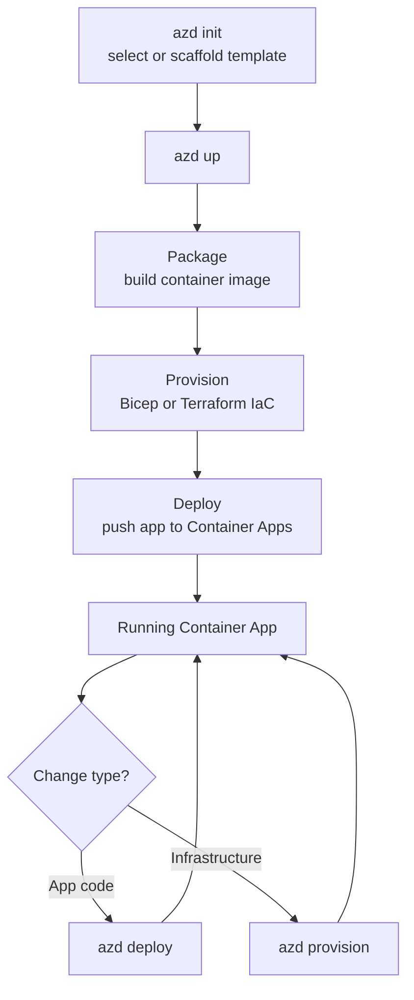

---
content_sources:
  diagrams:
    - id: azd-workflow
      type: flowchart
      source: mslearn-adapted
      based_on:
        - https://learn.microsoft.com/en-us/azure/developer/azure-developer-cli/overview
        - https://learn.microsoft.com/en-us/azure/developer/azure-developer-cli/get-started
content_validation:
  status: verified
  last_reviewed: '2026-07-18'
  reviewer: agent
  core_claims:
    - claim: "azd up packages, provisions, and deploys application resources in a single command"
      source: https://learn.microsoft.com/en-us/azure/developer/azure-developer-cli/overview
      verified: true
    - claim: "azd templates include reusable Bicep or Terraform infrastructure as code assets, app code, and optional CI/CD pipeline files"
      source: https://learn.microsoft.com/en-us/azure/developer/azure-developer-cli/overview
      verified: true
    - claim: "In azure.yaml, a service with host containerapp must specify either project (build from source) or image (deploy prebuilt image), but not both"
      source: https://learn.microsoft.com/en-us/azure/developer/azure-developer-cli/azd-schema
      verified: true
    - claim: "azd infra provider defaults to bicep and can be set to terraform"
      source: https://learn.microsoft.com/en-us/azure/developer/azure-developer-cli/azd-schema
      verified: true
---
# Deploy Container Apps with the Azure Developer CLI (azd)

The Azure Developer CLI (`azd`) is an open-source, developer-focused command-line tool that turns a template into a running Azure application. It combines infrastructure as code, application build/deploy, and optional CI/CD wiring behind a small set of workflow commands, so you can go from an empty folder to a deployed Container App with `azd up`.

This page explains when to use `azd` for Azure Container Apps, how it relates to the CLI and Bicep workflows already covered in this guide, and how to structure `azure.yaml` for a Container Apps service.

## Prerequisites

- Azure CLI installed and signed in (`az login`).
- Azure Developer CLI installed:

    ```bash
    # macOS
    brew install azure/azd/azd

    # Linux
    curl -fsSL https://aka.ms/install-azd.sh | bash

    # Windows
    winget install microsoft.azd
    ```

- An Azure subscription with permission to create resource groups and Container Apps resources.
- Docker (optional) — only needed for local container builds. `azd` can also build container images remotely via Azure Container Registry.

## When to Use

| Scenario | Recommended Method |
|---|---|
| Go from template to running app in one command | `azd up` |
| Repeatable app + infrastructure lifecycle for a whole project | `azd` (provision + deploy together) |
| Fine-grained control of a single app or hotfix | `az containerapp up` / `az containerapp update` (see [Deployment Workflows](index.md)) |
| Production baseline with governance and review | Bicep / ARM via `az deployment group create` |
| Team-wide standard release automation | CI/CD pipeline (GitHub Actions) |

!!! tip "azd complements, not replaces, the CLI and Bicep"
    `azd` orchestrates the same underlying building blocks this guide already covers — Bicep or Terraform for infrastructure and container image build/deploy for the app. Use `azd` when you want a single, opinionated workflow across both; use the raw CLI or `az deployment group create` when you need precise, resource-level control.

## azd Workflow

`azd` maps a small set of commands to the stages of a deployment lifecycle. `azd up` is a convenience command that runs package, provision, and deploy together.

<!-- diagram-id: azd-workflow -->


| Command | Purpose |
|---|---|
| `azd init` | Initialize a project from an existing template or scaffold `azure.yaml` for your code. |
| `azd up` | Package, provision, and deploy in a single command. |
| `azd provision` | Apply infrastructure changes (Bicep/Terraform) only. |
| `azd deploy` | Build and deploy application code only, without re-provisioning. |
| `azd down` | Tear down the provisioned Azure resources. |

## Procedure

### 1. Initialize from a template

Start from an existing template that already contains Container Apps infrastructure, or run `azd init` in your own repository to scaffold `azure.yaml`.

```bash
azd init --template hello-azd
```

| Command | Why it is used |
|---|---|
| `azd init --template ...` | Initializes a project from an `azd` template that includes IaC, app code, and configuration. |

### 2. Define the Container Apps service in azure.yaml

`azure.yaml` at the project root tells `azd` how to build and deploy each service. For a Container App, set `host: containerapp` and provide **either** `project` (build the image from source) **or** `image` (deploy a prebuilt image) — not both.

```yaml
name: my-aca-app
metadata:
  template: my-aca-app@0.0.1
infra:
  provider: bicep
services:
  api:
    project: ./src/api
    language: js
    host: containerapp
    docker:
      path: ./Dockerfile
```

Deploy from a prebuilt image instead of building from source:

```yaml
services:
  api:
    image: myregistry.azurecr.io/myapp:latest
    host: containerapp
```

!!! note "project vs image for containerapp"
    When `host` is `containerapp`, you must set exactly one of `project` or `image`. `project` builds the container image from source (locally with Docker, or remotely via Azure Container Registry with `docker.remoteBuild: true`). `image` deploys an existing image without a build step.

The `infra.provider` field defaults to `bicep`. Set it to `terraform` to provision with Terraform instead:

```yaml
infra:
  provider: terraform
```

### 3. Provision and deploy

Run a single command to build the image, provision the Container Apps environment and app, and deploy your code:

```bash
azd up
```

| Command | Why it is used |
|---|---|
| `azd up` | Packages the app, provisions Azure infrastructure, and deploys the container app in one step. |

`azd` prompts for an environment name, target subscription, and Azure region on first run. These values are stored per environment so subsequent runs are non-interactive.

### 4. Iterate

Redeploy only the application after code changes, without re-running infrastructure provisioning:

```bash
azd deploy
```

Apply infrastructure changes (for example, a modified Bicep module) without rebuilding the app:

```bash
azd provision
```

## Verification

Confirm the deployment succeeded and the app is reachable:

```bash
# List azd environment values, including the resource group and endpoints
azd env get-values

# Confirm the container app and its running revision
az containerapp show \
  --name "$APP_NAME" \
  --resource-group "$RG" \
  --query "properties.runningStatus" \
  --output tsv

# Confirm the ingress FQDN and open it
az containerapp show \
  --name "$APP_NAME" \
  --resource-group "$RG" \
  --query "properties.configuration.ingress.fqdn" \
  --output tsv
```

| Command | Why it is used |
|---|---|
| `azd env get-values` | Prints the environment outputs (resource group, service endpoints) captured after provisioning. |
| `az containerapp show ...` | Verifies the deployed container app's running status and ingress endpoint. |

Expected result: `azd up` reports a successful deployment with the service endpoint URL, and the `az containerapp show` calls return a running status and a resolvable FQDN.

## Rollback / Troubleshooting

- **Roll back application code**: `azd` deployments create new Container Apps revisions. To roll back, shift traffic to the previous stable revision as described in [Deployment Workflows](index.md#rollback-procedures), or redeploy a known-good image.
- **Tear down everything**: Run `azd down` to delete the resources `azd` provisioned for the current environment.

    ```bash
    azd down --purge
    ```

    | Command | Why it is used |
    |---|---|
    | `azd down --purge` | Deletes the provisioned resources and purges soft-deletable resources for the environment. |

- **Provisioning failures**: When `azd up` fails during the provision stage, the error surfaces the underlying Bicep or Terraform deployment error. Re-run `azd provision` after fixing the template, or inspect the deployment in the resource group.
- **Image build failures**: If a local Docker build fails, set `docker.remoteBuild: true` on the service to build the image remotely in Azure Container Registry.

## See Also

- [Deployment Workflows](index.md)
- [Deployment (Platform)](../../platform/deployment.md)
- [Deployment Scenarios (Platform)](../../platform/deployment-scenarios.md)
- [Language Guides](../../language-guides/index.md)
- [Revision Management](../revision-management/index.md)

## Sources

- [What is the Azure Developer CLI? (Microsoft Learn)](https://learn.microsoft.com/en-us/azure/developer/azure-developer-cli/overview)
- [Get started with the Azure Developer CLI (Microsoft Learn)](https://learn.microsoft.com/en-us/azure/developer/azure-developer-cli/get-started)
- [Azure Developer CLI's azure.yaml schema (Microsoft Learn)](https://learn.microsoft.com/en-us/azure/developer/azure-developer-cli/azd-schema)
- [Install the Azure Developer CLI (Microsoft Learn)](https://learn.microsoft.com/en-us/azure/developer/azure-developer-cli/install-azd)
- [Use Terraform as an IaC provider (Microsoft Learn)](https://learn.microsoft.com/en-us/azure/developer/azure-developer-cli/use-terraform-for-azd)
