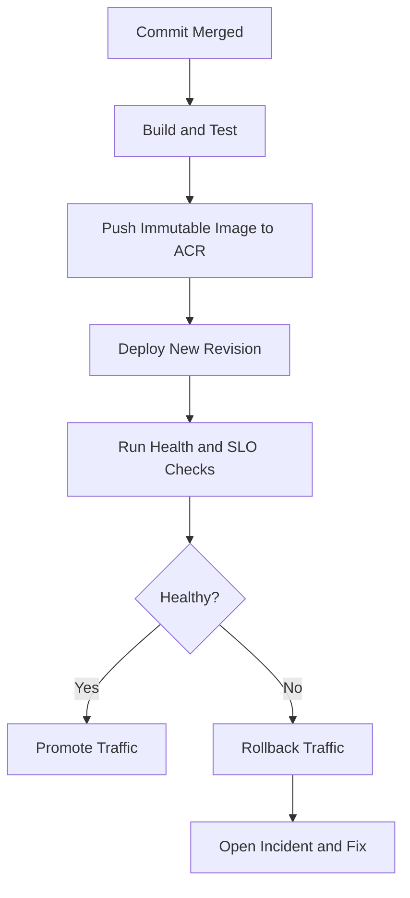

---
hide:
  - toc
content_sources:
  diagrams:
    - id: deployment-workflow-and-release-guardrails
      type: flowchart
      source: mslearn-adapted
      based_on:
        - https://learn.microsoft.com/azure/container-apps/
        - https://learn.microsoft.com/azure/container-apps/tutorial-deploy-first-app-cli
---

# Deployment Workflows

This guide summarizes practical deployment workflows for Azure Container Apps across CLI, Infrastructure as Code, and CI/CD pipelines.

## Deployment Strategies

Choose deployment style based on release frequency and control requirements:

- **Direct CLI** for fast iteration in development environments.
- **Bicep/ARM** for repeatable infrastructure and policy alignment.
- **CI/CD pipelines** for standardized builds, approvals, and rollback control.

## CI/CD with GitHub Actions

Use GitHub Actions to build images, push to ACR, and deploy to Container Apps in one pipeline.

Typical stages:

1. Lint and test application code.
2. Build container image.
3. Push image to ACR.
4. Deploy or update Container App / Job.
5. Verify health endpoint and revision state.

Use workload identity federation where possible to avoid long-lived service principal secrets.

## Azure CLI Deployment

Direct CLI deployment is useful for smoke testing or emergency patching.

```bash
az containerapp up \
  --name "$APP_NAME" \
  --resource-group "$RG" \
  --location "$LOCATION" \
  --environment "$ENVIRONMENT_NAME" \
  --source "./apps/python"
```

Update image to create a new revision:

```bash
az containerapp update \
  --name "$APP_NAME" \
  --resource-group "$RG" \
  --image "$ACR_NAME.azurecr.io/python-app:v2"
```

## Bicep/ARM Deployment

IaC deployments keep environment, identity, and app configuration consistent.

```bash
az deployment group create \
  --resource-group "$RG" \
  --template-file "infra/main.bicep" \
  --parameters "baseName=myapp" "location=$LOCATION"
```

Use `what-if` before production applies:

```bash
az deployment group what-if \
  --resource-group "$RG" \
  --template-file "infra/main.bicep" \
  --parameters "baseName=myapp" "location=$LOCATION"
```

## Image Build and Push to ACR

```bash
az acr build \
  --registry "$ACR_NAME" \
  --image "python-app:$(date +%Y%m%d%H%M%S)" \
  --file "apps/python/Dockerfile" \
  "apps/python"
```

Prefer immutable tags for release traceability, and maintain a stable alias tag only for non-production testing.

## Deployment Checklist

- Container image built from pinned base image and scanned.
- Revision mode and traffic strategy validated.
- Health probes configured and verified.
- Managed identity and secret references resolved.
- Post-deploy smoke test completed.
- Rollback path documented and tested.

## Deployment Workflow and Release Guardrails

<!-- diagram-id: deployment-workflow-and-release-guardrails -->


| Deployment Method | Strength | Tradeoff | Best Operational Use |
|---|---|---|---|
| Direct CLI (`az containerapp up/update`) | Fastest change path | Higher drift risk | Hotfixes and smoke deployments |
| Bicep (`az deployment group create`) | Deterministic infra state | Requires template discipline | Production baseline and governance |
| CI/CD pipeline | Approval + traceability + repeatability | More setup overhead | Team-wide standard release workflow |

!!! tip "Prefer immutable image tags per deployment"
    Use tags like `git-<sha>` or date-based release tags to guarantee revision traceability and safe rollback.

!!! warning "Run what-if before production IaC applies"
    `az deployment group what-if` should be mandatory for production environments to prevent accidental networking, identity, or ingress drift.

### Progressive Rollout Example

```bash
export IMAGE_TAG="git-$(git rev-parse --short HEAD)"
export IMAGE_NAME="$ACR_NAME.azurecr.io/$APP_NAME:$IMAGE_TAG"

az acr build \
  --registry "$ACR_NAME" \
  --image "$APP_NAME:$IMAGE_TAG" \
  --file "apps/python/Dockerfile" \
  "apps/python"

az containerapp update \
  --name "$APP_NAME" \
  --resource-group "$RG" \
  --image "$IMAGE_NAME"

az containerapp revision list \
  --name "$APP_NAME" \
  --resource-group "$RG" \
  --output table
```

### Post-Deployment Acceptance Checks

```bash
az containerapp logs show \
  --name "$APP_NAME" \
  --resource-group "$RG" \
  --type console \
  --follow false

az containerapp ingress traffic show \
  --name "$APP_NAME" \
  --resource-group "$RG" \
  --output table
```

## See Also

- [Language Guides](../../language-guides/index.md)
- [Revision Management](../revision-management/index.md)
- [Recovery and Incident Readiness](../recovery/index.md)

## Sources

- [Azure Container Apps documentation (Microsoft Learn)](https://learn.microsoft.com/azure/container-apps/)
- [Deploy to Azure Container Apps (Microsoft Learn)](https://learn.microsoft.com/azure/container-apps/tutorial-deploy-first-app-cli)
