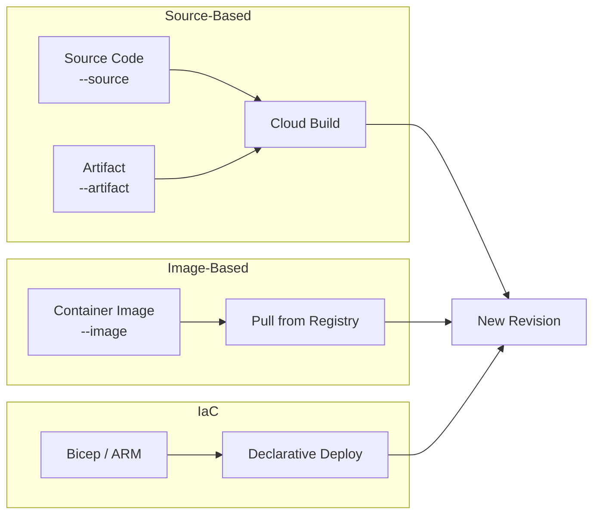
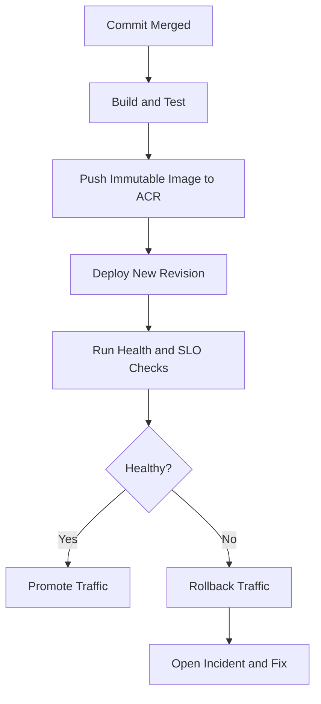

---
hide:
  - toc
content_sources:
  diagrams:
  - id: deployment-workflow-and-release-guardrails
    type: flowchart
    source: mslearn-adapted
    based_on:
    - https://learn.microsoft.com/azure/container-apps/
    - https://learn.microsoft.com/azure/container-apps/tutorial-deploy-first-app-cli
    - https://learn.microsoft.com/azure/container-apps/deploy-artifact
    - https://learn.microsoft.com/azure/container-apps/revisions
content_validation:
  status: verified
  last_reviewed: '2026-05-23'
  reviewer: agent
  core_claims:
  - claim: "az containerapp up supports --source for cloud build from source code"
    source: https://learn.microsoft.com/azure/container-apps/tutorial-deploy-first-app-cli
    verified: true
  - claim: "az containerapp up supports --artifact for JAR/WAR deployment without Dockerfile"
    source: https://learn.microsoft.com/azure/container-apps/deploy-artifact
    verified: true
  - claim: "Revision-scope changes create new revisions; application-scope changes do not"
    source: https://learn.microsoft.com/azure/container-apps/revisions
    verified: true
  - claim: "Deployment labels allow routing traffic to specific revisions by name"
    source: https://learn.microsoft.com/azure/container-apps/revisions
    verified: true
---
# Deployment Workflows

This guide summarizes practical deployment workflows for Azure Container Apps across CLI, Infrastructure as Code, and CI/CD pipelines.

## Prerequisites

- Azure CLI with `containerapp` extension installed
- An existing Container Apps environment (`$ENVIRONMENT_NAME`)
- An Azure Container Registry (`$ACR_NAME`) for image-based deployments

## When to Use

| Scenario | Recommended Method |
|---|---|
| Fast iteration in dev/test | `az containerapp up --source` or `--artifact` |
| Production baseline with governance | Bicep / ARM templates |
| Team-wide standard releases | CI/CD pipeline (GitHub Actions) |
| Emergency hotfix | Direct CLI `az containerapp update --image` |

## Deployment Methods

Azure Container Apps supports four deployment methods:



### Source Code Deployment

Deploy directly from source code without building a container image locally. Azure builds the image in the cloud using Oryx or a Buildpack.

```bash
az containerapp up \
  --name "$APP_NAME" \
  --resource-group "$RG" \
  --location "$LOCATION" \
  --environment "$ENVIRONMENT_NAME" \
  --source "./apps/python"
```

| Command | Why it is used |
|---|---|
| `az containerapp up ...` | Runs the Azure CLI operation required by the documented step. |

!!! tip "When to use source deploy"
    Best for rapid prototyping and development. The platform auto-detects the language runtime and builds the image for you.

### Artifact Deployment (JAR / WAR)

Deploy Java artifacts directly without writing a Dockerfile. The platform builds a container image from the artifact automatically.

```bash
az containerapp up \
  --name "$APP_NAME" \
  --resource-group "$RG" \
  --location "$LOCATION" \
  --environment "$ENVIRONMENT_NAME" \
  --artifact "./target/myapp.jar"
```

Supported artifact types:

| Artifact | Extension | Runtime |
|---|---|---|
| JAR | `.jar` | Java (Spring Boot, Quarkus, etc.) |
| WAR | `.war` | Java (Servlet-based) |

!!! warning "Artifact deploy limitations"
    Artifact deployment is for Java applications only. For other languages, use `--source` or build a container image.

### Container Image Deployment

The standard production deployment method. Build and push an image to a registry, then deploy.

```bash
# Build and push to ACR with an immutable tag
IMAGE_TAG="$(date +%Y%m%d%H%M%S)"
az acr build \
  --registry "$ACR_NAME" \
  --image "$APP_NAME:$IMAGE_TAG" \
  --file "apps/python/Dockerfile" \
  "apps/python"

# Deploy or update with the new image
az containerapp update \
  --name "$APP_NAME" \
  --resource-group "$RG" \
  --image "$ACR_NAME.azurecr.io/$APP_NAME:$IMAGE_TAG"
```

| Command | Why it is used |
|---|---|
| `az containerapp update ...` | Updates the existing Container App configuration without recreating the app. |

Prefer immutable tags for release traceability, and maintain a stable alias tag only for non-production testing.

### Bicep / ARM Deployment

IaC deployments keep environment, identity, and app configuration consistent.

```bash
az deployment group create \
  --resource-group "$RG" \
  --template-file "infra/main.bicep" \
  --parameters "baseName=myapp" "location=$LOCATION"
```

| Command | Why it is used |
|---|---|
| `az deployment group create ...` | Deploys the Bicep or ARM template into the target resource group. |

Use `what-if` before production applies:

```bash
az deployment group what-if \
  --resource-group "$RG" \
  --template-file "infra/main.bicep" \
  --parameters "baseName=myapp" "location=$LOCATION"
```

| Command | Why it is used |
|---|---|
| `az deployment group what-if ...` | Previews resource changes before deployment. |

!!! warning "Run what-if before production IaC applies"
    `az deployment group what-if` should be mandatory for production environments to prevent accidental networking, identity, or ingress drift.

## CI/CD with GitHub Actions

Use GitHub Actions to build images, push to ACR, and deploy to Container Apps in one pipeline.

Typical stages:

1. Lint and test application code.
2. Build container image.
3. Push image to ACR.
4. Deploy or update Container App / Job.
5. Verify health endpoint and revision state.

Use workload identity federation where possible to avoid long-lived service principal secrets.

## Revision Behavior and Zero-Downtime Deployments

Every deployment that changes revision-scope properties creates a **new revision**. In single-revision mode, the platform automatically performs a zero-downtime cutover to the new revision. In multiple-revision mode, you must explicitly manage traffic routing between revisions.

### Revision-Scope vs Application-Scope Changes

| Scope | Creates New Revision? | Examples |
|---|---|---|
| Revision-scope | Yes | Container image, environment variables, resources (CPU/memory), scale rules, probes |
| Application-scope | No | Traffic splitting, custom domains, authentication, managed identity |

### Traffic Splitting for Progressive Rollout

```bash
# Send 20% traffic to new revision for canary testing
az containerapp ingress traffic set \
  --name "$APP_NAME" \
  --resource-group "$RG" \
  --revision-weight "$APP_NAME--new-rev=20" "$APP_NAME--stable-rev=80"
```

### Deployment Labels (Preview)

Deployment labels allow you to route traffic to a specific revision by a stable label name, independent of revision name.

```bash
# Assign a label to a specific revision
az containerapp revision label add \
  --name "$APP_NAME" \
  --resource-group "$RG" \
  --label "canary" \
  --revision "$APP_NAME--new-rev"
```

The labeled revision becomes accessible at `<label>.<app-fqdn>` for testing before promoting traffic.

## Rollback Procedures

### Quick Rollback via Traffic Shift

Route 100% traffic back to the previous stable revision:

```bash
az containerapp ingress traffic set \
  --name "$APP_NAME" \
  --resource-group "$RG" \
  --revision-weight "$APP_NAME--stable-rev=100"
```

### Reactivate a Deactivated Revision

If the previous revision has been deactivated, reactivate it first:

```bash
az containerapp revision activate \
  --name "$APP_NAME" \
  --resource-group "$RG" \
  --revision "$APP_NAME--stable-rev"
```

### Redeploy a Known-Good Image

```bash
az containerapp update \
  --name "$APP_NAME" \
  --resource-group "$RG" \
  --image "$ACR_NAME.azurecr.io/$APP_NAME:last-known-good"
```

## Inactive Revision Cleanup

Old revisions consume no compute but remain listed. Limit inactive revisions to reduce clutter:

```bash
az containerapp update \
  --name "$APP_NAME" \
  --resource-group "$RG" \
  --max-inactive-revisions 5
```

!!! tip "Revision cleanup"
    Setting `--max-inactive-revisions` automatically purges the oldest inactive revisions when the count exceeds the limit. This does not affect active revisions receiving traffic.

## Deployment Workflow and Release Guardrails

<!-- diagram-id: deployment-workflow-and-release-guardrails -->


| Deployment Method | Strength | Tradeoff | Best Operational Use |
|---|---|---|---|
| Source deploy (`--source`) | No Dockerfile needed | Less control over build | Prototyping and dev environments |
| Artifact deploy (`--artifact`) | No Dockerfile for Java | Java-only | Java apps without container expertise |
| Direct CLI (`az containerapp update --image`) | Fastest change path | Higher drift risk | Hotfixes and smoke deployments |
| Bicep (`az deployment group create`) | Deterministic infra state | Requires template discipline | Production baseline and governance |
| CI/CD pipeline | Approval + traceability + repeatability | More setup overhead | Team-wide standard release workflow |

!!! tip "Prefer immutable image tags per deployment"
    Use tags like `git-<sha>` or date-based release tags to guarantee revision traceability and safe rollback.

## Deployment Checklist

- Container image built from pinned base image and scanned.
- Revision mode and traffic strategy validated.
- Health probes configured and verified.
- Managed identity and secret references resolved.
- Post-deploy smoke test completed.
- Rollback path documented and tested.

### Progressive Rollout Example

```bash
export IMAGE_TAG="git-$(git rev-parse --short HEAD)"
export IMAGE_NAME="$ACR_NAME.azurecr.io/$APP_NAME:$IMAGE_TAG"

az acr build \
  --registry "$ACR_NAME" \
  --image "$APP_NAME:$IMAGE_TAG" \
  --file "apps/python/Dockerfile" \
  "apps/python"

az containerapp update \
  --name "$APP_NAME" \
  --resource-group "$RG" \
  --image "$IMAGE_NAME"

az containerapp revision list \
  --name "$APP_NAME" \
  --resource-group "$RG" \
  --output table
```

| Command | Why it is used |
|---|---|
| `az acr build ...` | Builds and pushes the container image to Azure Container Registry. |

### Post-Deployment Acceptance Checks

```bash
az containerapp logs show \
  --name "$APP_NAME" \
  --resource-group "$RG" \
  --type console \
  --follow false

az containerapp ingress traffic show \
  --name "$APP_NAME" \
  --resource-group "$RG" \
  --output table
```

| Command | Why it is used |
|---|---|
| `az containerapp logs show ...` | Runs the Azure CLI operation required by the documented step. |

## See Also

- [Deployment (Platform)](../../platform/deployment.md)
- [Revision Strategy (Best Practices)](../../best-practices/revision-strategy.md)
- [Revisions (Platform)](../../platform/revisions/index.md)
- [Language Guides](../../language-guides/index.md)
- [Revision Management](../revision-management/index.md)
- [Recovery and Incident Readiness](../recovery/index.md)

## Sources

- [Azure Container Apps documentation (Microsoft Learn)](https://learn.microsoft.com/azure/container-apps/)
- [Deploy to Azure Container Apps (Microsoft Learn)](https://learn.microsoft.com/azure/container-apps/tutorial-deploy-first-app-cli)
- [Template deployment what-if - Azure Resource Manager](https://learn.microsoft.com/azure/azure-resource-manager/templates/deploy-what-if)
- [Deploy from an artifact (Microsoft Learn)](https://learn.microsoft.com/azure/container-apps/deploy-artifact)
- [Revisions in Azure Container Apps (Microsoft Learn)](https://learn.microsoft.com/azure/container-apps/revisions)
