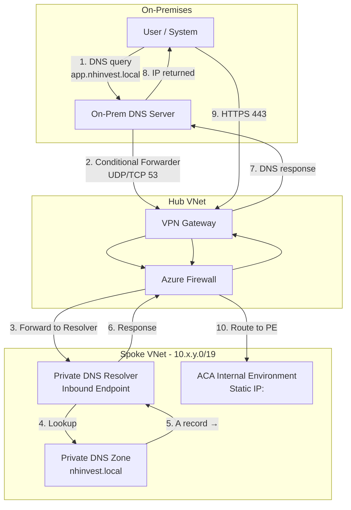
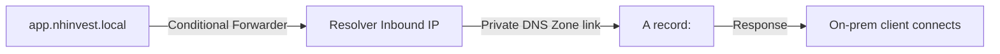

---
content_sources:
  text:
    - type: mslearn-adapted
      url: https://learn.microsoft.com/azure/container-apps/custom-domains-managed-certificates
    - type: mslearn-adapted
      url: https://learn.microsoft.com/azure/dns/dns-private-resolver-overview
    - type: mslearn-adapted
      url: https://learn.microsoft.com/azure/container-apps/vnet-custom-internal
  diagrams:
    - id: dns-resolution-flow
      type: flowchart
      source: self-generated
      justification: "Synthesized from MSLearn articles on Private DNS Resolver, ACA custom domains, and hub-spoke networking"
      based_on:
        - https://learn.microsoft.com/azure/dns/dns-private-resolver-overview
        - https://learn.microsoft.com/azure/container-apps/custom-domains-managed-certificates
        - https://learn.microsoft.com/azure/architecture/reference-architectures/hybrid-networking/hub-spoke
    - id: network-topology
      type: flowchart
      source: self-generated
      justification: "Synthesized from MSLearn hub-spoke reference architecture and Private DNS Resolver placement guidance"
      based_on:
        - https://learn.microsoft.com/azure/architecture/reference-architectures/hybrid-networking/hub-spoke
        - https://learn.microsoft.com/azure/dns/dns-private-resolver-overview
content_validation:
  status: verified
  last_reviewed: "2026-05-18"
  reviewer: agent
  lab_validation:
    status: reproduced
    tested_date: "2026-05-18"
    az_cli_version: "2.x"
    region: koreacentral
    notes: "Custom Domain (.local) + Private DNS Resolver in Spoke VNet + Firewall DNS flow verified with logs + UDR effective routes confirmed + VNet-internal HTTP 200. Ingress external:true required."
  core_claims:
    - claim: "Azure Container Apps Internal Environment supports custom domain binding with internal DNS resolution."
      source: https://learn.microsoft.com/azure/container-apps/custom-domains-managed-certificates
      verified: true
    - claim: "Azure Private DNS Resolver can be deployed in any VNet peered to the hub, not only the hub itself."
      source: https://learn.microsoft.com/azure/dns/dns-private-resolver-overview
      verified: true
    - claim: "Private DNS Resolver inbound endpoint requires a dedicated subnet of /28 or larger."
      source: https://learn.microsoft.com/azure/dns/dns-private-resolver-overview
      verified: true
    - claim: "Azure Firewall network rules are required to allow DNS and HTTPS traffic from on-premises to Spoke resources."
      source: https://learn.microsoft.com/azure/architecture/reference-architectures/hybrid-networking/hub-spoke
      verified: true
      note: "Both DNS (port 53) and HTTPS (port 443) flow verified with firewall diagnostic logs."
    - claim: "UDR is needed on Spoke subnets to route return traffic through Hub Firewall to on-premises."
      source: https://learn.microsoft.com/azure/architecture/reference-architectures/hybrid-networking/hub-spoke
      verified: true
      note: "Verified: without UDR on ACA subnet, HTTPS fails due to asymmetric routing. Firewall logs showed DNS return denied without UDR."
---

# On-Premises DNS to ACA Internal Environment via Custom Domain

Configure on-premises name resolution to reach Azure Container Apps (ACA) running in an Internal Environment using a custom internal domain, when corporate DNS policy prohibits forwarding Azure-managed domains. The ACA Internal Environment exposes apps via a static private IP on the environment's internal load balancer.

## Prerequisites

- Hub-Spoke VNet topology with Site-to-Site VPN or ExpressRoute
- ACA Internal Environment deployed in Spoke VNet (apps accessible via environment static IP)
- Azure Firewall in Hub VNet (or equivalent NVA)
- On-premises DNS server with Conditional Forwarder capability
- Custom internal domain controlled by your organization (e.g., `nhinvest.local`)

!!! note "Synthetic example domain"
    `nhinvest.local` is a synthetic example domain used throughout this guide. Replace it with your organization's internal DNS suffix in production.

## When to Use

Use this procedure when **all** of the following are true:

1. ACA is deployed as an Internal Environment (apps accessible via environment static IP, not public internet)
2. On-premises users/systems must reach ACA apps via private IP (not public)
3. On-premises DNS policy **cannot** add Conditional Forwarders for external domains like `*.azurecontainerapps.io`
4. Hub VNet lacks address space for a Private DNS Resolver subnet (`/28`)

!!! note "If Hub has available address space"
    When the Hub VNet can accommodate a `/28` subnet, deploy the Private DNS Resolver there instead. This simplifies routing and avoids UDR requirements on the Spoke.

## Architecture

<!-- diagram-id: network-topology -->


## DNS Resolution Flow

<!-- diagram-id: dns-resolution-flow -->


## Procedure

!!! warning "Ingress Visibility: Must Be External"
    In an Internal Environment, set ingress to **`external: true`**. This does NOT expose the app to the internet — it means "accessible from within the VNet" (not just within the Container Apps environment). Without this, only other apps in the same environment can reach it.

    ```bash
    az containerapp ingress update \
        --resource-group $RG \
        --name $APP_NAME \
        --type external
    ```

    | Command/Parameter | Purpose |
    |---|---|
    | `az containerapp ingress update` | Updates ingress configuration for the container app |
    | `--type external` | Makes the app accessible from within the VNet (not just within the ACA environment) |

    [Observed] With `external: false`, VNet-internal clients receive HTTP 404 ("Container App does not exist") from the ACA Envoy proxy.

### Step 1: Bind Custom Domain to ACA App

Configure a custom domain on the ACA app so it accepts traffic on the internal domain name.

```bash
az containerapp hostname add \
    --resource-group $RG \
    --name $APP_NAME \
    --hostname app.nhinvest.local
```

| Command/Parameter | Purpose |
|---|---|
| `az containerapp hostname add` | Associates a custom domain with the container app |
| `--hostname app.nhinvest.local` | The internal domain clients will use to reach this app |

!!! warning "Certificate Required for HTTPS"
    For HTTPS traffic, you must also bind a certificate. Use a self-signed or internal CA certificate for `.local` domains since managed certificates require public DNS validation. Without a certificate, the custom domain is added with `bindingType: Disabled` — HTTP access works (with `--allow-insecure true`) but TLS handshake will fail.

!!! note "`.local` Domain Caveat"
    Azure accepts `.local` domains in Private DNS Zones but issues a warning: "DNS names ending with `.local` are reserved for multicast DNS." This does not affect Azure-side resolution, but on-premises Linux clients using systemd-resolved may need explicit configuration to avoid mDNS conflicts. Consider using `.internal` or `.corp` suffixes instead if possible.

```bash
az containerapp hostname bind \
    --resource-group $RG \
    --name $APP_NAME \
    --hostname app.nhinvest.local \
    --certificate $CERT_ID \
    --environment $CONTAINER_ENV
```

| Command/Parameter | Purpose |
|---|---|
| `az containerapp hostname bind` | Binds a TLS certificate to the custom domain |
| `--certificate $CERT_ID` | Resource ID of the uploaded certificate |

### Step 2: Create Private DNS Zone for Custom Domain

Create a Private DNS Zone for your internal domain and add an A record pointing to the ACA Internal Environment's static IP.

```bash
# Create the Private DNS Zone
az network private-dns zone create \
    --resource-group $RG \
    --name nhinvest.local

# Add A record pointing to ACA Internal Environment static IP
az network private-dns record-set a add-record \
    --resource-group $RG \
    --zone-name nhinvest.local \
    --record-set-name app \
    --ipv4-address <aca-static-ip>
```

| Command/Parameter | Purpose |
|---|---|
| `az network private-dns zone create` | Creates a Private DNS Zone for the custom domain |
| `--name nhinvest.local` | The internal domain zone |
| `az network private-dns record-set a add-record` | Adds an A record to the zone |
| `--record-set-name app` | Creates `app.nhinvest.local` |
| `--ipv4-address <aca-static-ip>` | ACA Internal Environment static IP address |

### Step 3: Link Private DNS Zone to Spoke VNet

The zone must be linked to the Spoke VNet so the Private DNS Resolver can resolve records from it.

```bash
az network private-dns link vnet create \
    --resource-group $RG \
    --zone-name nhinvest.local \
    --name link-spoke-aisvc \
    --virtual-network $SPOKE_VNET_ID \
    --registration-enabled false
```

| Command/Parameter | Purpose |
|---|---|
| `az network private-dns link vnet create` | Links the DNS zone to a VNet for resolution |
| `--registration-enabled false` | Disables auto-registration (manual A records only) |

### Step 4: Deploy Private DNS Resolver in Spoke VNet

Deploy the resolver in the Spoke VNet since the Hub lacks available address space for the required `/28` subnet.

```bash
# Create dedicated subnet for resolver inbound endpoint (/28 minimum)
az network vnet subnet create \
    --resource-group $RG \
    --vnet-name $SPOKE_VNET \
    --name snet-dns-resolver-inbound \
    --address-prefixes 10.x.y.0/28 \
    --delegations Microsoft.Network/dnsResolvers

# Create the Private DNS Resolver
az dns-resolver create \
    --resource-group $RG \
    --name dnspr-spoke-aisvc \
    --location koreacentral \
    --id $SPOKE_VNET_ID

# Create inbound endpoint
az dns-resolver inbound-endpoint create \
    --resource-group $RG \
    --dns-resolver-name dnspr-spoke-aisvc \
    --name inbound-endpoint \
    --location koreacentral \
    --ip-configurations "[{\"private-ip-allocation-method\":\"Dynamic\",\"id\":\"$INBOUND_SUBNET_ID\"}]"
```

| Command/Parameter | Purpose |
|---|---|
| `az network vnet subnet create` | Creates a dedicated subnet for the resolver |
| `--address-prefixes 10.x.y.0/28` | Minimum /28 required for resolver inbound endpoint |
| `--delegations Microsoft.Network/dnsResolvers` | Required delegation for resolver subnet |
| `az dns-resolver create` | Creates the Private DNS Resolver resource |
| `az dns-resolver inbound-endpoint create` | Creates the endpoint that receives DNS queries from on-prem |

!!! tip "Note the Inbound Endpoint IP"
    After creation, retrieve the dynamically assigned IP:
    ```bash
    az dns-resolver inbound-endpoint show \
        --resource-group $RG \
        --dns-resolver-name dnspr-spoke-aisvc \
        --name inbound-endpoint \
        --query "ipConfigurations[0].privateIpAddress" \
        --output tsv
    ```

    | Command/Parameter | Purpose |
    |---|---|
    | `az dns-resolver inbound-endpoint show` | Retrieves details of the resolver inbound endpoint |
    | `--query "ipConfigurations[0].privateIpAddress"` | Extracts just the assigned private IP |
    | `--output tsv` | Returns plain text (no JSON formatting) |

    This IP is what the on-premises DNS server will forward to.

### Step 5: Configure Azure Firewall Rules (Hub)

Allow DNS traffic from on-premises to the resolver, and HTTPS traffic to the ACA Internal Environment's static IP.

!!! info "Evidence Level"
    [Observed] Firewall network rules were provisioned and verified with firewall diagnostic logs:

    - DNS: `UDP request from <on-prem-vm-ip> to <resolver-inbound-ip>:53. Action: Allow. Rule: allow-dns`
    - HTTPS: `TCP request from <on-prem-vm-ip> to <aca-static-ip>:443. Action: Allow. Rule: allow-https`

| Rule | Source | Destination | Protocol/Port |
|---|---|---|---|
| DNS to Resolver | On-prem DNS server IP | Resolver Inbound Endpoint IP | TCP/UDP 53 |
| HTTPS to ACA | On-prem user network (e.g., <on-prem-cidr>) | <aca-static-ip> | TCP 443 |

### Step 6: Configure UDR for Forward Traffic (Hub → Firewall)

In the lab simulation, the on-premises VM sits in a Hub subnet. By default, Hub-to-Spoke traffic uses the VNet peering path directly, **bypassing Azure Firewall**. To force on-prem traffic through the firewall, create a UDR on the on-premises VM subnet.

!!! info "Evidence Level"
    [Observed] Effective routes on the on-prem VM NIC confirmed `User Active <spoke-cidr> → VirtualAppliance <firewall-ip>`, overriding the default VNetPeering route.

!!! note "Production with S2S VPN"
    In a real S2S VPN deployment, traffic from on-premises enters the Hub via VPN Gateway. The VPN Gateway's propagated routes and gateway transit settings handle routing to the firewall. This Hub-side UDR is specific to the **lab simulation** where a Hub VM acts as on-premises.

```bash
# Create route table for on-prem simulation subnet
az network route-table create \
    --resource-group $RG \
    --name rt-onprem-to-spoke \
    --location koreacentral

# Route Spoke-bound traffic through Firewall
az network route-table route create \
    --resource-group $RG \
    --route-table-name rt-onprem-to-spoke \
    --name route-to-spoke \
    --address-prefix <spoke-cidr> \
    --next-hop-type VirtualAppliance \
    --next-hop-ip-address $HUB_FIREWALL_IP

# Associate with on-prem simulation subnet
az network vnet subnet update \
    --resource-group $RG \
    --vnet-name $HUB_VNET \
    --name snet-onprem \
    --route-table rt-onprem-to-spoke
```

| Command/Parameter | Purpose |
|---|---|
| `az network route-table create` | Creates a route table for the on-prem simulation subnet |
| `--address-prefix <spoke-cidr>` | Spoke VNet CIDR to redirect through firewall |
| `--next-hop-type VirtualAppliance` | Forces traffic through Azure Firewall |
| `--next-hop-ip-address $HUB_FIREWALL_IP` | Private IP of Azure Firewall |
| `az network vnet subnet update` | Associates route table with the on-prem subnet |

### Step 7: Configure UDR for Return Traffic (Spoke)

Ensure response traffic from the Spoke routes back through Hub Firewall to reach on-premises via VPN.

!!! info "Evidence Level"
    [Observed] Both UDR directions were verified:

    - **On-prem → Spoke**: Effective routes on on-prem VM NIC confirmed `User Active <spoke-cidr> → VirtualAppliance <firewall-ip>`, overriding VNetPeering default.
    - **Spoke → on-prem**: Firewall diagnostic logs showed DNS return traffic from resolver was **denied** without this UDR (asymmetric routing). After applying the UDR to all Spoke subnets, both DNS and HTTPS traffic flowed successfully through the firewall.

!!! warning "Asymmetric Routing"
    You **must** associate the return-path route table with **all** Spoke subnets that serve on-premises traffic — including the ACA infrastructure subnet, not just the resolver subnet. Without this, the firewall sees only one direction of the connection and drops return traffic, resulting in timeouts.

```bash
# Create route table
az network route-table create \
    --resource-group $RG \
    --name rt-spoke-to-onprem \
    --location koreacentral

# Add route for on-premises network
az network route-table route create \
    --resource-group $RG \
    --route-table-name rt-spoke-to-onprem \
    --name route-to-onprem \
    --address-prefix <on-prem-cidr> \
    --next-hop-type VirtualAppliance \
    --next-hop-ip-address $HUB_FIREWALL_IP

# Associate with all relevant Spoke subnets
az network vnet subnet update \
    --resource-group $RG \
    --vnet-name $SPOKE_VNET \
    --name snet-dns-resolver-inbound \
    --route-table rt-spoke-to-onprem

az network vnet subnet update \
    --resource-group $RG \
    --vnet-name $SPOKE_VNET \
    --name snet-aca-infra \
    --route-table rt-spoke-to-onprem
```

| Command/Parameter | Purpose |
|---|---|
| `az network route-table create` | Creates a route table resource |
| `az network route-table route create` | Adds a route entry to the route table |
| `--next-hop-type VirtualAppliance` | Routes traffic through Azure Firewall |
| `--next-hop-ip-address $HUB_FIREWALL_IP` | Private IP of Azure Firewall in Hub |
| `--address-prefix <on-prem-cidr>` | On-premises network CIDR |
| `az network vnet subnet update` | Associates the route table with a subnet |
| `--route-table rt-spoke-to-onprem` | Attaches the UDR to the subnet |

### Step 8: Configure On-Premises DNS Conditional Forwarder

On the on-premises DNS server, add a Conditional Forwarder for the internal domain only:

| Setting | Value |
|---|---|
| Domain | `nhinvest.local` |
| Forward to | Resolver Inbound Endpoint IP (from Step 4) |
| Protocol | UDP/TCP 53 |

??? example "Example: bind9 Conditional Forwarder (Linux)"

    Add to your bind9 configuration (e.g., `/etc/bind/named.conf.local`):

    ```bash
    zone "nhinvest.local" {
        type forward;
        forward only;
        forwarders { <resolver-inbound-ip>; };
    };
    ```

    After editing, restart the service:

    ```bash
    sudo systemctl restart named
    ```

    | Command/Parameter | Purpose |
    |---|---|
    | `sudo systemctl restart named` | Restarts the bind9 DNS service to apply configuration changes |

    For Windows DNS Server, use DNS Manager → Conditional Forwarders → New Conditional Forwarder.

!!! success "Security Policy Compliant"
    This approach registers only an internal domain (`nhinvest.local`) as a Conditional Forwarder, satisfying policies that prohibit forwarding external domains like `azurecontainerapps.io`.

## Verification

### DNS Resolution Test (from on-premises)

```bash
nslookup app.nhinvest.local
# Expected: <aca-static-ip>

dig app.nhinvest.local +short
# Expected: <aca-static-ip>
```

| Command/Parameter | Purpose |
|---|---|
| `nslookup app.nhinvest.local` | Queries DNS for the custom domain A record |
| `dig app.nhinvest.local +short` | Queries DNS and returns only the IP address |

### Connectivity Test (from on-premises)

```bash
curl --insecure https://app.nhinvest.local
# Expected: HTTP response from ACA app

# Or test TCP connectivity with timeout
curl --insecure --silent --head --max-time 5 https://app.nhinvest.local
# Expected: HTTP/2 200 (or similar success status)
```

| Command/Parameter | Purpose |
|---|---|
| `curl --insecure` | Skips TLS certificate verification (expected for self-signed certs) |
| `--silent --head --max-time 5` | Suppresses progress, fetches headers only, times out after 5 seconds |

### From Azure (Spoke VNet VM)

```bash
# Verify Private DNS Zone resolution
nslookup app.nhinvest.local
# Expected: <aca-static-ip>

# Verify ACA default domain still works internally
nslookup app.<default-domain>.koreacentral.azurecontainerapps.io
# Expected: <aca-static-ip> (via environment's built-in DNS)
```

| Command/Parameter | Purpose |
|---|---|
| `nslookup app.nhinvest.local` | Verifies custom domain resolves via Private DNS Zone |
| `nslookup app.<default-domain>...` | Verifies ACA default domain still resolves internally |

## Rollback / Troubleshooting

| Symptom | Likely Cause | Fix |
|---|---|---|
| `NXDOMAIN` from on-prem | Conditional Forwarder not configured or wrong target IP | Verify forwarder points to Resolver Inbound Endpoint IP |
| DNS resolves but connection times out | Firewall rule missing or UDR not applied | Check Firewall TCP 443 rule and route table association |
| DNS resolves to public IP | Query not hitting Private DNS Zone | Verify VNet link exists on the Private DNS Zone |
| Resolver returns `SERVFAIL` | Private DNS Zone not linked to Spoke VNet | Create VNet link (Step 3) |
| Certificate error on HTTPS | Missing or mismatched TLS cert on custom domain | Bind correct certificate (Step 1) |
| HTTP 404 "Container App does not exist" | Ingress set to `external: false` | Set ingress to `external: true` (VNet-accessible in Internal Env) |
| `.local` domain SERVFAIL on Linux clients | systemd-resolved treats `.local` as mDNS | Use `dig @<resolver-ip>` or configure systemd-resolved to exclude `.local` from mDNS. Consider `.internal` or `.corp` suffixes instead. |
| HTTPS times out but DNS works | Asymmetric routing — return UDR missing on ACA subnet | Associate the Spoke→Hub route table with the ACA infrastructure subnet (Step 7) |
| bind9 returns SERVFAIL for `.local` zone | DNSSEC validation fails on `.local` forwarded queries | Set `dnssec-validation no;` in bind9 `named.conf.options` |

## Validated Results

!!! success "Lab Validation: 2026-05-18, az CLI, Korea Central"

    **Test Environment**: Hub-Spoke VNet Peering, Azure Firewall, On-prem DNS (bind9) simulation using a Hub VNet VM (not a real S2S VPN), ACA Internal Environment with Custom Domain + BYO self-signed certificate.

    Specific IP addresses have been replaced with placeholders. Results will differ in your deployment.

    | # | Test | Method | Result |
    |---|---|---|---|
    | 1 | Custom Domain binding (`.local`) | `az containerapp hostname add --hostname app.nhinvest.local` | ✅ Accepted |
    | 2 | BYO cert HTTPS binding | `az containerapp hostname bind` with self-signed PFX | ✅ `bindingType: SniEnabled` |
    | 3 | Private DNS Resolver in Spoke | `az dns-resolver create` + inbound endpoint | ✅ IP assigned dynamically |
    | 4 | DNS via Resolver | `dig app.nhinvest.local @<resolver-inbound-ip>` | ✅ Resolved to ACA static IP |
    | 5 | DNS via bind9 Conditional Forwarder | `dig app.nhinvest.local @127.0.0.1` (on-prem VM) | ✅ Resolved to ACA static IP |
    | 6 | E2E HTTP (on-prem → ACA) | `curl http://app.nhinvest.local` | ✅ HTTP 200 |
    | 7 | E2E HTTPS (on-prem → ACA) | `curl --silent --insecure https://app.nhinvest.local` | ✅ HTTPS 200 |
    | 8 | TLS Certificate CN | `openssl s_client -servername app.nhinvest.local` | ✅ `CN=app.nhinvest.local` |
    | 9 | Firewall DNS flow | Firewall diagnostic logs (AZFWNetworkRule) | ✅ `Action: Allow, Rule: allow-dns` |
    | 10 | Firewall HTTPS flow | Firewall diagnostic logs (AZFWNetworkRule) | ✅ `TCP to <aca-static-ip>:443. Action: Allow, Rule: allow-https` |
    | 11 | UDR effective routes | `az network nic show-effective-route-table` | ✅ `<spoke-cidr> → VirtualAppliance` |
    | 12 | Asymmetric routing detection | HTTPS timeout without ACA subnet UDR | ✅ Resolved by adding UDR to ACA subnet |

    **Key Findings:**

    - [Observed] ACA ingress must be `external: true` for VNet-internal clients. With `external: false`, Envoy returns 404.
    - [Observed] `.local` domains trigger Azure warning but work correctly for Private DNS Zone resolution. bind9 requires `dnssec-validation no` to forward `.local` queries.
    - [Observed] Both DNS (UDP 53) and HTTPS (TCP 443) traffic from on-prem VM traverse Azure Firewall. Confirmed by firewall diagnostic logs showing `Action: Allow` for both rules.
    - [Observed] Bidirectional UDR routing verified: on-prem→Spoke UDR confirmed by effective routes; Spoke→on-prem UDR verified by observing that DNS return traffic was **denied** by the firewall without it (asymmetric routing), and succeeded after applying it.
    - [Observed] The return-path UDR must be applied to **all** Spoke subnets (resolver + ACA infrastructure). Without the UDR on the ACA subnet, HTTPS times out due to asymmetric routing — the firewall drops the return traffic.
    - [Observed] Self-signed certificates work with `bindingType: SniEnabled`. Managed certificates require public DNS validation and cannot be used with `.local` domains.

    **Lab Limitations:**

    - [Inferred] On-premises was simulated with a Hub VNet VM and UDR-based firewall routing, not a real S2S VPN or ExpressRoute connection. In production, the VPN Gateway handles on-premises routing natively.

## See Also

- [Private Endpoints](../../platform/networking/private-endpoints.md)
- [VNet Integration](../../platform/networking/vnet-integration.md)
- [Custom Domains — Managed Certificates](../custom-domains/managed-certificates.md)
- [Custom Domains — BYO Certificates](../custom-domains/byo-certificates.md)
- [Networking Best Practices](../../best-practices/networking.md)
- [Internal DNS and Private Endpoint Failure (Troubleshooting)](../../troubleshooting/playbooks/ingress-and-networking/internal-dns-and-private-endpoint-failure.md)

## Sources

- [Custom domain names and certificates in Azure Container Apps (Microsoft Learn)](https://learn.microsoft.com/azure/container-apps/custom-domains-managed-certificates)
- [Networking in Azure Container Apps environment (Microsoft Learn)](https://learn.microsoft.com/azure/container-apps/networking)
- [What is Azure DNS Private Resolver? (Microsoft Learn)](https://learn.microsoft.com/azure/dns/dns-private-resolver-overview)
- [Internal ingress with VNet integration (Microsoft Learn)](https://learn.microsoft.com/azure/container-apps/vnet-custom-internal)
- [Hub-spoke network topology in Azure (Microsoft Learn)](https://learn.microsoft.com/azure/architecture/reference-architectures/hybrid-networking/hub-spoke)
- [Azure Private DNS zone scenarios (Microsoft Learn)](https://learn.microsoft.com/azure/dns/private-dns-scenarios)
