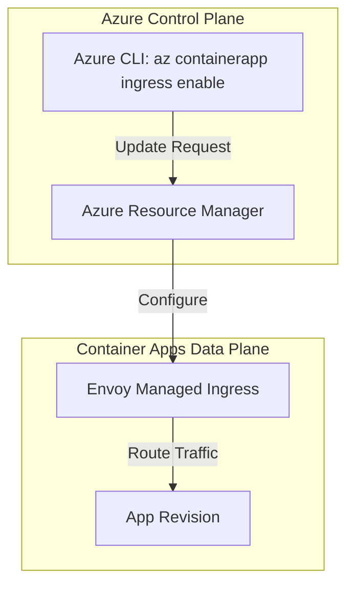
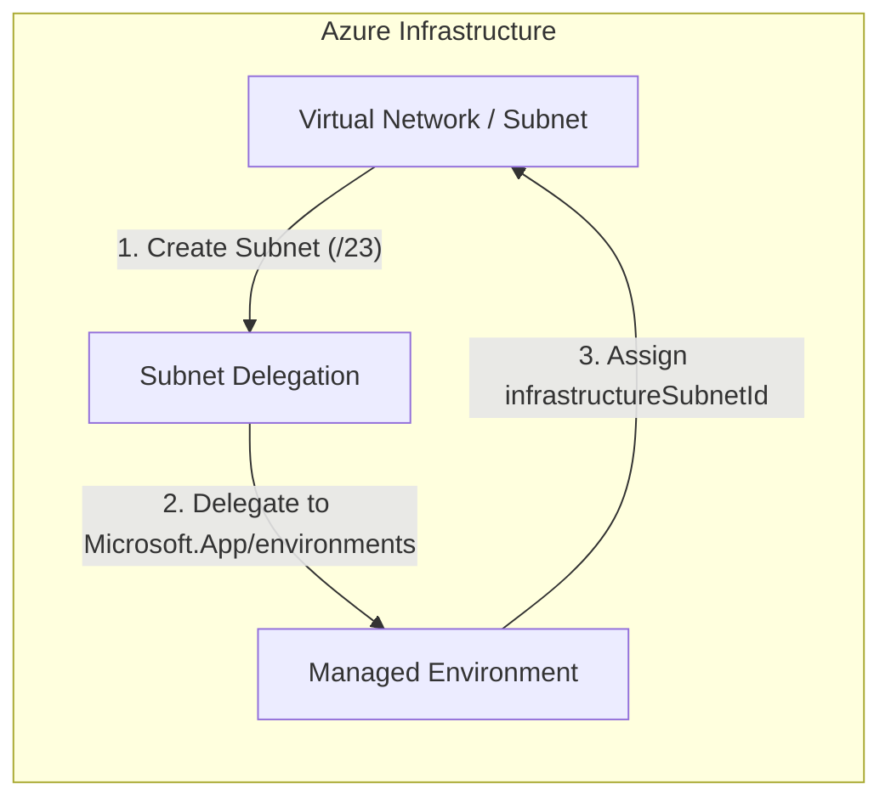
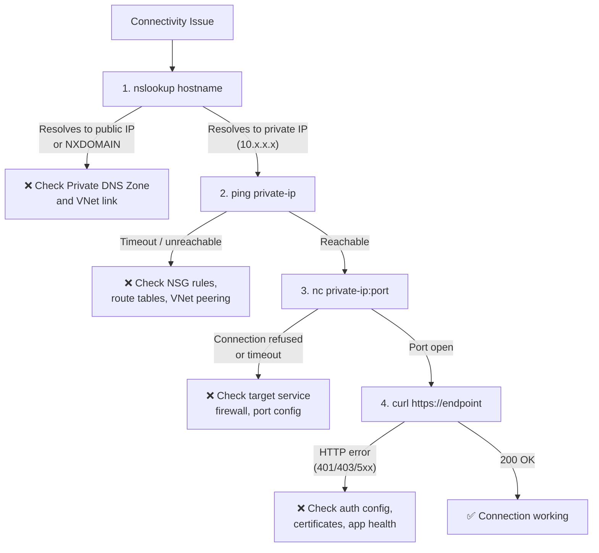

# Networking Operations

This guide covers networking operations for Container Apps: ingress updates, VNet-related checks, and service discovery between apps.

## Prerequisites

- Container Apps environment deployed with required network model
- Ingress requirements documented (internal vs external)

```bash
export RG="rg-myapp"
export APP_NAME="ca-myapp"
export ENVIRONMENT_NAME="cae-myapp"
```

## Ingress Configuration Operations

Enable external ingress with explicit target port:

```bash
az containerapp ingress enable \
  --name "$APP_NAME" \
  --resource-group "$RG" \
  --type external \
  --target-port 8000
```

### Ingress Flow



Switch to internal ingress for private-only access:

```bash
az containerapp ingress disable \
  --name "$APP_NAME" \
  --resource-group "$RG"
```

```bash
az containerapp ingress enable \
  --name "$APP_NAME" \
  --resource-group "$RG" \
  --type internal \
  --target-port 8000
```

### Verify Ingress Configuration

**Control-plane check** — confirm ingress type and target port:

```bash
az containerapp show \
  --name "$APP_NAME" \
  --resource-group "$RG" \
  --query "properties.configuration.ingress" \
  --output json

az containerapp ingress show \
  --name "$APP_NAME" \
  --resource-group "$RG" \
  --output json
```

Expected output (PII masked):

```json
{
  "allowInsecure": false,
  "external": true,
  "fqdn": "ca-myapp.<hash>.<region>.azurecontainerapps.io",
  "targetPort": 8000,
  "transport": "Auto",
  "traffic": [
    {
      "latestRevision": true,
      "weight": 100
    }
  ]
}
```

**Data-plane check** — confirm the app responds on the FQDN:

```bash
# For external ingress
FQDN=$(az containerapp show \
  --name "$APP_NAME" \
  --resource-group "$RG" \
  --query "properties.configuration.ingress.fqdn" \
  --output tsv)

curl --silent --output /dev/null --write-out "%{http_code}" "https://$FQDN/health"
```

Expected result: `200`

Example health payload:

```json
{"status":"healthy","timestamp":"2026-04-04T11:32:37.322216+00:00"}
```

!!! note "Internal ingress"
    Internal ingress FQDNs resolve only from within the same VNet. Run the data-plane check from a VM or pod inside the environment's VNet.

## VNet and Environment Checks

### VNet Setup Flow



Inspect managed environment network profile:

```bash
az containerapp env show \
  --name "$ENVIRONMENT_NAME" \
  --resource-group "$RG" \
  --output json
```

Validate subnet details (Azure CLI network command):

```bash
az network vnet subnet show \
  --resource-group "$RG" \
  --vnet-name "vnet-aca-prod" \
  --name "snet-containerapps" \
  --output table
```

### Verify VNet Integration

**Control-plane check** — confirm the environment is attached to a VNet:

```bash
az containerapp env show \
  --name "$ENVIRONMENT_NAME" \
  --resource-group "$RG" \
  --query "{vnetConfig: properties.vnetConfiguration, staticIp: properties.staticIp}" \
  --output json
```

Expected output (PII masked):

```json
{
  "vnetConfig": null,
  "staticIp": "20.249.x.x"
}
```

**Data-plane check** — confirm subnet delegation is correct:

```bash
az network vnet subnet show \
  --resource-group "$RG" \
  --vnet-name "vnet-aca-prod" \
  --name "snet-containerapps" \
  --query "delegations[].serviceName" \
  --output tsv
```

Expected result: `Microsoft.App/environments`

## Service Discovery Operations

For app-to-app calls in the same environment, use internal FQDN from ingress settings.

```bash
az containerapp show \
  --name "$APP_NAME" \
  --resource-group "$RG" \
  --query "properties.configuration.ingress.fqdn" \
  --output tsv
```

### Verify Service Discovery

**Control-plane check** — retrieve the internal FQDN of the target app:

```bash
az containerapp show \
  --name "$APP_NAME" \
  --resource-group "$RG" \
  --query "properties.configuration.ingress.{fqdn: fqdn, external: external}" \
  --output json
```

Expected output (internal app):

```json
{
  "fqdn": "ca-myapp.internal.<region>.azurecontainerapps.io",
  "external": false
}
```

**Data-plane check** — confirm DNS resolution from another app in the same environment using an exec session:

```bash
# Run from inside the calling container (exec into container)
nslookup ca-myapp.internal.<region>.azurecontainerapps.io
```

Expected result: The FQDN resolves to the environment's internal IP (e.g., `10.0.x.x`).

!!! warning "Cross-environment calls"
    Internal FQDNs are scoped to the environment. Apps in different environments cannot reach each other via these FQDNs — use VNet peering or public endpoints for cross-environment communication.

## Network Debugging Checklist

When connectivity issues arise with privately networked resources, follow this systematic approach. Each step targets a specific OSI layer to isolate the problem.

### Diagnostic Flow



### Step 1: DNS Resolution (Layer 7 — Application/DNS)

Run diagnostics from inside a running Container App revision.

```bash
az containerapp exec \
  --resource-group "$RG" \
  --name "$APP_NAME" \
  --command "/bin/sh"

# In the container shell
nslookup your-private-resource.database.windows.net
```

Expected: private hostname resolves to a private IP.

If DNS fails (`NXDOMAIN`) or returns a public IP, fix private DNS configuration and VNet linkage.

### Step 2: Network Reachability (Layer 3 — Network)

Check basic IP-level reachability from the same container network context.

```bash
# In the container shell
ping -c 4 10.0.2.4
```

If ping is unavailable in your image, install tooling in a debug session (for example, `apt-get update && apt-get install -y iputils-ping dnsutils netcat-openbsd curl`).

### Step 3: Port Connectivity (Layer 4 — Transport)

Because `tcpping` is not typically available in Container Apps, use `nc` or `curl --connect-timeout`.

```bash
# TCP port probe
nc -zv 10.0.2.4 443

# HTTPS connect timeout probe
curl --connect-timeout 5 --verbose https://your-private-api.contoso.local/health
```

If port probe fails, investigate service-side firewall rules, listener ports, and NSG/UDR controls.

### Step 4: Application Response (Layer 7 — Application)

Validate application response after network and transport checks succeed.

```bash
curl --silent --show-error --include https://your-private-api.contoso.local/health
```

Expected: `HTTP/1.1 200 OK` (or service-specific success response).

### Service-Specific Commands (Container Apps)

```bash
az containerapp exec \
  --resource-group "$RG" \
  --name "$APP_NAME" \
  --command "/bin/sh"
```

Inside the container, use:
- `nslookup <hostname>`
- `ping -c 4 <private-ip>`
- `nc -zv <host> <port>`
- `curl --connect-timeout 5 https://<endpoint>`

### Common Failures by Layer

| Symptom | OSI Layer | Likely Cause | Fix |
|---------|-----------|-------------|-----|
| `NXDOMAIN` or public IP | L7 (DNS) | Private DNS Zone missing or not linked | Create/link Private DNS Zone to VNet |
| Private IP but unreachable | L3 (Network) | NSG blocking, missing route, peering issue | Check NSG rules and route tables |
| IP reachable, port closed | L4 (Transport) | Service firewall, wrong port, service stopped | Check target service network rules |
| Port open, HTTP error | L7 (Application) | Auth failure, bad cert, app crash | Check credentials, TLS config, app logs |

### Change Window Decision Matrix

| Change Type | Risk Level | Recommended Window | Rollback Plan |
|---|---|---|---|
| Ingress external/internal toggle | Medium | Low-traffic period | Restore prior ingress type and re-validate FQDN |
| Subnet/route/NSG update | High | Planned maintenance window | Reapply last known-good network policy from IaC |
| Private DNS zone link update | High | Planned maintenance window | Re-link previous zone and flush DNS clients |
| WAF or gateway routing change | Medium | Controlled release window | Revert listener/rule set and retest `/health` |

!!! tip "Validate from caller network context"
    Always run connectivity checks from the same network path as the failing caller (same VNet/subnet/peering boundary). Control-plane success does not guarantee data-plane reachability.

!!! warning "Do not combine multiple network changes in one window"
    Applying DNS, NSG, UDR, and ingress changes together makes root-cause isolation significantly harder during incidents.

## Troubleshooting

### Requests time out

- Confirm ingress type matches caller location.
- Verify application port and `targetPort` alignment.
- Check NSG or route table updates affecting VNet path.

```bash
az network watcher test-connectivity \
  --resource-group "$RG" \
  --source-resource "/subscriptions/<subscription-id>/resourceGroups/$RG/providers/Microsoft.App/containerApps/$APP_NAME" \
  --dest-address "<dependency-hostname>" \
  --dest-port 443
```

## Advanced Topics

- Use internal ingress plus Application Gateway for centralized WAF.
- Define egress allow-list controls with Azure Firewall or NVA.
- Standardize DNS and naming for service-to-service resilience.

## See Also
- [Security](../../platform/identity-and-secrets/security-operations.md)
- [Health and Recovery](../../platform/reliability/health-recovery.md)

## Sources
- [Container Apps networking](https://learn.microsoft.com/azure/container-apps/networking)
- [VNet integration in Azure Container Apps (Microsoft Learn)](https://learn.microsoft.com/azure/container-apps/vnet-custom-internal)
