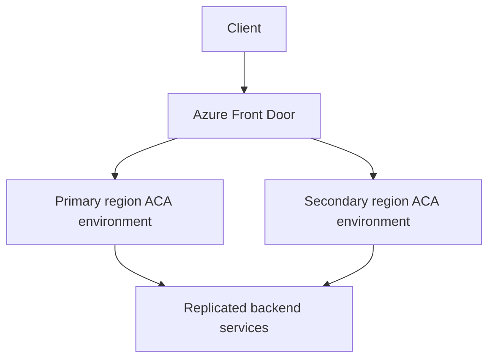

---
content_sources:
  diagrams:
    - id: multi-region-front-door-topology
      type: flowchart
      source: mslearn-adapted
      based_on:
        - https://learn.microsoft.com/azure/reliability/reliability-azure-container-apps
        - https://learn.microsoft.com/azure/frontdoor/front-door-overview
content_validation:
  status: pending_review
  last_reviewed: "2026-04-25"
  reviewer: agent
  core_claims:
    - claim: "Reliability guidance for Azure Container Apps should be used when planning zonal or regional resilience."
      source: "https://learn.microsoft.com/azure/reliability/reliability-azure-container-apps"
      verified: true
    - claim: "Azure Front Door provides a global entry point that can be used in front of regional origins."
      source: "https://learn.microsoft.com/azure/frontdoor/front-door-overview"
      verified: true
    - claim: "Built-in cross-region failover for Container Apps was not re-verified in time and should not be assumed."
      source: "https://learn.microsoft.com/azure/reliability/reliability-azure-container-apps"
      verified: false
---

# Disaster Recovery

Azure Container Apps disaster recovery is an architecture decision rather than a single platform toggle: you must decide whether zonal resilience, multi-region deployment, or both are required for the workload.

## Prerequisites

- A documented RTO and RPO for the workload
- Infrastructure as Code for recreating environments in multiple regions
- Replication plans for stateful dependencies such as databases, secrets, and images

```bash
export PRIMARY_LOCATION="eastus"
export SECONDARY_LOCATION="centralus"
export FRONT_DOOR_NAME="afd-aca-prod"
```

## When to Use

- When a single-region outage exceeds workload tolerance
- When you need a documented active-active or active-passive pattern
- When you need a clear distinction between zone redundancy and region failover

## Procedure

1. Decide whether the failure domain to address is **zone**, **region**, or both.
2. Keep the application stateless where possible.
3. Replicate backend dependencies before assuming traffic failover is safe.
4. Put a global routing layer in front of regional environments if region failover is required.

Common production pattern:

- one Container Apps environment per region
- one app deployment per region
- Azure Front Door or Traffic Manager in front
- replicated backend state such as databases, Key Vault strategy, and ACR replication

!!! warning "Do not assume platform-managed cross-region failover"
    The Container Apps disaster-recovery librarian task remained queued and did not return evidence in time.
    Treat cross-region failover as an application and routing architecture pattern until current Microsoft documentation explicitly proves otherwise.

<!-- diagram-id: multi-region-front-door-topology -->


## Verification

- Confirm regional deployments are functionally equivalent.
- Confirm the global routing layer can stop sending traffic to an unhealthy region.
- Confirm backend state replication meets the workload RPO.

## Rollback / Troubleshooting

- If failover is manual, document exact operator actions and DNS impact.
- If a failed region remains in rotation, inspect global health probe and origin status.
- If backend state diverges, delay failback until data is reconciled.

## See Also

- [Multi-Region Deployment](multi-region-deployment.md)
- [Zone Redundancy](zone-redundancy.md)
- [Recovery and Incident Readiness](../recovery/index.md)

## Sources

- [Reliability in Azure Container Apps](https://learn.microsoft.com/azure/reliability/reliability-azure-container-apps)
- [Azure Front Door overview](https://learn.microsoft.com/azure/frontdoor/front-door-overview)
- [Azure Traffic Manager overview](https://learn.microsoft.com/azure/traffic-manager/traffic-manager-overview)
