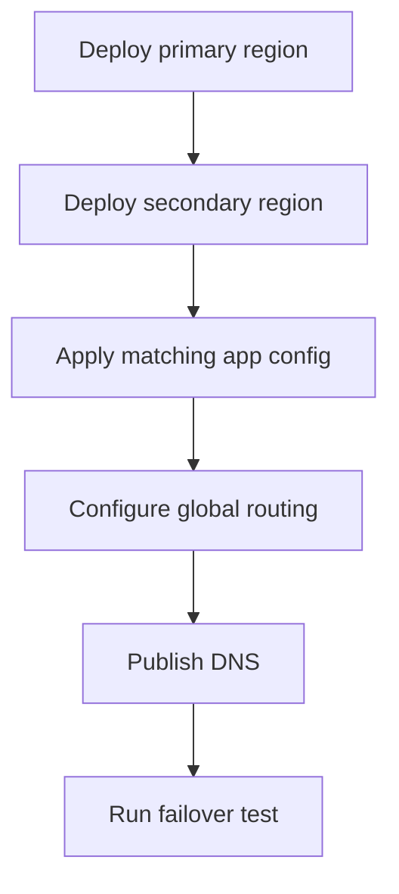

---
content_sources:
  diagrams:
    - id: multi-region-deployment-steps
      type: flowchart
      source: mslearn-adapted
      based_on:
        - https://learn.microsoft.com/azure/frontdoor/front-door-overview
        - https://learn.microsoft.com/azure/traffic-manager/traffic-manager-overview
        - https://learn.microsoft.com/azure/reliability/reliability-azure-container-apps
content_validation:
  status: pending_review
  last_reviewed: "2026-04-25"
  reviewer: agent
  core_claims:
    - claim: "Azure Front Door and Traffic Manager are Microsoft routing services commonly used for multi-region entry points."
      source: "https://learn.microsoft.com/azure/frontdoor/front-door-overview"
      verified: true
    - claim: "Multi-region Container Apps requires separate regional deployments rather than a single cross-region environment."
      source: "https://learn.microsoft.com/azure/reliability/reliability-azure-container-apps"
      verified: false
---

# Multi-Region Deployment

Use this runbook when the workload needs a cross-region pattern rather than a single regional environment.

## Prerequisites

- Two approved Azure regions
- Repeatable Bicep or ARM for both environments
- A global routing layer selected before cutover

```bash
export PRIMARY_LOCATION="eastus"
export SECONDARY_LOCATION="centralus"
export PRIMARY_ENVIRONMENT_NAME="aca-env-prod-eastus"
export SECONDARY_ENVIRONMENT_NAME="aca-env-prod-centralus"
```

## When to Use

- When zone redundancy is not sufficient
- When you need active-passive or active-active traffic management
- When you need a repeatable regional failover drill

## Procedure

1. Deploy the Container Apps environment in the primary region.
2. Deploy the same environment pattern in the secondary region.
3. Deploy matching app revisions, secrets, ingress, and scale configuration to both regions.
4. Add both regions to Azure Front Door or Traffic Manager.
5. Configure health probes and routing policy.
6. Publish DNS to the global endpoint.

Minimal Bicep placeholder for dual-region composition:

```bicep
param primaryLocation string = 'eastus'
param secondaryLocation string = 'centralus'

// Deploy one managed environment and one container app per region.
// Add global routing in Front Door or Traffic Manager separately.
```

!!! warning "Front Door origin details and probe-path guidance were not re-verified in time"
    Confirm the current Front Door or Traffic Manager origin configuration, health probe path, and failover behavior against the latest Microsoft routing documentation before standardizing this pattern.

<!-- diagram-id: multi-region-deployment-steps -->


## Verification

- Confirm both regional endpoints are healthy.
- Confirm the global endpoint routes to a healthy region.
- Confirm a simulated regional failure removes the failed origin from traffic.

## Rollback / Troubleshooting

- If regions drift, compare environment settings, secrets, and revision config side by side.
- If failover does not occur, inspect the health probe path and routing policy.
- If DNS was changed manually, wait for TTL before declaring the cutover failed.

## See Also

- [Disaster Recovery](index.md)
- [Zone Redundancy](zone-redundancy.md)
- [Custom Domains and TLS](../custom-domains/index.md)

## Sources

- [Azure Front Door overview](https://learn.microsoft.com/azure/frontdoor/front-door-overview)
- [Azure Traffic Manager overview](https://learn.microsoft.com/azure/traffic-manager/traffic-manager-overview)
- [Reliability in Azure Container Apps](https://learn.microsoft.com/azure/reliability/reliability-azure-container-apps)
