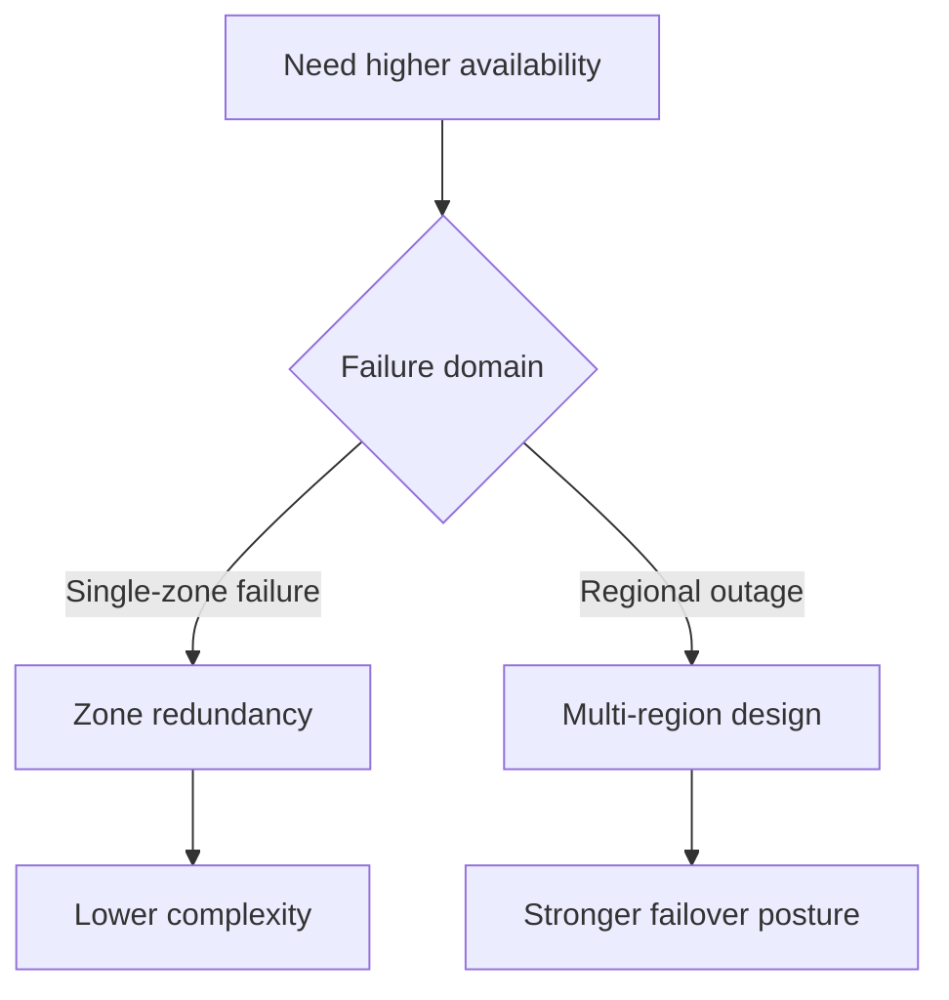
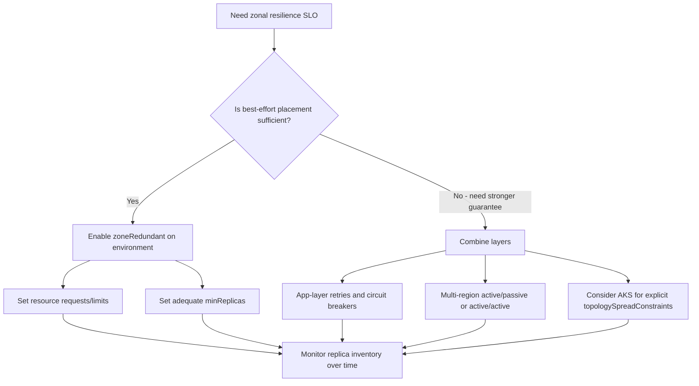

---
content_sources:
  diagrams:
    - id: zone-redundancy-vs-multi-region
      type: flowchart
      source: mslearn-adapted
      based_on:
        - https://learn.microsoft.com/en-us/azure/reliability/reliability-azure-container-apps
    - id: zone-redundancy-best-effort-decision
      type: flowchart
      source: self-generated
      justification: "Synthesizes Microsoft Learn best-effort scheduler guidance into an operator-facing decision flow that distinguishes platform-only guarantees from application- and topology-level mitigations."
      based_on:
        - https://learn.microsoft.com/en-us/azure/reliability/reliability-container-apps
        - https://learn.microsoft.com/en-us/azure/container-apps/how-to-zone-redundancy
content_validation:
  status: verified
  last_reviewed: '2026-06-08'
  reviewer: agent
  core_claims:
    - claim: Azure reliability guidance for Container Apps should be used when evaluating zone redundancy.
      source: https://learn.microsoft.com/en-us/azure/reliability/reliability-azure-container-apps
      verified: true
    - claim: Zone redundancy is available to all Container Apps plans, must be enabled during environment creation, and can't be changed afterward.
      source: https://learn.microsoft.com/en-us/azure/reliability/reliability-container-apps
      verified: true
    - claim: "The platform scheduler distributes replicas across physical hosts while meeting your minimum replica count requirements, but per-replica zone placement is a best-effort outcome rather than a guarantee."
      source: https://learn.microsoft.com/en-us/azure/container-apps/how-to-zone-redundancy
      verified: true
    - claim: "Underspecified resource requests can lead to uneven distribution across zones, so set resource requests and limits to help the scheduler make optimal placement decisions."
      source: https://learn.microsoft.com/en-us/azure/container-apps/how-to-zone-redundancy
      verified: true
---
# Zone Redundancy

Zone redundancy improves resilience within a single region, but it is not a substitute for full multi-region disaster recovery, and the per-replica zone placement it delivers is **best-effort** rather than a contractual guarantee.

!!! warning "Best-effort placement, not a per-replica zone guarantee"
    Microsoft Learn describes zone-redundant Container Apps environments as follows: *"The platform scheduler ensures optimal distribution across physical hosts while meeting your minimum replica count requirements."* This is a best-effort behavior. Setting `minReplicas=3` in a zone-redundant environment does **not** guarantee that you will always observe one replica in each of three distinct availability zones. The actual distribution depends on host capacity, resource requests, scheduler decisions, and platform maintenance events at any given moment. Treat zone-redundant environments as one layer of a defense-in-depth strategy; do not rely on it alone to meet zonal SLOs.

## Prerequisites

- A target region that supports the required Container Apps resilience features
- Infrastructure as Code for environment creation
- A decision on whether zonal failure tolerance is enough for the workload

```bash
export RG="rg-aca-prod"
export ACA_ENV_NAME="aca-env-prod"
export LOCATION="eastus"
```

## When to Use

- When you need protection from a single availability zone failure
- When you need a lower-complexity option than multi-region deployment
- When you need to explain why zonal resilience and regional resilience are different

## Procedure

1. Check the current reliability guidance for Azure Container Apps.
2. Confirm the target region and environment type support zone redundancy.
3. Decide whether the setting must be enabled at environment creation.
4. Compare the zonal design against your DR objectives.

Illustrative Bicep shape:

```bicep
resource managedEnvironment 'Microsoft.App/managedEnvironments@2024-03-01' = {
  name: envName
  location: location
  properties: {
    zoneRedundant: true
  }
}
```

Microsoft Learn now documents the current zone-redundancy rules: zone redundancy is available to **all Container Apps plans**, it must be enabled **during environment creation**, it **can't be changed afterward**, and it doesn't add charges beyond standard Container Apps pricing.

<!-- diagram-id: zone-redundancy-vs-multi-region -->


## What Zone Redundancy Does Not Guarantee

Zone redundancy is best understood as a platform-level **disposition**, not a per-replica contract. The Container Apps scheduler attempts to spread replicas across zones, but several conditions can cause a zone-redundant environment to run with fewer occupied zones than your `minReplicas` count would suggest.

| Situation | What Microsoft Learn says | Operator implication |
|---|---|---|
| Underspecified resource requests | "Underspecified resource requirements can lead to uneven distribution..." | Set explicit CPU and memory requests to give the scheduler a stable basis for placement. |
| Image pull on cold zones | "Container images are pulled from your container register into each zone as needed when replicas are created." | First replica in a previously cold zone may experience extra start latency; do not interpret this as zone failure. |
| Maintenance, host failure, or autoscale churn | "The platform scheduler ensures optimal distribution across physical hosts while meeting your minimum replica count requirements." | Brief windows of skewed distribution are expected; correlate with platform events before treating as an outage. |
| Per-replica zone identity | Not exposed by the Container Apps management API. | You **cannot** verify exact zone of each replica from outside the platform. Treat any such mapping as `[Not Proven]`. |

<!-- diagram-id: zone-redundancy-best-effort-decision -->


For the full decision tree, the four-layer mitigation matrix (in-Azure Container Apps inputs, app-layer resilience, topology escalation, observability), and a falsifiable lab that quantifies best-effort behavior under load, see the [Zone Redundancy Best-Effort playbook](../../troubleshooting/playbooks/platform-features/zone-redundancy-best-effort.md) and the [Zone Redundancy Best-Effort lab](../../troubleshooting/lab-guides/zone-redundancy-best-effort.md).

## Verification

- Confirm the environment reports the expected zone-redundancy state.
- Confirm the region and environment type support the configuration.
- Confirm your DR plan does not treat zone redundancy as a regional failover solution.
- Confirm that your zonal SLO is consistent with **best-effort** placement: if you depend on N replicas being on N distinct zones at all times, escalate to the four-layer matrix in the [Zone Redundancy Best-Effort playbook](../../troubleshooting/playbooks/platform-features/zone-redundancy-best-effort.md).

## Rollback / Troubleshooting

- If the setting is immutable, recreate the environment instead of editing in place.
- If the region does not support the setting, move to a supported region or a multi-region pattern.
- If RTO or RPO targets exceed a single region, use multi-region instead.
- If you observe clustered replica churn (multiple replicas restarted within a short window) and suspect a correlated zone event, use the [zone redundancy mass-reschedule KQL pack](../../troubleshooting/kql/scaling-and-replicas/zone-redundancy-mass-reschedule.md) to triage before assuming a per-replica zone failure.

## Review Matrix

| Review area | Page-specific check |
|---|---|
| Scope | Confirm the guidance applies to Zone Redundancy. |
| Source basis | Validate the recommendation against the Microsoft Learn sources in this page. |
| Evidence | Capture command output, portal state, metrics, logs, or screenshots before treating the result as proven. |

## See Also

- [Disaster Recovery](index.md)
- [Multi-Region Deployment](multi-region-deployment.md)
- [Zone Redundancy Best-Effort playbook](../../troubleshooting/playbooks/platform-features/zone-redundancy-best-effort.md)
- [Zone Redundancy Best-Effort lab](../../troubleshooting/lab-guides/zone-redundancy-best-effort.md)
- [Zone redundancy mass-reschedule KQL pack](../../troubleshooting/kql/scaling-and-replicas/zone-redundancy-mass-reschedule.md)

## Sources

- [Reliability in Azure Container Apps](https://learn.microsoft.com/en-us/azure/reliability/reliability-container-apps)
- [How to use zone redundancy in Azure Container Apps](https://learn.microsoft.com/en-us/azure/container-apps/how-to-zone-redundancy)
