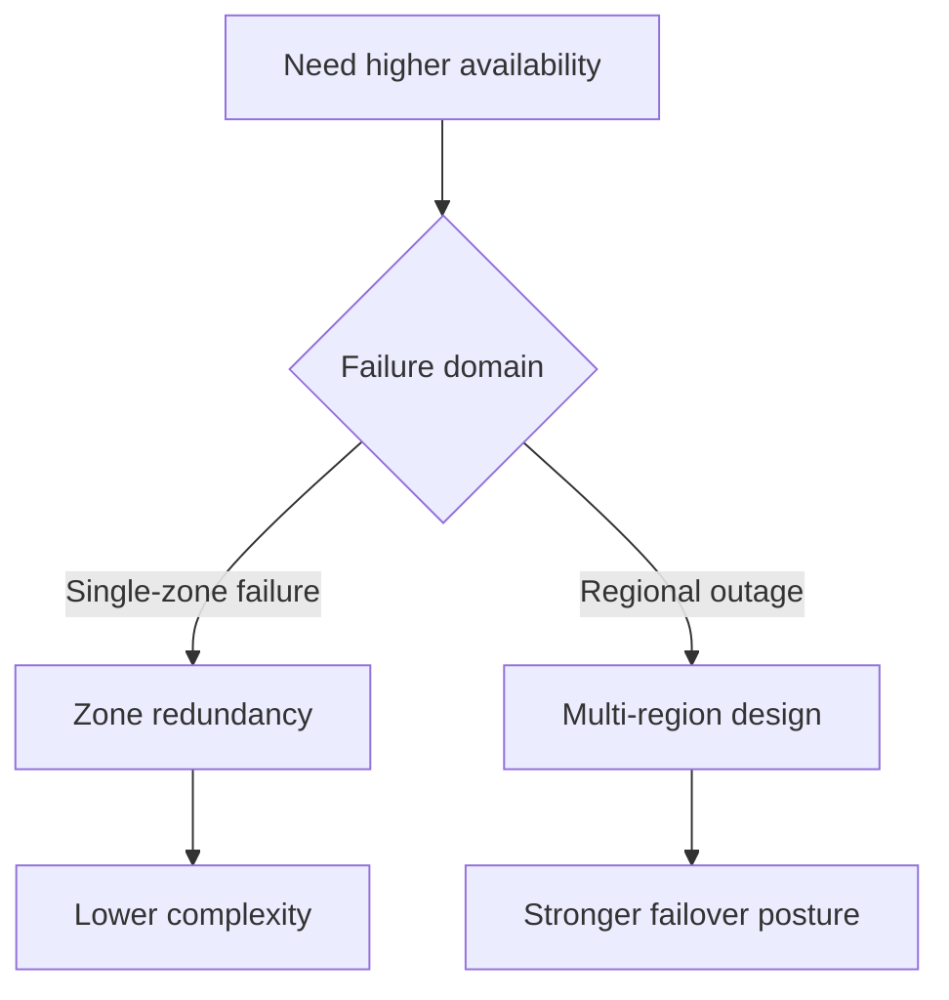

---
content_sources:
  diagrams:
    - id: zone-redundancy-vs-multi-region
      type: flowchart
      source: mslearn-adapted
      based_on:
        - https://learn.microsoft.com/azure/reliability/reliability-azure-container-apps
content_validation:
  status: pending_review
  last_reviewed: "2026-04-25"
  reviewer: agent
  core_claims:
    - claim: "Azure reliability guidance for Container Apps should be used when evaluating zone redundancy."
      source: "https://learn.microsoft.com/azure/reliability/reliability-azure-container-apps"
      verified: true
    - claim: "Exact zoneRedundant property rules and workload profile requirements were not re-verified in time."
      source: "https://learn.microsoft.com/azure/reliability/reliability-azure-container-apps"
      verified: false
---

# Zone Redundancy

Zone redundancy improves resilience within a single region, but it is not a substitute for full multi-region disaster recovery.

## Prerequisites

- A target region that supports the required Container Apps resilience features
- Infrastructure as Code for environment creation
- A decision on whether zonal failure tolerance is enough for the workload

```bash
export RG="rg-aca-prod"
export ENVIRONMENT_NAME="aca-env-prod"
export LOCATION="eastus"
```

## When to Use

- When you need protection from a single availability zone failure
- When you need a lower-complexity option than multi-region deployment
- When you need to explain why zonal resilience and regional resilience are different

## Procedure

1. Check the current reliability guidance for Azure Container Apps.
2. Confirm the target region and environment type support zone redundancy.
3. Decide whether the setting must be enabled at environment creation.
4. Compare the zonal design against your DR objectives.

Illustrative Bicep shape:

```bicep
resource managedEnvironment 'Microsoft.App/managedEnvironments@2024-03-01' = {
  name: envName
  location: location
  properties: {
    zoneRedundant: true
  }
}
```

!!! warning "Workload profile requirement and immutability were not re-verified in time"
    Before using `zoneRedundant: true` in a production template, confirm the current Container Apps reliability documentation for region support, workload profile requirements, creation-time restrictions, and pricing impact.

<!-- diagram-id: zone-redundancy-vs-multi-region -->


## Verification

- Confirm the environment reports the expected zone-redundancy state.
- Confirm the region and environment type support the configuration.
- Confirm your DR plan does not treat zone redundancy as a regional failover solution.

## Rollback / Troubleshooting

- If the setting is immutable, recreate the environment instead of editing in place.
- If the region does not support the setting, move to a supported region or a multi-region pattern.
- If RTO or RPO targets exceed a single region, use multi-region instead.

## See Also

- [Disaster Recovery](index.md)
- [Multi-Region Deployment](multi-region-deployment.md)

## Sources

- [Reliability in Azure Container Apps](https://learn.microsoft.com/azure/reliability/reliability-azure-container-apps)
