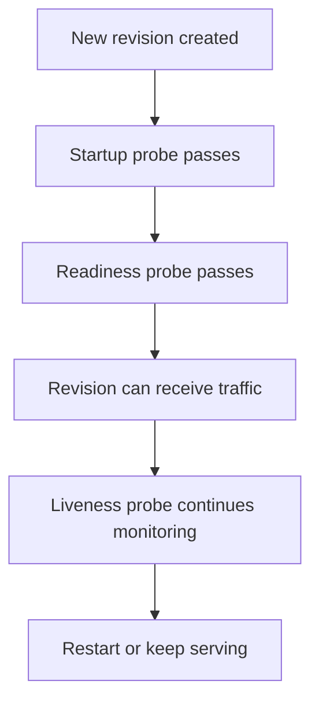

---
content_sources:
  diagrams:
    - id: probe-lifecycle-during-revision-activation
      type: flowchart
      source: mslearn-adapted
      based_on:
        - https://learn.microsoft.com/azure/container-apps/health-probes
        - https://learn.microsoft.com/azure/container-apps/revisions
content_validation:
  status: verified
  last_reviewed: "2026-04-25"
  reviewer: agent
  core_claims:
    - claim: "Azure Container Apps documents startup, readiness, and liveness probes."
      source: "https://learn.microsoft.com/azure/container-apps/health-probes"
      verified: true
    - claim: "Revisions are considered ready only after successful provisioning, scale, and readiness behavior."
      source: "https://learn.microsoft.com/azure/container-apps/revisions"
      verified: true
    - claim: "Azure Container Apps health probes support startup, readiness, and liveness probes over HTTP(S) or TCP, and exec probes aren't supported."
      source: "https://learn.microsoft.com/azure/container-apps/health-probes"
      verified: true
---

# Health Probes

Health probes determine whether a revision can become ready, continue serving traffic, or be restarted when the workload is unhealthy.

## Prerequisites

- An app with a clear health endpoint or TCP listener
- Access to revision configuration and system logs
- A rollback plan for any probe change

```bash
export RG="rg-aca-prod"
export APP_NAME="app-python-api-prod"
```

## When to Use

- When defining startup, readiness, and liveness behavior for production apps
- When new revisions fail to activate
- When restart loops or slow warm-up behavior require tuning

## Procedure

Azure Container Apps documents three probe types:

- **Startup** to protect slow initialization
- **Readiness** to control when the revision can receive traffic
- **Liveness** to detect unhealthy running containers

Documented probe configuration commonly includes:

- transport type
- path or port
- scheme
- `initialDelaySeconds`
- `periodSeconds`
- `timeoutSeconds`
- `successThreshold`
- `failureThreshold`

Use a YAML-based update when you need precise probe settings:

```bash
az containerapp update \
  --name "$APP_NAME" \
  --resource-group "$RG" \
  --yaml "./infra/containerapp-health.yaml"
```

Microsoft Learn now documents the current probe behavior: Container Apps supports **startup**, **liveness**, and **readiness** probes; probes use **HTTP(S)** or **TCP** only; `exec` probes aren't supported; and the portal automatically adds default TCP probes to the main app container when ingress is enabled and you don't define that probe type yourself.

<!-- diagram-id: probe-lifecycle-during-revision-activation -->


## Verification

Check revision state:

```bash
az containerapp revision list \
  --name "$APP_NAME" \
  --resource-group "$RG" \
  --output table
```

Review system logs for probe failures:

```bash
az containerapp logs show \
  --name "$APP_NAME" \
  --resource-group "$RG" \
  --type system \
  --follow false
```

## Rollback / Troubleshooting

- If the app never becomes ready, inspect startup output and system logs together.
- If liveness is too aggressive, reduce false-positive restarts before changing scale rules.
- If you rely on platform defaults, document them explicitly after verifying them in your environment.

## See Also

- [Probe Tuning](probe-tuning.md)
- [Health and Recovery](../../platform/reliability/health-recovery.md)
- [Recovery and Incident Readiness](../recovery/index.md)

## Sources

- [Health probes in Azure Container Apps](https://learn.microsoft.com/azure/container-apps/health-probes)
- [Revisions in Azure Container Apps](https://learn.microsoft.com/azure/container-apps/revisions)
