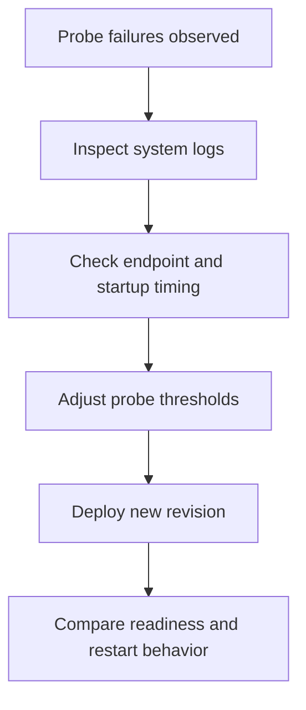

---
content_sources:
  diagrams:
    - id: probe-debugging-loop
      type: flowchart
      source: mslearn-adapted
      based_on:
        - https://learn.microsoft.com/azure/container-apps/health-probes
        - https://learn.microsoft.com/azure/container-apps/revisions
content_validation:
  status: pending_review
  last_reviewed: "2026-04-25"
  reviewer: agent
  core_claims:
    - claim: "Probe failures surface in Container Apps system logs and revision behavior."
      source: "https://learn.microsoft.com/azure/container-apps/health-probes"
      verified: true
    - claim: "Readiness and startup behavior affect whether a revision becomes ready for traffic."
      source: "https://learn.microsoft.com/azure/container-apps/revisions"
      verified: true
---

# Probe Tuning

Probe tuning is about reducing false positives without hiding real failures.

## Prerequisites

- Access to system logs, console logs, and revision state
- A known-good health endpoint or TCP listener
- A rollback plan for any production probe change

```bash
export RG="rg-aca-prod"
export APP_NAME="app-python-api-prod"
```

## When to Use

- When probes fail during rollout or warm-up
- When restart loops suggest liveness misconfiguration
- When downstream dependencies make readiness checks too strict

## Procedure

1. Check system logs for probe failures and restart reasons.
2. Confirm the endpoint, port, and scheme match the real application listener.
3. Adjust one timing parameter at a time.
4. Deploy a new revision and compare restart behavior.

Recommended conservative starting posture for many web apps:

- keep **startup** more tolerant than liveness
- keep **readiness** focused on traffic readiness, not every downstream dependency
- keep **liveness** narrow enough to catch hangs, not slow warm-up

!!! warning "Use conservative starting values, then tune from evidence"
    Because the queued health-probe research did not return exact default recommendations in time, do not treat any single timing profile as universal.
    Prefer evidence from your revision activation time, dependency latency, and restart history.

<!-- diagram-id: probe-debugging-loop -->


## Verification

- Confirm restart counts decrease after tuning.
- Confirm the app becomes ready within the expected activation window.
- Confirm liveness still detects genuine stuck or failed processes.

## Rollback / Troubleshooting

- If tuning makes detection too slow, roll back to the previous revision.
- If readiness depends on unavailable downstream services, separate dependency checks from basic process readiness.
- If failures persist, inspect image startup, secret loading, and dependency latency before widening thresholds further.

## See Also

- [Health Probes](index.md)
- [Health Probe Timeline](../../troubleshooting/kql/system-and-revisions/health-probe-timeline.md)
- [Repeated Startup Attempts](../../troubleshooting/kql/restarts/repeated-startup-attempts.md)

## Sources

- [Health probes in Azure Container Apps](https://learn.microsoft.com/azure/container-apps/health-probes)
- [Revisions in Azure Container Apps](https://learn.microsoft.com/azure/container-apps/revisions)
