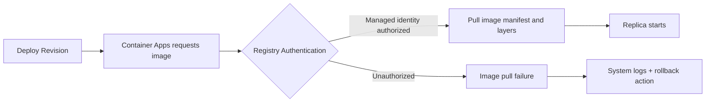

# Image Pull and Registry Operations

Image distribution reliability is foundational for stable deployments. This guide covers authentication, tagging, rotation, and troubleshooting for registry operations.

## ACR Authentication Methods

Container Apps can pull images from Azure Container Registry using several methods:

1. **Managed identity (recommended)**
   - Best for production security posture
   - No long-lived credentials in configuration
2. **Service principal**
   - Useful for cross-tenant or constrained scenarios
   - Requires credential lifecycle management
3. **Admin user (not recommended for production)**
   - Fast setup for testing only
   - Broad credentials increase risk

Assign pull role for managed identity:

```bash
az role assignment create \
  --assignee-object-id "<object-id>" \
  --assignee-principal-type "ServicePrincipal" \
  --role "AcrPull" \
  --scope "/subscriptions/<subscription-id>/resourceGroups/$RG/providers/Microsoft.ContainerRegistry/registries/$ACR_NAME"
```

## Private ACR with VNet

For regulated workloads:

- Use Private Endpoint for ACR.
- Configure private DNS resolution in the same network boundary as Container Apps environment.
- Restrict public network access for the registry.

Validate connectivity from workload subnet before enforcing deny-public rules.

## Image Tagging Strategy

Use immutable version tags for deployment references:

- Good: `python-app:20260404.1`, `python-app:gitsha-1a2b3c4d`
- Avoid: relying only on `latest` in production

Maintain retention policy to prune stale tags while preserving rollback window.

## Registry Credential Rotation

If using service principal credentials:

- Rotate client secret on a fixed schedule.
- Update Container Apps secret references before expiry.
- Verify image pull after rotation and keep previous secret for rollback window.

Prefer managed identity to reduce operational rotation burden.

## ACR Tasks for Automated Builds

ACR Tasks can build images on commit or schedule without external runners.

```bash
az acr task create \
  --registry "$ACR_NAME" \
  --name "build-python-app" \
  --context "https://github.com/yeongseon/azure-container-apps-python-guide.git" \
  --file "apps/python/Dockerfile" \
  --image "python-app:{{.Run.ID}}" \
  --commit-trigger-enabled true
```

## Troubleshooting Image Pull Failures

Common causes:

- Identity lacks `AcrPull`
- Image tag does not exist
- Registry firewall/private endpoint DNS misconfiguration
- Secret reference mismatch when using username/password auth

Collect system logs and verify effective image reference during rollout:

```bash
az containerapp logs show \
  --name "$APP_NAME" \
  --resource-group "$RG" \
  --type system
```

## Image Pull Workflow



## Registry Access Strategy Matrix

| Method | Security Posture | Operational Overhead | Recommendation |
|---|---|---|---|
| System-assigned managed identity | Strong | Low | Preferred default |
| User-assigned managed identity | Strong | Medium | Use for shared identity patterns |
| Service principal secret | Medium | High | Use only when MI is not possible |
| ACR admin user | Low | Medium | Avoid in production |

!!! tip "Validate image existence before deployment"
    Run a registry tag check in CI before calling `az containerapp update` to prevent preventable revision failures.

!!! warning "Network-restricted ACR requires DNS correctness"
    Private endpoint registry access fails if private DNS zone links are missing or stale, even when identity permissions are correct.

### Registry and Image Validation Commands

```bash
az acr repository show-tags \
  --name "$ACR_NAME" \
  --repository "$APP_NAME" \
  --output table

az containerapp show \
  --name "$APP_NAME" \
  --resource-group "$RG" \
  --query "properties.template.containers[].image" \
  --output table
```

### Pull Failure Triage Table

| Log Pattern | Likely Cause | Immediate Action |
|---|---|---|
| `UNAUTHORIZED` | Missing `AcrPull` role or wrong identity | Verify role assignment scope and principal |
| `MANIFEST_UNKNOWN` | Tag does not exist in repository | Confirm image tag pushed to ACR |
| `dial tcp` timeout | DNS or network path issue to registry | Validate private DNS and subnet routing |
| `denied` | Registry firewall policy blocks request | Allow trusted network path or private endpoint |

## See Also

- [Troubleshooting Playbooks](../../troubleshooting/playbooks/index.md)
- [Deployment Workflows](../deployment/index.md)
- [Secret Rotation](../secret-rotation/index.md)

## Sources

- [Manage containers in Azure Container Apps](https://learn.microsoft.com/azure/container-apps/containers)
- [Authenticate with managed identity in Azure Container Apps](https://learn.microsoft.com/azure/container-apps/managed-identity-image-pull)
