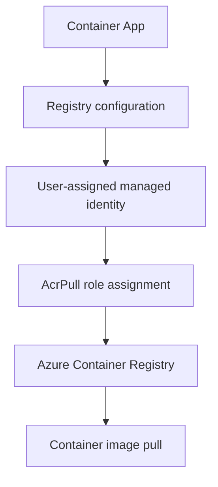

---
content_sources:
  diagrams:
  - id: uami-acr-pull-flow
    type: flowchart
    source: mslearn-adapted
    mslearn_url: https://learn.microsoft.com/azure/container-apps/managed-identity-image-pull
content_validation:
  status: verified
  last_reviewed: 2026-05-06
  reviewer: agent
  core_claims:
  - claim: Container Apps can use a user-assigned managed identity to pull images from Azure Container Registry.
    source: https://learn.microsoft.com/azure/container-apps/managed-identity-image-pull
    verified: true
  - claim: The AcrPull role grants read-only access to pull container images from a registry.
    source: https://learn.microsoft.com/azure/role-based-access-control/built-in-roles#acrpull
    verified: true
  - claim: User-assigned managed identities can be assigned to a Container App after creation.
    source: https://learn.microsoft.com/azure/container-apps/managed-identity#add-a-user-assigned-identity
    verified: true
---
# Use a User-Assigned Managed Identity for ACR Image Pull

Configure an existing Container App to pull images from Azure Container Registry using a user-assigned managed identity (UAMI). This approach eliminates long-lived credentials and provides explicit principal separation for role assignments.

<!-- diagram-id: uami-acr-pull-flow -->


## Prerequisites

- Azure CLI 2.62+ with the `containerapp` extension
- An existing Container App
- An Azure Container Registry with the target image
- Permissions to create managed identities and role assignments in the subscription

## When to Use

- Migrating from admin credentials or service principal to managed identity
- Reconnecting Continuous Deployment after RBAC conflicts
- Separating image pull identity from application identity (system-assigned)
- Establishing a dedicated principal for ACR access auditing

## Procedure

### Step 1: Create a User-Assigned Managed Identity

```bash
az identity create \
  --resource-group $RG \
  --name "${APP_NAME}-uami" \
  --location $LOCATION
```

| Command part | Purpose |
|---|---|
| `az identity create` | Creates a user-assigned managed identity. |
| `--resource-group` | Places the identity in the same resource group used by the app resources. |
| `--name` | Names the identity so later commands can retrieve it consistently. |
| `--location` | Creates the identity in the target Azure region. |

Note the `id` (resource ID) and `principalId` from the output — both are needed in later steps.

### Step 2: Assign the UAMI to the Container App

```bash
UAMI_ID=$(az identity show \
  --resource-group $RG \
  --name "${APP_NAME}-uami" \
  --query id \
  --output tsv)

az containerapp identity assign \
  --resource-group $RG \
  --name $APP_NAME \
  --user-assigned "$UAMI_ID"
```

| Command part | Purpose |
|---|---|
| `az identity show` | Reads the managed identity metadata created in the previous step. |
| `--query id` | Returns only the identity resource ID for reuse. |
| `--output tsv` | Emits a shell-friendly value without JSON formatting. |
| `az containerapp identity assign` | Attaches the user-assigned identity to the Container App. |
| `--user-assigned` | Specifies which identity resource the app should use. |

### Step 3: Grant AcrPull Role on the Registry

```bash
UAMI_PRINCIPAL=$(az identity show \
  --resource-group $RG \
  --name "${APP_NAME}-uami" \
  --query principalId \
  --output tsv)

ACR_ID=$(az acr show \
  --name $ACR_NAME \
  --resource-group $RG \
  --query id \
  --output tsv)

az role assignment create \
  --assignee-object-id "$UAMI_PRINCIPAL" \
  --assignee-principal-type ServicePrincipal \
  --role AcrPull \
  --scope "$ACR_ID"
```

| Command part | Purpose |
|---|---|
| `az identity show --query principalId` | Gets the service principal object ID behind the managed identity. |
| `az acr show --query id` | Gets the registry scope for the role assignment. |
| `az role assignment create` | Grants the identity permission to pull images from the registry. |
| `--assignee-principal-type ServicePrincipal` | Avoids ambiguous principal lookup during role assignment creation. |
| `--role AcrPull` | Grants read-only image pull access to the registry. |
| `--scope` | Limits the permission to the target registry. |

!!! warning "Role Propagation Delay"
    Role assignments may take 1–2 minutes to propagate. If the next step fails with an authentication error, wait and retry.

### Step 4: Configure the Container App Registry to Use the UAMI

```bash
az containerapp registry set \
  --resource-group $RG \
  --name $APP_NAME \
  --server "${ACR_NAME}.azurecr.io" \
  --identity "$UAMI_ID"
```

| Command part | Purpose |
|---|---|
| `az containerapp registry set` | Updates the registry authentication configuration for the Container App. |
| `--server` | Identifies the ACR login server used by the image reference. |
| `--identity` | Selects the user-assigned identity for registry pulls. |

This tells Container Apps to use the specified UAMI when pulling images from this registry. Without this step, simply having AcrPull on the identity is not sufficient.

### Step 5: Update the Container Image to Pull from ACR

```bash
az containerapp update \
  --resource-group $RG \
  --name $APP_NAME \
  --image "${ACR_NAME}.azurecr.io/${IMAGE_NAME}:${TAG}"
```

| Command part | Purpose |
|---|---|
| `az containerapp update` | Creates a new revision with the specified container image. |
| `--image` | Points the app to the private ACR image and tag. |

## Verification

Confirm the app is running with the ACR image:

```bash
az containerapp show \
  --resource-group $RG \
  --name $APP_NAME \
  --query "{image:properties.template.containers[0].image, registries:properties.configuration.registries, provisioningState:properties.provisioningState}" \
  --output json
```

| Command part | Purpose |
|---|---|
| `az containerapp show` | Reads the current Container App configuration. |
| `--query` | Extracts the image, registry identity, and provisioning state fields needed for verification. |
| `--output json` | Keeps nested registry details readable. |

Expected output shows:

- `image` pointing to your ACR
- `registries[0].identity` set to the UAMI resource ID
- `provisioningState` is `Succeeded`

## Reconnect Continuous Deployment (Optional)

If you are reconnecting Portal-based Continuous Deployment (Deployment Center) after this change:

1. Remove any previous GitHub Actions workflow or secrets that referenced old credentials.
2. In the Azure Portal, navigate to the Container App → **Continuous Deployment**.
3. Re-run the connection wizard. The new UAMI with AcrPull is now the active pull identity.

!!! tip "CD Reconnect RBAC Conflicts"
    If the reconnect fails with a role assignment conflict, see the [CD RBAC Role Assignment Conflict](../../troubleshooting/playbooks/identity-and-configuration/cd-rbac-role-assignment-conflict.md) playbook.

## Rollback / Troubleshooting

| Symptom | Likely Cause | Action |
|---------|-------------|--------|
| `ImagePullBackOff` after update | Role not yet propagated, or wrong UAMI | Wait 2 min; verify `az role assignment list --scope $ACR_ID` |
| `401 Unauthorized` | Registry not configured with UAMI | Re-run `az containerapp registry set` with `--identity` |
| App shows old image | Revision not updated | Confirm `az containerapp update` created a new revision |

For detailed diagnosis, see the [Image Pull Failure](../../troubleshooting/playbooks/startup-and-provisioning/image-pull-failure.md) playbook and [Image Pull and Auth Errors KQL](../../troubleshooting/kql/system-and-revisions/image-pull-and-auth-errors.md) queries.

## Clean Up

To remove the demo resources:

```bash
az group delete --name $RG --yes --no-wait
```

| Command part | Purpose |
|---|---|
| `az group delete` | Removes the demo resource group and resources created for this procedure. |
| `--yes` | Confirms deletion without an interactive prompt. |
| `--no-wait` | Starts deletion and returns before Azure finishes removing the resources. |

## See Also

- [Image Pull and Registry Operations](index.md)
- [Managed Identity (Platform Concepts)](../../platform/identity-and-secrets/managed-identity.md)
- [CD RBAC Role Assignment Conflict Playbook](../../troubleshooting/playbooks/identity-and-configuration/cd-rbac-role-assignment-conflict.md)
- [CD Reconnect RBAC Conflict Lab](../../troubleshooting/lab-guides/cd-reconnect-rbac-conflict.md)

## Sources

- [Use managed identity for image pull — Microsoft Learn](https://learn.microsoft.com/azure/container-apps/managed-identity-image-pull)
- [Managed identities in Azure Container Apps — Microsoft Learn](https://learn.microsoft.com/azure/container-apps/managed-identity)
- [AcrPull built-in role — Microsoft Learn](https://learn.microsoft.com/azure/role-based-access-control/built-in-roles#acrpull)
