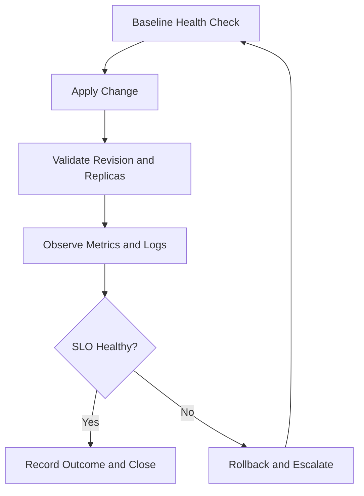

---
content_sources:
  diagrams:
    - id: use-a-repeatable-control-loop-so
      type: flowchart
      source: mslearn-adapted
      based_on:
        - https://learn.microsoft.com/azure/container-apps/
---

# Operations

This section covers production operations for Azure Container Apps. It is language-agnostic and focuses on platform behavior, reliability, and cost control in running systems.

!!! note "Variable naming in this section"
    Operations guides use production-style variable names (e.g., `RG="rg-aca-prod"`) to reflect real operational contexts. Tutorial guides use demo-style names (e.g., `RG="rg-aca-python-demo"`). Substitute your own resource names as appropriate.

## Prerequisites

- An existing Container Apps environment and app
- Azure CLI with Container Apps extension installed
- Permissions to view and update Container App resources

```bash
export RG="rg-aca-prod"
export APP_NAME="app-python-api-prod"
export ENVIRONMENT_NAME="aca-env-prod"

az extension add --name containerapp --upgrade
az account show --output table
```

## Main Content

### Operations Documents

| Document | Description |
|---|---|
| [Deployment](deployment/index.md) | CI/CD patterns, image build, registry authentication, production rollouts |
| [Custom Domains](custom-domains/index.md) | Hostname binding, managed certificates, and BYO TLS operations |
| [Disaster Recovery](disaster-recovery/index.md) | Zone redundancy, multi-region routing, and regional failover patterns |
| [Networking](deployment/networking.md) | VNet deployment, private endpoints, egress controls |
| [Health Probes](health-probes/index.md) | Startup, readiness, and liveness probe runbooks |
| [Logging](logging/index.md) | Console and system log streams, streaming, KQL, and export |
| [Revision Management](revision-management/index.md) | Revision lifecycle, traffic splitting, rollback procedures |
| [Monitoring](monitoring/index.md) | Log Analytics, metrics, distributed tracing, alerting |
| [Scaling](scaling/index.md) | KEDA scale rules, manual scaling, concurrency limits |
| [Alerts](alerts/index.md) | SLO-driven alerts for availability, latency, and resource usage |
| [Image Pull and Registry](image-pull-and-registry/index.md) | Private registry authentication, managed identity pull |
| [Secret Rotation](secret-rotation/index.md) | Credential rotation without downtime |
| [Recovery](recovery/index.md) | Failed revision handling, replica restarts, regional failover |

### Quick Operational Commands

```bash
az containerapp show --resource-group $RG --name $APP_NAME --output json
az containerapp restart --resource-group $RG --name $APP_NAME
az containerapp revision list --resource-group $RG --name $APP_NAME --output table
az containerapp logs show --resource-group $RG --name $APP_NAME --type system --follow
```

### Verification Steps

Validate that the operations baseline is healthy before changing configuration.

```bash
az containerapp show \
  --name "$APP_NAME" \
  --resource-group "$RG" \
  --query "{name:name,environmentId:properties.managedEnvironmentId,provisioningState:properties.provisioningState,runningStatus:properties.runningStatus}" \
  --output json
```

Example output (PII masked):

```json
{
  "name": "app-python-api-prod",
  "environmentId": "/subscriptions/<subscription-id>/resourceGroups/rg-aca-prod/providers/Microsoft.App/managedEnvironments/aca-env-prod",
  "provisioningState": "Succeeded",
  "runningStatus": "Running"
}
```

### Operations Control Loop

Use a repeatable control loop so every operational change is observable, reversible, and documented.

<!-- diagram-id: use-a-repeatable-control-loop-so -->


### Operational Cadence Matrix

| Cadence | Primary Goal | Required Commands | Exit Criteria |
|---|---|---|---|
| Per deployment | Prevent bad revision promotion | `az containerapp revision list`, `az containerapp ingress traffic show` | New revision healthy with expected traffic |
| Daily | Catch platform drift early | `az containerapp show`, `az containerapp env show` | Running status is healthy and config matches baseline |
| Weekly | Validate scale and alert posture | `az monitor metrics list`, `az monitor scheduled-query list` | Alerts are enabled and thresholds are current |
| Monthly | Recovery readiness | rollback simulation + runbook review | Recovery target time met in drill |

!!! tip "Use pre-change and post-change snapshots"
    Capture key fields before and after updates (ingress, scale rules, identity, revision mode). A small JSON diff dramatically reduces incident triage time.

!!! warning "Treat operations changes as production releases"
    Any update to scale rules, traffic weights, ingress, secrets, or identity can change customer impact immediately. Always run health verification and rollback checks after each change.

### Baseline Snapshot Commands

```bash
az containerapp show \
  --name "$APP_NAME" \
  --resource-group "$RG" \
  --query "{name:name,latestRevision:properties.latestRevisionName,provisioningState:properties.provisioningState,runningStatus:properties.runningStatus}" \
  --output json

az containerapp ingress traffic show \
  --name "$APP_NAME" \
  --resource-group "$RG" \
  --output json
```

### Operational Ownership Checklist

| Capability | Primary Owner | Backup Owner | Evidence |
|---|---|---|---|
| Deployment and rollback | Application team | Platform team | Successful revision promotion logs |
| Alert tuning | SRE/operations | Application team | Alert history and threshold review notes |
| Secret rotation | Security/app owner | Operations | Rotation runbook and audit log entries |
| Recovery drills | Operations lead | Incident commander | Quarterly drill report |

!!! info "Keep runbooks co-located with services"
    Store the operational runbook path in each service repository so on-call engineers can find the latest rollback and recovery guidance without context switching.

Operational readiness minimum:

- Every production app has a tested rollback command set.
- Every sev1 alert maps to a named incident owner.
- Every production app has an explicit logging, health probe, and custom-domain runbook where applicable.

## Advanced Topics

- Build an SLO-based operating model mapping each control to measurable service outcomes.
- Keep runbooks and IaC synchronized so recovery steps are deterministic during incidents.
- Validate production controls regularly through game days and restore exercises.

## Language-Specific Details

For language-specific operational guidance, see:
- [Python Guide](../language-guides/python/index.md)

## See Also

- [Platform](../platform/index.md)
- [Best Practices](../best-practices/index.md)
- [Reference](../reference/index.md)
- [Logging](logging/index.md)
- [Custom Domains and TLS](custom-domains/index.md)
- [Disaster Recovery](disaster-recovery/index.md)
- [Health Probes](health-probes/index.md)

## Sources

- [Azure Container Apps documentation (Microsoft Learn)](https://learn.microsoft.com/azure/container-apps/)
