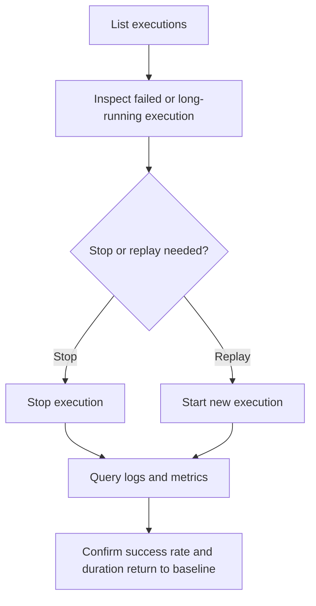

---
content_sources:
  diagrams:
    - id: jobs-day-2-operations-flow
      type: flowchart
      source: self-generated
      justification: Synthesized from repository job runbooks and Microsoft Learn Jobs guidance while exact CLI/log-schema quotes remained pending.
      based_on:
        - https://learn.microsoft.com/azure/container-apps/jobs
        - https://learn.microsoft.com/azure/container-apps/log-monitoring
content_validation:
  status: pending_review
  last_reviewed: "2026-04-26"
  reviewer: ai-agent
  core_claims:
    - claim: "Job executions can be listed and inspected after they run."
      source: "https://learn.microsoft.com/azure/container-apps/jobs"
      verified: true
    - claim: "Container Apps can send job-related logs to Log Analytics."
      source: "https://learn.microsoft.com/azure/container-apps/log-monitoring"
      verified: true
---

# Jobs Operations

This guide covers day-2 operations for Container Apps Jobs: listing executions, drilling into failures, replaying work, and tracking job health over time.

## Prerequisites

- Azure Container Apps environment and Job already deployed
- Azure CLI and Container Apps extension available in the operator workstation
- Log Analytics workspace connected to the environment for longer-term history

```bash
export RG="rg-aca-prod"
export JOB_NAME="job-orders-reconcile"
export EXECUTION_NAME="job-orders-reconcile-abc123"
export WORKSPACE_ID="<log-analytics-workspace-id>"
```

## When to Use

Use this runbook when you need to:

- inspect the most recent Job executions
- stop a bad execution
- replay a failed run
- answer whether success rate, duration, or retry behavior is drifting

## Procedure

### 1. List recent executions

```bash
az containerapp job execution list \
  --name "$JOB_NAME" \
  --resource-group "$RG" \
  --output table
```

### 2. Inspect a specific execution

```bash
az containerapp job execution show \
  --name "$JOB_NAME" \
  --resource-group "$RG" \
  --job-execution-name "$EXECUTION_NAME" \
  --output json
```

### 3. Stop an in-flight execution when needed

```bash
az containerapp job execution stop \
  --name "$JOB_NAME" \
  --resource-group "$RG" \
  --job-execution-name "$EXECUTION_NAME"
```

!!! warning "Confirm CLI command availability against your installed extension"
    The `execution list`, `show`, and `stop` patterns above reflect the expected long-form command group for current Container Apps Jobs operations.
    Verify them against the Container Apps extension version you run in production before codifying them in automation.

### 4. Replay a failed execution manually

Replay starts a new execution from the same job definition.

```bash
az containerapp job start \
  --name "$JOB_NAME" \
  --resource-group "$RG"
```

Before replaying, confirm whether you also need to:

- requeue or unlock an input item
- clean up partial output from the failed run
- reduce parallelism or retries for the replay window

### 5. Query logs for a job or execution

When your workspace schema is known, filter directly on the job and execution fields. If schema differs across workspaces, use a defensive query that tolerates different column names.

```kusto
let TargetJob = "job-orders-reconcile";
let TargetExecution = "job-orders-reconcile-abc123";
ContainerAppSystemLogs_CL
| extend JobName = tostring(column_ifexists("JobName_s", column_ifexists("ContainerAppName_s", "")))
| extend ExecutionName = tostring(column_ifexists("ExecutionName_s", column_ifexists("ExecutionId_g", "")))
| where JobName == TargetJob
| where isempty(TargetExecution) or ExecutionName == TargetExecution
| project TimeGenerated, JobName, ExecutionName, Reason=tostring(column_ifexists("Reason_s", "")), Log=tostring(column_ifexists("Log_s", ""))
| order by TimeGenerated desc
```

!!! warning "Exact Log Analytics column names vary by workspace schema"
    Existing repository KQL examples use `JobName_s` and `ExecutionName_s` in `ContainerAppSystemLogs_CL`.
    Re-check the actual columns in your workspace before you build dashboards or alerts around a fixed schema.

### 6. Track success rate, duration, and retry activity

Success and failure trend:

```kusto
ContainerAppSystemLogs_CL
| extend JobName = tostring(column_ifexists("JobName_s", column_ifexists("ContainerAppName_s", "")))
| extend Reason = tostring(column_ifexists("Reason_s", ""))
| where JobName == "job-orders-reconcile"
| where Reason in ("Completed", "Failed")
| summarize Executions=count() by Reason, bin(TimeGenerated, 1h)
| order by TimeGenerated asc
```

Retry activity trend:

```kusto
ContainerAppSystemLogs_CL
| extend JobName = tostring(column_ifexists("JobName_s", column_ifexists("ContainerAppName_s", "")))
| extend Reason = tostring(column_ifexists("Reason_s", ""))
| where JobName == "job-orders-reconcile"
| where Reason has "Retry"
| summarize RetryEvents=count() by bin(TimeGenerated, 1h)
| order by TimeGenerated asc
```

Duration example from structured application logs:

```kusto
ContainerAppConsoleLogs_CL
| extend Payload = parse_json(Log_s)
| extend ExecutionName = tostring(Payload.execution_name)
| extend DurationMs = todouble(Payload.duration_ms)
| where tostring(Payload.message) == "Job execution completed"
| summarize P50Ms=percentile(DurationMs, 50), P95Ms=percentile(DurationMs, 95), MaxMs=max(DurationMs) by bin(TimeGenerated, 1h)
| order by TimeGenerated asc
```

## Verification

Use the control loop below after any replay or stop action.

<!-- diagram-id: jobs-day-2-operations-flow -->


Basic verification commands:

```bash
az containerapp job execution list \
  --name "$JOB_NAME" \
  --resource-group "$RG" \
  --output table
```

## Rollback / Troubleshooting

- If a replay starts reprocessing bad input, stop it and quarantine the input item.
- If failures are data-dependent, reduce retries and use the dead-letter path instead of repeated replay.
- If logs are insufficient, update the job image to emit explicit execution correlation fields before the next incident.

Use [Jobs Troubleshooting](troubleshooting.md) for symptom-based triage.

## See Also

- [Jobs Troubleshooting](troubleshooting.md)
- [Execution Lifecycle](../../platform/jobs/execution-lifecycle.md)
- [Job Design](../../best-practices/job-design.md)
- [Job Execution History KQL](../../troubleshooting/kql/dapr-and-jobs/job-execution-history.md)

## Sources

- [Jobs in Azure Container Apps (Microsoft Learn)](https://learn.microsoft.com/azure/container-apps/jobs)
- [Azure Monitor for Container Apps (Microsoft Learn)](https://learn.microsoft.com/azure/container-apps/log-monitoring)
